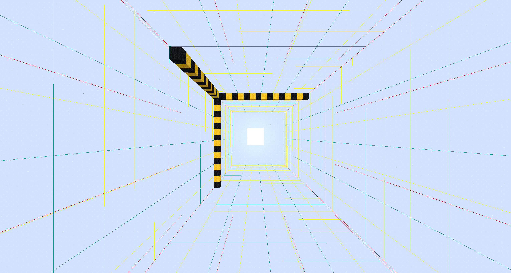
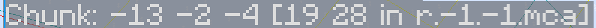

当游玩游戏时，读者是否想过一个基本的问题：游戏内是如何保证即使在世界上几乎任意一处位置放置一个方块，移除一个方块，都不会有明显卡顿的？

如果读者对计算机科学知识储备较大，并比较敏锐的话，应该很快能注意到一个直接的工程问题：当具备如此庞大的世界时，假设每次游玩游戏都需要将整个世界地图完整地，不加优化地存储在内存中，并通过寄存器查询内存，修改内存的话，游戏应该会非常卡。但实际上并不是这样的。

再比如，当读者使用鞘翅快速飞行的时候，或者在服务器游玩但是网络状况不佳的时候，是否观察到远处的地形是一片一片加载出来的？

我们回到第一个问题。如果读者具备一定的计算机知识，应该会很快意识到我们可以用类似分治的方案存储世界。将世界拆成一个个区块来存储，然后通过特定手段，比如哈希，将某个特定方块的三维坐标用一个比较小的类型存储下来，并搭配区块的坐标，应该就可以实现快速读写。再然后，我们动态地将区块载入，移除内存。这样就避免了恐怖的内存需求。至于第二个问题，当游戏动态载入，卸载区块的时候，就是会出现远处的地形一片一片加载出来。这个猜想因而基本可以被交叉验证。通过查询代码，恭喜读者，Mojang正是这么干的。

## 区块与子区块的定义

### 什么是区块？

在游戏内按下`F3+G`，读者应该能看到如下场景的出现：



每一个这样的框都代表了游戏的一个区块，每一个区块的大小都是水平方向上的$16 \times 16$。

严格来说，一个区块可以被如下定义：

$$\{(x, y, z) \mid 16m \le x < 16(m+1),\; 16n \le z < 16(n+1),\; m, n \in \mathbb{Z}\}$$

这里的`m,n`指的就是一个区块的区块坐标。一个区块的坐标可以被唯一固定的整数对`(m,n)`确认。

因此，区块实际上在Y方向上是没有限制的。主世界从Y=-64到Y=319全部都属于同一个区块。

### 什么是子区块？

注意到在上图中，水平方向上有许多蓝色的横线。这些横线将区块分成了一个个$16 \times 16 \times 16$的区域。我们称这样分隔的区域为子区块。容易计算，一个区块内存在24个子区块。

子区块坐标比区块坐标额外增加了Y这一维度，其从-4到19分布。在游戏内使用`F3`即可清晰地看到当前子区块坐标。



### :advance 子区块计数器

> 本小节只是单纯展示一下存在这个东西，然后告诉各位读者Mojang是怎么优化的，无实际用途，也不可观测。

子区块会维护三个计数器：非空气方块数，需要随机刻的方块数，非空流体方块数。其存在的意义是：完全为空的子区块可以直接跳过后续处理，如区块刻，保存等。而后两个字段主要是保证在处理区块刻/随机刻/流体计划刻时可以直接跳过而无需遍历区块。起到一个优化的作用。

### :advance 子区块的坐标哈希

> 本小节只展示Mojang的神秘优化小技巧，无实际用处。

游戏频繁需要在一个 16³ 的子区块中表示"第几行第几列第几层"的局部坐标。于是Mojang的做法是将其状态压缩为一个16位的`short`

```java
// 打包：x(4bit) | z(4bit) | y(4bit) → 总共 12 bit 有效
short packed = (short)(x << 8 | z << 4 | y);
```

打包成 16 位的 `short` 而非 32 位的 `int`，是为了在大量存储时节省内存。

## :advance 区块的数据结构

`Chunk`，即前文提到的区块，是所有区块对象的抽象基类。它定义了每个区块共有的数据结构和访问方式。

| 数据类别           | 存储字段                 | 类型                                                                                                             |
| ------------------ | ------------------------ | ---------------------------------------------------------------------------------------------------------------- |
| 子区块             | `sectionArray`           | `ChunkSection[]`                                                                                                 |
| 高度图             | `heightmaps`             | `Map<Heightmap.Type, Heightmap>`（四种：MOTION_BLOCKING、MOTION_BLOCKING_NO_LEAVES、OCEAN_FLOOR、WORLD_SURFACE） |
| 方块实体（已加载） | `blockEntities`          | `Map<BlockPos, BlockEntity>`                                                                                     |
| 方块实体（待加载） | `blockEntityNbts`        | `Map<BlockPos, NbtCompound>`                                                                                     |
| 结构起点           | `structureStarts`        | `Map<Structure, StructureStart>`                                                                                 |
| 结构引用           | `structureReferences`    | `Map<Structure, LongSet>`                                                                                        |
| 生物群系           | 每个 `ChunkSection` 内部 | `PalettedContainer<RegistryEntry<Biome>>`（4³ 分辨率）                                                           |
| 已居住时间         | `inhabitedTime`          | `long`                                                                                                           |
| 升级数据           | `upgradeData`            | `UpgradeData`                                                                                                    |
| 是否需要保存       | `needsSaving`            | `volatile boolean`                                                                                               |

## :advance 已生成区块和准生成区块

区块在代码中有两种主要实现，对应生命周期中的两个阶段：

|                            | 准生成区块                          | 已生成区块                         |
| -------------------------- | ----------------------------------- | ---------------------------------- |
| **用途**                   | 世界生成                            | 正常运行                           |
| **数据来源**               | 生成管线逐步填充                    | 从准生成区块转换或从磁盘加载       |
| **能否参与 tick**          | 否                                  | 是                                 |
| **能否正常查询**           | 否                                  | 是                                 |
| **有无加载等级提供器**     | 否                                  | 是                                 |
| **实体管理**               | 不参与                              | 由实体管理器管理                   |

**为什么需要准加载？** 世界生成是在独立于主线程的生成线程上进行的。如果生成线程直接操作 已生成区块，就可能在主线程同时读写这个区块时造成竞争条件。准生成区块提供了一个隔离的"生成沙盒"——只有生成完成的区块才能转换为已生成区块，正式进入服务端的运行逻辑。

已生成在构造时挂载了一个 **加载等级提供器**，它直接从区块容器查询当前区块的运行级别。这样，任何需要检查"这个区块是否应该执行 XX 运算"的代码，都可以直接获取。

## :advance 客户端区块管线

客户端和服务端对区块的管理是两个完全独立的体系。客户端是否渲染与区块是否运算是互相独立的。

### 客户端视角

客户端的区块数据**完全来自服务端同步**。流程为：

1. **服务端决定发送**：当区块进入玩家视距时，服务端判断是否需要向该玩家发送区块数据。
2. **区块数据网络包**：包含该区块内所有非空子区块的方块状态、生物群系、方块实体和光照数据。
3. **客户端接收与重建**：客户端解析数据包，构建对应的 已生成区块（客户端自己的版本），用于渲染和本地预测。

### 服务端视角

服务端的已生成区块是**权威数据**。它的加载由加载票系统驱动——即使客户端已经收到了区块数据网络包并完成了渲染，服务端的区块容器可能仍在通过区块异步推进区块的生成状态。
