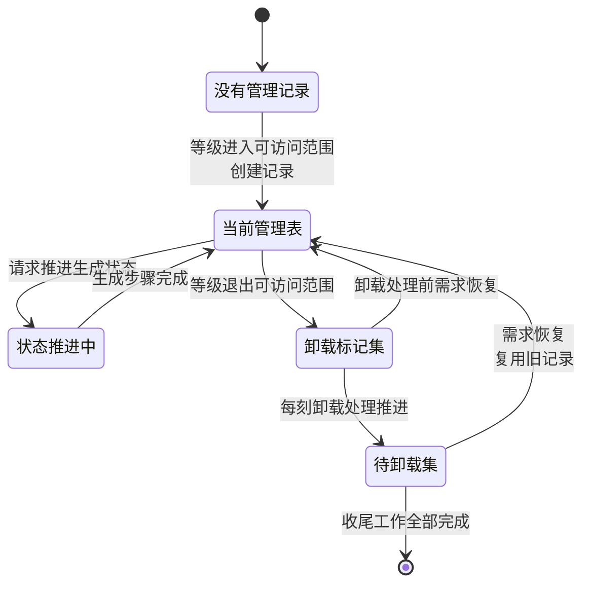
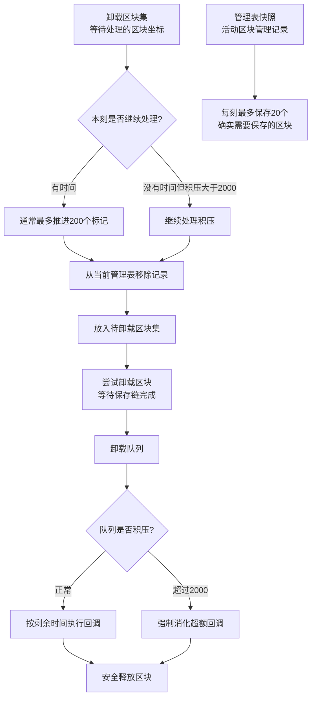

02 章讲了区块从空区块到生成完成的 12 步生成管线。但谁来决定"现在该推进哪个区块"？谁负责在 taskMargin 外圈依赖满足之后才启动下一步？谁在区块不再需要时保存数据并释放内存？

答案是**区块存储管理器**（`ThreadedAnvilChunkStorage`，源码中常简称 区块存储管理器）。你可以把它想象成机场塔台：它不驾驶飞机（不执行生成计算），但知道跑道上每架飞机的状态，安排起飞和降落的顺序。

区块存储管理器做三件事：

1. **维护区块清单**——当前内存中有哪些区块、哪些正在生成、哪些等待卸载。这是通过几张索引表实现的，见下一节。
2. **协调生成管线**——当一个区块需要推进区块生成状态时，区块存储管理器确保外圈依赖满足后安排对应的生成任务。生成运算本身由专门的生成管线执行，光照由光照引擎执行（见第 02 章），而区块存储管理器的角色是决定"现在该做哪一步"。
3. **管理保存和卸载**——当区块不再处于可访问范围时，区块存储管理器不会立刻删除它。它先标记、移出主表、等待最后的保存工作完成，最终才释放内存。这个过程拆成多个阶段，因此短时间内重新出现的需求有机会复用已有的区块数据，避免重复生成。

> 加载等级本身不由区块存储管理器决定。区块存储管理器接收来自外部的等级变化通知，然后据此执行上述三件事。等级的来源（加载票系统）将在第 06 章详细展开。

## 核心数据结构

区块存储管理器维护四张核心索引表，每张表解决一个特定的追踪需求：

**当前管理表**——"现在有哪些区块？"
存储当前维度中所有活跃区块的记录。每条记录跟踪对应区块的状态：生成到了第几步、数据是否已就绪、是否需要保存。区块进入可访问范围（加载等级 ≤ 33，见第 02 章末尾的等级表）时加入此表；完成卸载后从此表移出。

**卸载标记集**——"哪些区块已经不需要了？"
一个轻量的坐标集合，记录已退出可访问范围（加载等级 > 33）、等待进入卸载流程的区块。它在等级变化时被写入，在每刻的卸载处理阶段被消费。如果在此期间需求恢复（玩家又回来了），坐标直接从集合中移除，区块不会经历卸载。

**待卸载集**——"哪些区块正在等待最后的清理？"
记录已从当前管理表移出、但还不能释放的区块。这些区块可能还有未完成的保存操作或其他收尾工作。保留这份记录有两个目的：等待这些工作安全结束；如果需求在此期间重新出现，可以直接复用旧记录，省去重新生成的代价。

**管理表快照**——"怎么安全地遍历所有区块？"
当前管理表是频繁变动的——每刻可能有数十个区块加入或移出。如果遍历过程中发生了增删，就会出错。快照是当前管理表的一个只读副本，遍历者用它安全迭代，不受后续修改影响。代价是每次主表修改后需要重新克隆一份。

| 数据结构 | 解决的问题 | 何时写入 | 何时清除 |
|---------|-----------|---------|---------|
| 当前管理表 | 哪些区块在内存里 | 区块进入可访问范围 | 卸载处理推进时 |
| 卸载标记集 | 哪些区块等待卸载 | 区块退出可访问范围 | 卸载处理消费或需求恢复 |
| 待卸载集 | 哪些区块在收尾 | 卸载处理推进时 | 收尾工作全部完成 |
| 管理表快照 | 如何安全遍历 | 主表修改后重建 | 下次更新时覆盖 |

## 生命周期

一条区块管理记录从创建到最终释放经历六个阶段：



**创建**：当区块的加载等级首次进入可访问范围（≤ 33），区块存储管理器为它创建一条管理记录并放入当前管理表。如果待卸载集中恰好有同坐标的旧记录——比如玩家离开后又快速返回——区块存储管理器直接复用旧记录而不是新建。旧记录里保留着之前已完成的所有生成进度，不需要重新计算地形、群系或光照。

**活跃**：记录进入当前管理表后，外部可以请求推进它的生成状态。区块存储管理器协调目标区块和周围依赖区块（按 taskMargin 要求，见第 02 章），安排读取、生成或光照工作。每完成一个区块生成阶段，记录更新进度；当到达生成完成时，区块数据就可以被读写。如果等级进一步降低到 ≤ 32 或 ≤ 31，区块还可能获得对应的运算资格。

**卸载**：当加载等级退出可访问范围（> 33），区块存储管理器不会立刻删除记录。它先将坐标记入卸载标记集——这只是一个轻量标记，区块数据仍然完整。在后续的每刻卸载处理中，区块存储管理器从标记集中取出一批坐标，把对应记录从当前管理表移入待卸载集，并安排最后的保存和收尾工作。只有这些工作全部安全结束后，区块才从内存中释放。

通常每刻最多处理 200 个卸载标记；积压超过 2000 时会加速处理。另外每刻最多保存 20 个确实需要保存的活跃区块，避免集中写盘。

## 具体场景：快速返回

让我们用一个例子串起以上所有机制。假设玩家骑马跑图：先进入一片从未到过的区域，然后掉头快速返回原点。

### 第一阶段：首次进入

游戏检测到玩家位置变化，该区域中一批区块的加载等级随之降低（数值变小 = 加载变强）——从不可访问（> 33）进入了可访问范围（≤ 33）。区块存储管理器收到每个区块的等级变化通知。

对于从未加载过的区块，当前管理表和待卸载集中都没有记录。区块存储管理器创建新的管理记录，放入当前管理表。记录随后进入活跃状态：生成管线被触发，区块依次通过空区块、结构起始、群系、噪声地形、地表、洞穴、地物、光照初始化和光照计算等阶段（详见第 02 章）。每完成一步，区块存储管理器得到通知，知道该区块的进度又推进了一层。

当区块到达生成完成时，方块数据已完整可用。如果该区块也在玩家视距内，区块存储管理器向客户端发送区块数据包，玩家就能看到地形了。

### 第二阶段：离开

玩家继续向前，原来的那些区块逐渐远离。它们的加载等级开始回升（数值变大 = 加载变弱）——从可访问范围退回到不可访问（> 33）。

区块存储管理器收到变化通知：这些区块不再需要保持在内存中。但它并不立即删除它们。对每个区块，区块存储管理器先将坐标写入卸载标记集。此时区块本身还在当前管理表中，数据完整——只是多了一个"等待卸载"的标记。

在之后的每刻卸载处理中，区块存储管理器从卸载标记集里逐批取出坐标。如果需要保存（比如玩家在上面放过方块），保存操作在此时排队；然后记录从当前管理表移入待卸载集，等待收尾工作完成。

### 第三阶段：快速返回

假设立即掉头，在记录被真正释放之前就回到了同一区域。

区块存储管理器再次收到等级变化通知：这些区块的等级又回到了可访问范围。它首先检查卸载标记集——对应的坐标还在里面，直接移除标记，相当于撤销了卸载请求。然后检查待卸载集——旧记录还在。区块存储管理器把它取回，更新等级，重新放入当前管理表。

这个旧记录里保留着之前已经完成的所有生成进度。地形、群系、光照——这些都不需要重新计算。区块存储管理器只需要检查：当前等级要求的 ChunkStatus 是否已经达到？如果已经达到，区块直接进入可访问状态；如果不够，则继续推进剩余步骤。

这就是为什么骑马跑图时往返同一片区域几乎感觉不到加载延迟——不是生成变快了，而是 区块存储管理器的卸载流水线给了旧记录一个"后悔窗口"。区块在被彻底释放之前，有机会被重新捡起来。

以上是 区块存储管理器的概念模型。如果你只需要理解它在区块系统中的角色，读到这里就够了。后续章节会逐步展开：加载等级的具体来源（第 06 章）、进度跟踪的异步机制（第 05 章）、以及管理记录的内部结构（第 07 章）。

下面的进阶部分面向需要定位源码的读者，直接使用源码中的类名和方法名。每个小节先陈述规则，再展示源码片段验证。

---

## :advance 源码验证

### 设置加载等级 `setLevel()` 的规则和完整调用链

**规则**：管理器通过设置加载等级方法（`setLevel()`）接收加载等级变更通知。这个方法负责创建、加载、更新或标记区块管理记录；具体要建立哪些运行视图和生成状态异步结果，则由记录后续处理等级变化时决定。

**调用链**：

```
加载票等级传播完成
  → TicketManager.setLevel(pos, newLevel, holder, oldLevel)
    → 区块存储管理器设置加载等级 setLevel(...)
      → 创建、加载或更新区块管理记录
  → 后续每刻维护中由 holder.tick(...) 处理加载类型升降
  → 获取指定生成状态的区块 getChunkAt()/获取生成所需的区块区域 getRegion()
    在状态被请求时协调读取和生成
```

**源码验证**（按 1.20.1 Yarn 原逻辑删去构造参数）：

```java
// ThreadedAnvilChunkStorage.java
ChunkHolder setLevel(long pos, int level, @Nullable ChunkHolder holder, int oldLevel) {
    if (!ChunkLevels.isAccessible(oldLevel)
        && !ChunkLevels.isAccessible(level)) {
        return holder;
    }

    if (holder != null) {
        holder.setLevel(level);
    }

    if (holder != null) {
        if (!ChunkLevels.isAccessible(level)) {
            this.unloadedChunks.add(pos);
        } else {
            this.unloadedChunks.remove(pos);
        }
    }

    if (ChunkLevels.isAccessible(level) && holder == null) {
        holder = this.chunksToUnload.remove(pos);
        if (holder != null) {
            holder.setLevel(level);
        } else {
            holder = new ChunkHolder(new ChunkPos(pos), level, ...);
        }
        this.currentChunkHolders.put(pos, holder);
    }
    return holder;
}
```

**关键设计**：

- 新旧等级都属于卸载类型时，不需要改变管理表结构。
- 已有区块管理记录时，先更新它记录的目标等级；新等级属于卸载类型时只加入卸载区块集，不会在这里立即销毁。
- 新等级可访问但当前没有区块管理记录时，先从待卸载区块集取回旧记录；只有取不到时才新建。
- 设置加载等级方法完成的是管理记录的衔接，不等于生成任务已经执行。

### 管理表快照的线程安全实现

**规则**：管理表快照（`chunkHolders`）是当前管理表（`currentChunkHolders`）的快照，供需要稳定遍历的场景使用，避免并发修改异常。

**源码验证**：

```java
// ThreadedAnvilChunkStorage.java
private final Long2ObjectLinkedOpenHashMap<ChunkHolder> currentChunkHolders = new Long2ObjectLinkedOpenHashMap<>();
private volatile Long2ObjectLinkedOpenHashMap<ChunkHolder> chunkHolders = this.currentChunkHolders.clone();

// 当管理表发生结构变化后，在主线程重建快照引用
this.chunkHolders = this.currentChunkHolders.clone();
```

**关键设计**：

- `volatile` 保证可见性，其他线程能看到最新的快照引用。
- `clone()` 创建新的映射表，但引用的 `ChunkHolder` 对象是共享的（浅拷贝）。
- 这是一种**读多写少**优化：写入时成本高（clone），但读取时零开销。

### 设置视距 `setViewDistance()` 时的数据包边界计算

**规则**：当服务端视距改变时，管理器比较每个区块在新旧视距下是否可见；只有“进入视野”或“离开视野”的边界状态发生变化时，才发送或取消区块渲染数据（`sendWatchPackets()`）。

**源码验证**（按原 `setViewDistance()` 逻辑简化）：

```java
// ThreadedAnvilChunkStorage.java
protected void setViewDistance(int watchDistance) {
    int newDistance = MathHelper.clamp(watchDistance, 2, 32);
    if (newDistance != this.watchDistance) {
        int oldDistance = this.watchDistance;
        this.watchDistance = newDistance;
        this.ticketManager.setWatchDistance(newDistance);
        for (ChunkHolder holder : this.currentChunkHolders.values()) {
            ChunkPos pos = holder.getPos();
            this.getPlayersWatchingChunk(pos, false).forEach(player -> {
                boolean wasVisible = isWithinDistance(pos, playerPos, oldDistance);
                boolean isVisible = isWithinDistance(pos, playerPos, newDistance);
                if (wasVisible != isVisible) {
                    this.sendWatchPackets(player, pos, ...);
                }
            });
        }
    }
}
```

**关键设计**：

- 新旧范围内都可见的区块不会重发。
- 从可见变为不可见时同样要发送相应的取消观察信息，而不只是处理新增区块。

### 区块存储管理器每刻维护 `tick()` 中的处理位置

**规则**：区块存储管理器的每刻维护（`tick()`）位于加载票变化和正常区块运算之后，主要负责 POI 持久化与区块卸载收尾；它不在这里执行世界生成或方块刻。

**调用位置**：

```
ServerChunkManager.tick()
  → 清理过期加载票
  → 处理加载票导致的等级变化
  → 如需要，执行区块内游戏逻辑
  → 区块存储管理器每刻维护 tick()
      → POI 持久化
      → unloadChunks()
```

**源码验证**：

```java
// ThreadedAnvilChunkStorage.java
protected void tick(BooleanSupplier shouldKeepTicking) {
    this.pointOfInterestStorage.tick(shouldKeepTicking);
    if (!this.world.isSavingDisabled()) {
        this.unloadChunks(shouldKeepTicking);
    }
}
```

**关键设计**：

- POI 的脏数据在这一阶段持续写回。
- 世界关闭保存时，常规卸载处理会被跳过；保存行为由相应的保存流程接管。

### POI 更新、卸载区块 `unloadChunks()` 和保存节流

**规则**：卸载不是一次删除，而是三段流水线：先把卸载区块集中的标记转成待卸载区块集中的管理记录，再执行已经就绪的卸载回调，最后增量保存仍在活动但已经变脏的区块。



图中“200”和“20”属于两条不同的限流：前者限制卸载标记通常推进多少个，后者限制活动区块实际保存多少个。

**源码验证**（删去与流程无关的局部变量类型）：

```java
private void unloadChunks(BooleanSupplier shouldKeepTicking) {
    // 1. 卸载区块集 unloadedChunks → 待卸载区块集 chunksToUnload
    for (int moved = 0; unloadedIterator.hasNext()
        && (shouldKeepTicking.getAsBoolean()
            || moved < 200 || this.unloadedChunks.size() > 2000);
        unloadedIterator.remove()) {
        long pos = unloadedIterator.nextLong();
        ChunkHolder holder = this.currentChunkHolders.remove(pos);
        if (holder != null) {
            this.chunksToUnload.put(pos, holder);
            this.tryUnloadChunk(pos, holder);
            moved++;
        }
    }

    // 2. 卸载队列积压超过 2000 时，优先执行一部分卸载回调
    int excess = Math.max(0, this.unloadTaskQueue.size() - 2000);
    while ((shouldKeepTicking.getAsBoolean() || excess > 0)
        && (task = this.unloadTaskQueue.poll()) != null) {
        excess--;
        task.run();
    }

    // 3. 每刻最多增量保存 20 个确实需要保存的区块管理记录
    int saved = 0;
    for (ChunkHolder holder : this.chunkHolders.values()) {
        if (saved >= 20 || !shouldKeepTicking.getAsBoolean()) break;
        if (this.save(holder)) saved++;
    }
}
```

**关键设计**：

- “200”限制的是每刻通常从卸载区块集推进多少个区块管理记录，不是保存数量。
- “20”才是活动区块管理记录的每刻增量保存上限，而且只有保存区块（`save(holder)`）确实执行时才计数。
- 卸载回调积压超过 2000 时，即使本刻时间紧张，也会强制消化超出的部分，以免待释放对象持续占用内存。
- POI 的脏数据由 POI 存储的每刻维护（`pointOfInterestStorage.tick()`）推进；区块、实体和 POI 各有自己的存储路径，不能视为一次统一的保存区块调用。
