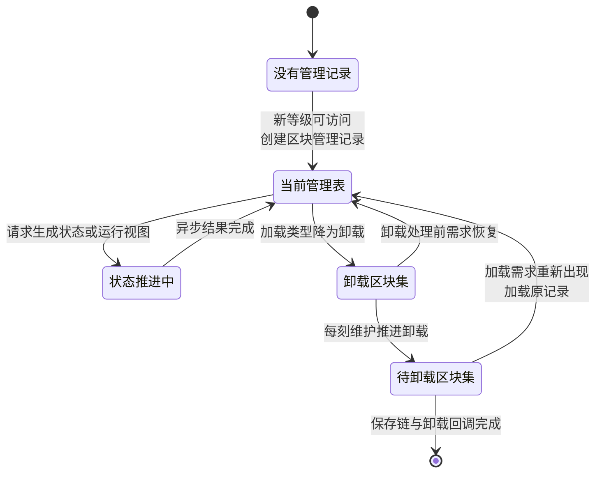
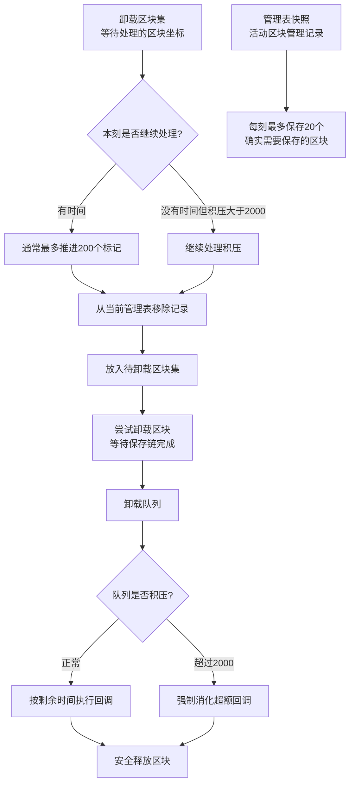

玩家走进新区域时,游戏从哪里决定加载哪些区块？当区块不再需要时,谁负责保存数据并释放内存？当玩家视距改变时,谁重新计算应发送的区块范围？

这些协调工作由**区块存储管理器**（`ThreadedAnvilChunkStorage`,源码中常简称 TACS）完成。它是服务端区块管理系统的中枢协调者:接收加载需求,创建并维护区块管理记录,安排加载、生成、光照等异步任务,决定何时向玩家发送区块数据,以及在区块不再需要时保存并卸载。

区块存储管理器既不决定加载等级（由加载票管理器决定）,也不执行实际的生成和光照计算（由生成管线和光照引擎完成）,但它负责协调整个流程：何时创建管理记录、何时安排任务、何时发送数据、何时保存和卸载。本章首先解释管理器的职责、完整生命周期和核心数据结构,然后通过一个具体场景验证这些机制如何协同工作。进阶部分保留源码级验证,包括加载等级变更的完整调用链、管理表快照机制、视距变更的数据包边界计算、区块存储管理器每刻维护中的处理位置、POI 更新和卸载保存节流。

**基础部分**

- 管理器的职责
- 完整生命周期
- 核心数据结构
- 创建与加载机制
- 具体场景验证

**进阶部分**

- 设置加载等级的规则和完整调用链
- 管理表快照的线程安全实现
- 视距变更时的数据包边界计算
- 区块存储管理器每刻维护中的处理位置
- POI 更新、卸载阶段和保存节流

## 管理器的职责

区块存储管理器负责协调区块从创建到卸载的完整生命周期。它不决定加载等级（加载票管理器根据加载票计算等级），也不执行实际的生成和光照计算（由生成管线和光照引擎完成），但它知道何时创建管理记录、何时安排任务、何时发送数据、何时保存和卸载。

管理器维护三张核心索引表：当前管理表记录所有活跃区块，卸载区块集标记等待进入卸载流水线的坐标，待卸载区块集保留等待保存链与卸载回调完成的记录。管理表快照为需要稳定遍历的场景提供线程安全的视图。管理器响应加载等级变化，在等级进入可访问范围时创建或加载区块管理记录，在等级降为卸载时标记卸载请求并在后续每刻维护中推进卸载流水线。

管理器通过异步结果跟踪任务进度。当外部请求某个生成状态或运行视图时，管理器协调目标区块和周围依赖区块，安排读取、生成或光照工作。任务完成后，等待该结果的系统才能继续工作，例如区块进入可访问状态、获得运行资格，或在满足客户端可见性条件时向玩家发送区块数据。

管理器还负责玩家视野管理。它维护每个玩家的视野中心，计算应发送的区块范围，当区块从玩家视距外进入视距内时触发区块数据包的发送。视距变更时，管理器比较每个区块在新旧视距下的可见性，只对边界状态发生变化的区块发送或取消数据。

## 完整生命周期

区块管理记录从创建到卸载经历六个阶段。加载票产生后，加载票管理器计算加载等级并通知区块存储管理器。管理器检查新等级是否已可访问：如果是，先查找待卸载区块集中是否有可加载的旧记录，没有才创建新记录并放入当前管理表。

区块管理记录收到新等级后，在后续处理等级变化时建立相应的异步结果。当外部请求某个生成状态或运行视图时，管理器协调目标区块和周围依赖区块，安排读取、生成或光照工作。任务完成后，区块可以进入可访问状态、获得运行资格，或在满足客户端可见性条件时向玩家发送区块数据。加载等级表达"需要达到什么程度"，异步结果表达"现在已经做到什么程度"。

当加载票消失后，加载票管理器重新计算等级。区块进入卸载类型时，管理器将区块坐标加入卸载区块集。真正从当前管理表移出要等到卸载阶段：每刻维护末尾，管理器从卸载区块集中取出一批标记，把对应区块管理记录从当前管理表移入待卸载区块集，并安排等待保存链完成的卸载回调。只有保存链和其他依赖已经安全结束，区块才真正释放。

通常每刻最多推进 200 个卸载标记；积压超过 2000 时会加速处理。另外管理器每刻最多增量保存 20 个确实需要保存的活动区块，避免集中写盘。



## 核心数据结构

区块存储管理器维护四张核心索引表，支撑完整的创建、活动、卸载流程。

**当前管理表** (`currentChunkHolders: Long2ObjectLinkedOpenHashMap<ChunkHolder>`) 存储当前维度中所有有管理记录的区块。key 是区块坐标序列化后的 long，value 是对应的区块管理记录。区块首次进入可访问范围，或从待卸载区块集加载时加入；卸载标记在每刻维护末尾被处理时，对应记录才移入待卸载区块集。

**卸载区块集** (`unloadedChunks: LongSet`) 存储已失去可访问需求、等待进入卸载流水线的区块坐标。区块从可访问类型降为卸载类型时加入；卸载阶段开始处理该坐标，或区块重新变为可访问时移除。

**待卸载区块集** (`chunksToUnload: Long2ObjectMap<ChunkHolder>`) 存储已从当前管理表移出，但仍在等待保存链或卸载回调完成的区块管理记录。区块管理记录可能还有生成、保存或其他异步结果尚未结束，保留它可以让卸载等待这些工作安全收尾；如果需求在此期间重新出现，也可以直接加载原有记录。

**管理表快照** (`chunkHolders: volatile Long2ObjectLinkedOpenHashMap<ChunkHolder>`) 是当前管理表的副本，供每刻维护和保存等需要稳定遍历的场景使用。每当当前管理表修改后，主线程重新 clone 一份。这是 Copy-On-Write 模式：写入端更新时成本高，但读取端可以零开销地安全遍历，避免遍历过程中因其他线程的修改导致并发修改异常。

| 数据结构 | 用途 | 何时加入 | 何时移除 |
|---------|------|---------|---------|
| 当前管理表 | 所有活跃区块管理记录 | 新等级可访问时 | 卸载阶段推进时 |
| 卸载区块集 | 等待卸载的坐标标记 | 等级降为卸载时 | 卸载推进或需求恢复时 |
| 待卸载区块集 | 等待保存链完成的记录 | 卸载阶段推进时 | 保存链与回调完成时 |
| 管理表快照 | 稳定遍历视图 | 当前管理表修改后 | 下次更新覆盖 |

**区块类型表** (`chunkToType: Long2ByteMap`) 记录区块的类型（已生成区块、生成中区块等）。**已加载区块**通过版本化区块存储间接管理，记录已从磁盘加载或已生成完毕、数据在内存中的区块。

## 创建与加载

管理器如何决定是创建新记录还是加载旧记录？关键在于新的等级是否已经达到可访问范围，以及待卸载区块集中是否还保留着尚未完成卸载的旧记录。

当新等级已可访问而当前没有区块管理记录时，管理器先查找待卸载区块集；只有找不到可以加载的旧记录时，才创建新的区块管理记录。触发场景包括玩家首次进入从未加载的区域、`/forceload` 命令强制加载新区块，或区块已经完全卸载并从内存中移除。

如果从待卸载区块集移除记录时能取回旧记录，管理器就为它更新加载等级并重新放入当前管理表。源码中的 `remove` 在这里既是"取消卸载"，也是"取回旧记录"。触发场景包括玩家离开后又快速返回同一区域，或加载器关闭后又重新激活。加载的好处是保留已完成的任务进度（如已生成的地形、已计算的光照），避免重复计算。

## 具体场景：快速返回的区块如何加载

让我们通过一个实际例子验证上述流程。玩家走近一个此前不需要加载的区块，之后又很快离开并返回，这个区块的管理记录会经历什么？

玩家位置等因素改变周围区块的加载需求。加载票管理器据此更新加载票，并把影响沿区块距离传播。当目标区块的加载等级发生变化时，加载票管理器通过内部的设置加载等级方法，把新旧等级交给区块存储管理器。

如果新的等级已经可访问，而当前管理表和待卸载区块集里都没有对应记录，管理器才创建新的区块管理记录并放入当前管理表。区块管理记录在处理等级变化时建立所需的异步结果。之后，当外部请求某个生成状态或运行视图时，区块存储管理器协调读取、生成、光照和周边区块依赖，使这些异步结果逐步完成。

读取、生成和光照工作可以在相应的任务通道中推进；需要修改世界状态的步骤则回到主线程。每个阶段完成后会完成对应的异步结果，让下一阶段或等待者继续运行。当区块数据已经准备好，而且该区块从玩家视距外进入视距内时，管理器向玩家发送相应的区块数据。

玩家继续远离后，相关加载需求减弱。加载票管理器重新计算等级；当区块退出可访问范围时，管理器开始登记卸载。管理器收到等级变化通知后，先把该坐标加入卸载区块集。在之后的卸载阶段，它才把区块管理记录从当前管理表移到待卸载区块集，并安排等待保存链完成的卸载回调。

在接下来的每刻维护中，管理器推进卸载流水线。需要保存的数据会经过序列化和存储工作器写入；等区块管理记录的保存链与卸载回调完成后，区块数据才从内存中释放。

如果在此期间玩家又返回，加载票管理器重新计算出一个可访问的加载等级。如果旧记录仍在待卸载区块集中，管理器将其取回，更新等级并重新放入当前管理表。已经完成且仍然有效的结果可以继续使用；后续仍需完成哪些工作，则由区块管理记录当前状态和新的请求共同决定。区块不会在失去需求的瞬间立即消失。卸载被拆成登记、移出当前表、等待异步收尾和最终释放几个阶段，因此短时间内重新出现的需求有机会复用原有区块管理记录。

---

## advance: 源码验证

接下来的内容面向希望验证实现细节或需要定位源码位置的读者。每个小节先陈述规则，再展示源码片段验证。

### 设置加载等级 `setLevel()` 的规则和完整调用链

**规则**：管理器通过设置加载等级方法（`setLevel()`）接收加载等级变更通知。这个方法负责创建、加载、更新或标记区块管理记录；具体要建立哪些运行视图和生成状态异步结果，则由记录后续处理等级变化时决定。

**调用链**：

```
加载票等级传播完成
  → TicketManager.setLevel(pos, newLevel, holder, oldLevel)
    → 区块存储管理器设置加载等级 setLevel(...)
      → 创建、加载或更新区块管理记录
  → 后续每刻维护中由 holder.tick(...) 处理加载类型升降
  → 获取指定生成状态的区块 getChunkAt()/获取生成所需的区块区域 getRegion()
    在状态被请求时协调读取和生成
```

**源码验证**（按 1.20.1 Yarn 原逻辑删去构造参数）：

```java
// ThreadedAnvilChunkStorage.java
ChunkHolder setLevel(long pos, int level, @Nullable ChunkHolder holder, int oldLevel) {
    if (!ChunkLevels.isAccessible(oldLevel)
        && !ChunkLevels.isAccessible(level)) {
        return holder;
    }

    if (holder != null) {
        holder.setLevel(level);
    }

    if (holder != null) {
        if (!ChunkLevels.isAccessible(level)) {
            this.unloadedChunks.add(pos);
        } else {
            this.unloadedChunks.remove(pos);
        }
    }

    if (ChunkLevels.isAccessible(level) && holder == null) {
        holder = this.chunksToUnload.remove(pos);
        if (holder != null) {
            holder.setLevel(level);
        } else {
            holder = new ChunkHolder(new ChunkPos(pos), level, ...);
        }
        this.currentChunkHolders.put(pos, holder);
    }
    return holder;
}
```

**关键设计**：

- 新旧等级都属于卸载类型时，不需要改变管理表结构。
- 已有区块管理记录时，先更新它记录的目标等级；新等级属于卸载类型时只加入卸载区块集，不会在这里立即销毁。
- 新等级可访问但当前没有区块管理记录时，先从待卸载区块集取回旧记录；只有取不到时才新建。
- 设置加载等级方法完成的是管理记录的衔接，不等于生成任务已经执行。

### 管理表快照的线程安全实现

**规则**：管理表快照（`chunkHolders`）是当前管理表（`currentChunkHolders`）的快照，供需要稳定遍历的场景使用，避免并发修改异常。

**源码验证**：

```java
// ThreadedAnvilChunkStorage.java
private final Long2ObjectLinkedOpenHashMap<ChunkHolder> currentChunkHolders = new Long2ObjectLinkedOpenHashMap<>();
private volatile Long2ObjectLinkedOpenHashMap<ChunkHolder> chunkHolders = this.currentChunkHolders.clone();

// 当管理表发生结构变化后，在主线程重建快照引用
this.chunkHolders = this.currentChunkHolders.clone();
```

**关键设计**：

- `volatile` 保证可见性，其他线程能看到最新的快照引用。
- `clone()` 创建新的映射表，但引用的 `ChunkHolder` 对象是共享的（浅拷贝）。
- 这是一种**读多写少**优化：写入时成本高（clone），但读取时零开销。

### 设置视距 `setViewDistance()` 时的数据包边界计算

**规则**：当服务端视距改变时，管理器比较每个区块在新旧视距下是否可见；只有“进入视野”或“离开视野”的边界状态发生变化时，才发送或取消区块渲染数据（`sendWatchPackets()`）。

**源码验证**（按原 `setViewDistance()` 逻辑简化）：

```java
// ThreadedAnvilChunkStorage.java
protected void setViewDistance(int watchDistance) {
    int newDistance = MathHelper.clamp(watchDistance, 2, 32);
    if (newDistance != this.watchDistance) {
        int oldDistance = this.watchDistance;
        this.watchDistance = newDistance;
        this.ticketManager.setWatchDistance(newDistance);
        for (ChunkHolder holder : this.currentChunkHolders.values()) {
            ChunkPos pos = holder.getPos();
            this.getPlayersWatchingChunk(pos, false).forEach(player -> {
                boolean wasVisible = isWithinDistance(pos, playerPos, oldDistance);
                boolean isVisible = isWithinDistance(pos, playerPos, newDistance);
                if (wasVisible != isVisible) {
                    this.sendWatchPackets(player, pos, ...);
                }
            });
        }
    }
}
```

**关键设计**：

- 新旧范围内都可见的区块不会重发。
- 从可见变为不可见时同样要发送相应的取消观察信息，而不只是处理新增区块。

### 区块存储管理器每刻维护 `tick()` 中的处理位置

**规则**：区块存储管理器的每刻维护（`tick()`）位于加载票变化和正常区块运算之后，主要负责 POI 持久化与区块卸载收尾；它不在这里执行世界生成或方块刻。

**调用位置**：

```
ServerChunkManager.tick()
  → 清理过期加载票
  → 处理加载票导致的等级变化
  → 如需要，执行区块内游戏逻辑
  → 区块存储管理器每刻维护 tick()
      → POI 持久化
      → unloadChunks()
```

**源码验证**：

```java
// ThreadedAnvilChunkStorage.java
protected void tick(BooleanSupplier shouldKeepTicking) {
    this.pointOfInterestStorage.tick(shouldKeepTicking);
    if (!this.world.isSavingDisabled()) {
        this.unloadChunks(shouldKeepTicking);
    }
}
```

**关键设计**：

- POI 的脏数据在这一阶段持续写回。
- 世界关闭保存时，常规卸载处理会被跳过；保存行为由相应的保存流程接管。

### POI 更新、卸载区块 `unloadChunks()` 和保存节流

**规则**：卸载不是一次删除，而是三段流水线：先把卸载区块集中的标记转成待卸载区块集中的管理记录，再执行已经就绪的卸载回调，最后增量保存仍在活动但已经变脏的区块。



图中“200”和“20”属于两条不同的限流：前者限制卸载标记通常推进多少个，后者限制活动区块实际保存多少个。

**源码验证**（删去与流程无关的局部变量类型）：

```java
private void unloadChunks(BooleanSupplier shouldKeepTicking) {
    // 1. 卸载区块集 unloadedChunks → 待卸载区块集 chunksToUnload
    for (int moved = 0; unloadedIterator.hasNext()
        && (shouldKeepTicking.getAsBoolean()
            || moved < 200 || this.unloadedChunks.size() > 2000);
        unloadedIterator.remove()) {
        long pos = unloadedIterator.nextLong();
        ChunkHolder holder = this.currentChunkHolders.remove(pos);
        if (holder != null) {
            this.chunksToUnload.put(pos, holder);
            this.tryUnloadChunk(pos, holder);
            moved++;
        }
    }

    // 2. 卸载队列积压超过 2000 时，优先执行一部分卸载回调
    int excess = Math.max(0, this.unloadTaskQueue.size() - 2000);
    while ((shouldKeepTicking.getAsBoolean() || excess > 0)
        && (task = this.unloadTaskQueue.poll()) != null) {
        excess--;
        task.run();
    }

    // 3. 每刻最多增量保存 20 个确实需要保存的区块管理记录
    int saved = 0;
    for (ChunkHolder holder : this.chunkHolders.values()) {
        if (saved >= 20 || !shouldKeepTicking.getAsBoolean()) break;
        if (this.save(holder)) saved++;
    }
}
```

**关键设计**：

- “200”限制的是每刻通常从卸载区块集推进多少个区块管理记录，不是保存数量。
- “20”才是活动区块管理记录的每刻增量保存上限，而且只有保存区块（`save(holder)`）确实执行时才计数。
- 卸载回调积压超过 2000 时，即使本刻时间紧张，也会强制消化超出的部分，以免待释放对象持续占用内存。
- POI 的脏数据由 POI 存储的每刻维护（`pointOfInterestStorage.tick()`）推进；区块、实体和 POI 各有自己的存储路径，不能视为一次统一的保存区块调用。
