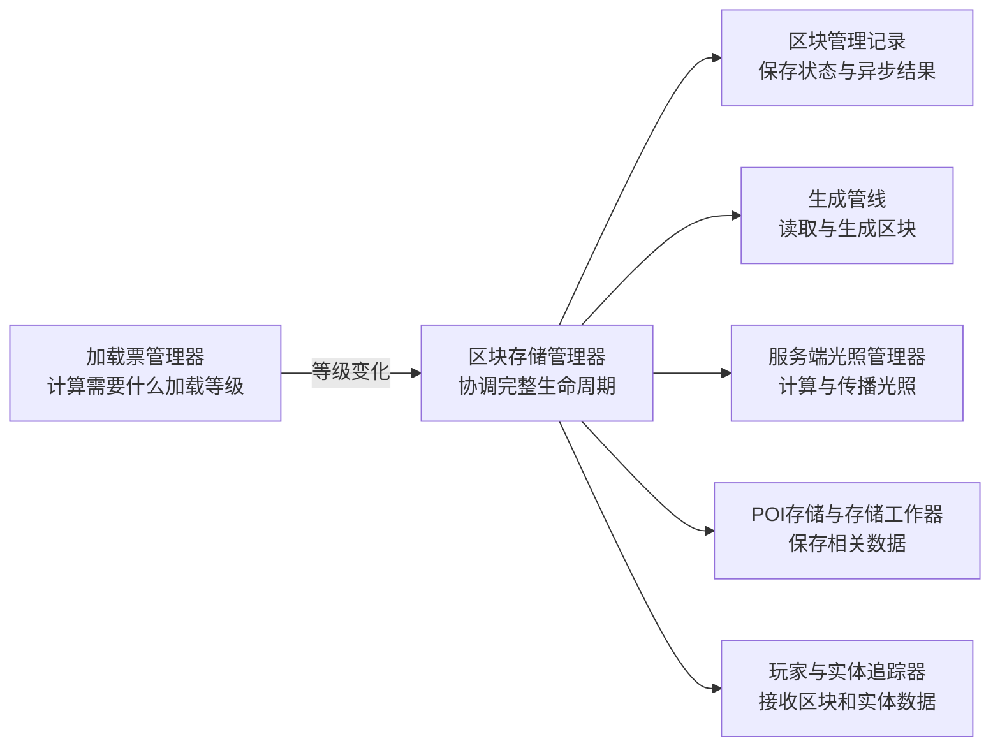
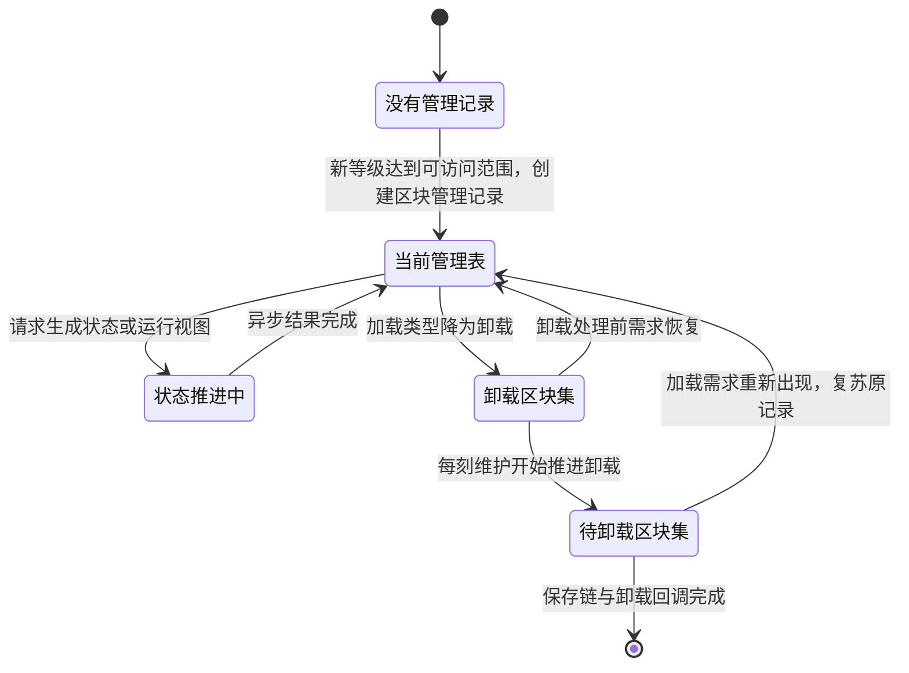
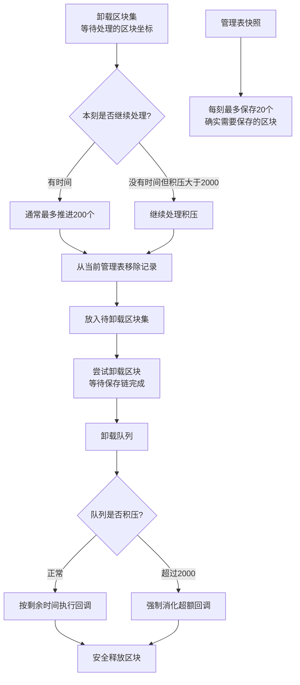

玩家走进新区域时，游戏从哪里决定加载哪些区块？当区块不再需要时，谁负责保存数据并释放内存？当玩家视距改变时，谁重新计算应发送的区块范围？

这些协调工作由**区块存储管理器**（`ThreadedAnvilChunkStorage`，源码中常简称 `TACS`）完成。它是服务端区块管理系统的中枢协调者：接收加载需求，创建并维护区块的管理记录，安排加载、生成、光照等异步任务，决定何时向玩家发送区块数据，以及在区块不再需要时保存并卸载。

本章将从读者视角解释管理器的职责和完整运行流程，然后展示支撑这一流程的核心数据结构。进阶部分保留源码级验证，包括加载等级变更的完整调用链、管理表快照机制、视距变更的数据包边界计算、区块存储管理器每刻维护中的处理位置、POI/卸载阶段和保存节流。

**基础部分**

- 管理器的职责边界：它决定什么，其他组件决定什么
- 从需求到卸载的完整生命周期
- 核心数据结构：当前管理表、卸载区块集、待卸载区块集和管理表快照
- 区块管理记录的创建与复苏
- 一个具体的加载场景

**进阶部分**

- 设置加载等级的规则和完整调用链
- 管理表快照的线程安全实现
- 视距变更时的数据包边界计算
- 区块存储管理器每刻维护中的处理位置
- POI 更新、卸载阶段和保存节流

## 管理器做什么，不做什么

区块存储管理器是**协调者**，理解它的职责边界是理解整个系统的关键。

### 管理器负责的事

- **创建和维护区块管理记录**：玩家进入新区域或加载需求改变时，管理器创建区块管理记录（`ChunkHolder`），或从待卸载区块集中复苏已有记录。
- **决定任务的触发时机**：根据加载等级的变化，决定何时触发加载、生成、光照计算等任务。
- **协调异步任务**：通过 `CompletableFuture`（异步结果）将任务提交给对应组件，并跟踪任务完成状态。
- **管理玩家视野**：维护每个玩家的视野中心，计算应发送的区块范围，触发区块数据包的发送。
- **决定卸载时机**：当加载需求消失时，将区块管理记录标记为待卸载，在适当时机保存数据并释放内存。
- **维护全局索引**：维护当前管理表、卸载区块集、待卸载区块集和管理表快照。

### 管理器不负责的事

- **加载等级的决策**：加载等级由加载票管理器（`ChunkTicketManager`，见第03章）根据加载票计算得出，区块存储管理器只是接收并响应等级变化。
- **实际的加载、生成和光照计算**：这些任务由世界生成器、区块生成管线、光照引擎等专门组件执行，管理器只负责提交任务和跟踪结果。
- **区块状态的存储细节**：区块管理记录（`ChunkHolder`）本身维护各加载阶段的异步结果，管理器通过它们判断当前进度。
- **实体和兴趣点数据的管理**：实体追踪由实体追踪器（`EntityTracker`）负责，兴趣点更新由 POI 存储（`PointOfInterestStorage`）负责，管理器只在适当时机调用它们。
- **磁盘 I/O 的执行**：区块数据的序列化、排队和文件写入由区块序列化器（`ChunkSerializer`）、存储工作器（`StorageIoWorker`）和区域文件等组件完成；管理器负责发起并衔接保存流程。

简单来说：管理器是"项目经理"，它知道谁该做什么、什么时候做、做到什么程度，但它自己不写代码、不设计、不测试。



这张图只表示**职责和协调关系**，不表示所有组件都由区块存储管理器直接调用，也不表示这些工作在同一线程或同一时刻完成。

## 从需求到卸载：完整生命周期

让我们用一个完整的中文描述来理解区块管理记录从创建到卸载的全过程，然后再看支撑这一流程的数据结构。

### 第一阶段：需求出现

1. **加载票产生**：玩家移动、区块加载器加载、/forceload 命令等产生加载票（见第03章）。
2. **等级计算**：加载票管理器根据加载票计算目标加载等级（`targetLevel`）。
3. **通知管理器**：加载票管理器调用设置加载等级方法（`TACS.setLevel()`），传入区块坐标、新等级和区块管理记录。

### 第二阶段：创建或复苏管理记录

**如果区块没有管理记录**（当前管理表 `currentChunkHolders` 中不存在）：

- 管理器创建新的区块管理记录（`ChunkHolder`），设置初始等级，放入当前管理表（`currentChunkHolders`）。

**如果区块已在待卸载区块集**（`chunksToUnload`）中：

- 管理器将它从待卸载区块集中取回，相当于“复苏”这个管理记录。

### 第三阶段：推进区块所需的状态

加载等级首先决定区块当前需要达到什么程度的**生成状态**和**运行级别**。这两个概念不能混为一谈，详见[第03章：级别与运行态分层](./03-级别与运行态分层.zh.md)。

| 中文概念 | 源码概念 | 回答的问题 |
| --- | --- | --- |
| 区块生成状态 | `ChunkStatus` | 地形生成已经完成到哪一步？ |
| 区块加载类型 | `ChunkLevelType` | 区块现在可以被访问、执行方块运算或执行实体运算吗？ |

区块存储管理器并不会看到一个等级后，立刻列出并执行一组固定任务。实际过程是：区块管理记录收到新等级，在后续处理等级变化时建立相应的异步结果；当某个生成状态被请求时，管理器再通过获取指定生成状态的区块（`getChunkAt()`）、获取生成所需的区块区域（`getRegion()`）等入口协调目标区块和周围依赖区块，安排读取、生成或光照工作。

因此，加载等级表达的是“需要达到什么程度”，`ChunkStatus` 和异步结果表达的是“现在已经做到什么程度”。

### 第四阶段：让结果对其他系统可用

当相应的异步结果完成后，等待该结果的系统才能继续工作。例如，区块可以进入可访问状态、获得弱加载或强加载资格，或者在满足客户端可见性条件时向玩家发送区块数据。区块数据和实体追踪是两套相邻但不同的流程：管理器协调区块数据包，实体追踪器（`EntityTracker`）负责实体追踪数据。

### 第五阶段：需求消失

1. **加载票移除**：玩家离开、加载器关闭、/forceload 取消等导致加载票消失。
2. **加载类型降为卸载**：加载票管理器重新计算后，区块进入卸载（`INACCESSIBLE`）类型。
3. **登记卸载请求**：管理器先把区块坐标加入卸载区块集（`unloadedChunks`）。真正从当前管理表移出，要等到卸载阶段开始处理这个标记。

### 第六阶段：保存和卸载

在区块存储管理器的每个 tick 末尾，它依次完成三类收尾工作：

1. 从卸载区块集（`unloadedChunks`）中取出一批卸载标记，把对应区块管理记录从当前管理表移入待卸载区块集（`chunksToUnload`），并安排异步卸载。通常每刻最多推进 200 个标记；积压超过 2000 时会加速处理。
2. 执行已经完成前置等待的卸载回调。只有保存链和其他依赖已经安全结束，区块才真正释放。
3. 另外遍历仍在活动的区块管理记录，每刻最多增量保存 20 个确实需要保存的区块，避免集中写盘。

整个生命周期可以概括为：



需要注意：图中的“状态推进中”不是一张长期保存区块的表，而是区块管理记录中的异步结果正在完成的过程。

## 核心数据结构

理解了生命周期后，我们来看支撑这一流程的数据结构。

### 当前管理表 `currentChunkHolders`

```java
Long2ObjectLinkedOpenHashMap<ChunkHolder> currentChunkHolders
```

**存储内容**：当前维度中所有**有管理记录**的区块。key 是 `ChunkPos.toLong()` 序列化后的 `long`，value 是对应的 `ChunkHolder`。

**何时加入**：区块首次进入可访问范围，或从待卸载区块集复苏时。

**何时移除**：区块的卸载标记在每刻维护末尾被处理时，对应区块管理记录才从当前管理表移入待卸载区块集。

### 卸载区块集 `unloadedChunks`

```java
LongSet unloadedChunks
```

**存储内容**：已经失去可访问需求、等待进入卸载流水线的区块坐标。

**何时加入**：区块从可访问类型降为卸载类型时。

**何时移除**：卸载阶段开始处理该坐标，或者区块重新变为可访问。

### 待卸载区块集 `chunksToUnload`

```java
Long2ObjectMap<ChunkHolder> chunksToUnload
```

**存储内容**：已经从当前管理表移出，但仍在等待保存链或卸载回调完成的区块管理记录。

**为什么不能立即删除**：区块管理记录可能还有生成、保存或其他异步结果尚未结束。保留它可以让卸载等待这些工作安全收尾；如果需求在此期间重新出现，也可以直接复苏原有记录。

### 管理表快照 `chunkHolders`

```java
private volatile Long2ObjectLinkedOpenHashMap<ChunkHolder> chunkHolders = this.currentChunkHolders.clone();
```

**存储内容**：当前管理表的副本，供每刻维护（`tick()`）和保存区块（`save()`）等需要稳定遍历的场景使用。

**更新时机**：每当 `currentChunkHolders` 修改后，主线程重新 clone 一份。

**为什么需要快照**：避免遍历过程中因其他线程的修改导致 `ConcurrentModificationException`。这是一种 **Copy-On-Write** 模式：写入端（主线程）更新时成本高，但读取端（tick/save）可以零开销地安全遍历。

> [!NOTE] 与加载票管理器的 `chunkHolders` 的区别
>
> - 区块存储管理器的管理表快照（`TACS.chunkHolders`）：当前维度**所有**活跃区块管理记录的完整映射表。
> - 加载票管理器的变化记录集（`ChunkTicketManager.chunkHolders`）：仅收集本轮每刻维护中**加载等级发生变化的**区块管理记录，用于后续通知回调。

### 其他辅助表

| 表名 | 类型 | 用途 |
|------|------|------|
| 区块类型表（`chunkToType`） | `Long2ByteMap` | 记录区块的类型（已生成区块、生成中区块等） |
| 已加载区块（`loadedChunks`） | 通过版本化区块存储（`VersionedChunkStorage`）间接管理 | 已从磁盘加载或已生成完毕、数据在内存中的区块 |

## 创建和复苏：何时决定

管理器如何决定是创建新记录还是复苏旧记录？关键在于：新的等级是否已经达到可访问范围，以及待卸载区块集（`chunksToUnload`）中是否还保留着尚未完成卸载的旧记录。

### 创建新记录的条件

当新等级已可访问而当前没有区块管理记录时，管理器先查找待卸载区块集；只有找不到可以复苏的旧记录时，才创建新的区块管理记录。

**触发场景**：

- 玩家首次进入一个从未加载的区域。
- /forceload 命令强制加载一个新区块。
- 区块已经完全卸载并从内存中移除。

### 复苏旧记录的条件

如果从待卸载区块集移除记录（`chunksToUnload.remove(pos)`）时能取回旧记录，管理器就为它更新加载等级并重新放入当前管理表。源码中的 `remove` 在这里既是“取消卸载”，也是“取回旧记录”。

**触发场景**：

- 玩家离开后又快速返回同一区域。
- 加载器关闭后又重新激活。

**复苏的好处**：保留已完成的任务进度（如已生成的地形、已计算的光照），避免重复计算。

## 一个具体场景

让我们通过一个实际例子来验证上述流程。

**问题**：玩家走近一个此前不需要加载的区块，之后又很快离开并返回。这个区块的管理记录会经历什么？

### 第 1 步：加载票产生

玩家位置等因素会改变周围区块的加载需求。加载票管理器据此更新加载票，并把影响沿区块距离传播。

### 第 2 步：等级传播

当目标区块的加载等级发生变化时，加载票管理器通过内部的设置加载等级方法（`TicketManager.setLevel()`），把新旧等级交给区块存储管理器。

### 第 3 步：创建管理记录

如果新的等级已经可访问，而当前管理表和待卸载区块集里都没有对应记录，管理器才创建新的区块管理记录，并放入当前管理表。

### 第 4 步：安排任务

区块管理记录在处理等级变化时建立所需的异步结果。之后，当外部请求某个生成状态或运行视图时，区块存储管理器协调读取、生成、光照和周边区块依赖，使这些异步结果逐步完成。

### 第 5 步：任务完成

读取、生成和光照工作可以在相应的任务通道中推进；需要修改世界状态的步骤则回到主线程。每个阶段完成后会完成对应的异步结果，让下一阶段或等待者继续运行。具体任务执行方式见[第05章：主线程异步任务](./05-主线程异步任务.zh.md)。

### 第 6 步：发送数据

当区块数据已经准备好，而且该区块从玩家视距外进入视距内时，管理器向玩家发送相应的区块数据。实体是否参与运算、实体追踪数据何时发送，还要分别满足运行级别和实体追踪条件。

### 第 7 步：玩家离开

玩家继续远离后，相关加载需求减弱。加载票管理器重新计算等级；当区块退出可访问范围时，管理器开始登记卸载。

### 第 8 步：标记卸载

管理器收到等级变化通知后，先把该坐标加入卸载区块集。在之后的卸载阶段，它才把区块管理记录从当前管理表移到待卸载区块集，并安排等待保存链完成的卸载回调。

### 第 9 步：保存和释放

在接下来的每刻维护中，管理器推进卸载流水线。需要保存的数据会经过序列化和存储工作器写入；等区块管理记录的保存链与卸载回调完成后，区块数据才从内存中释放。

### 如果玩家快速返回

如果在第 8 步后、第 9 步完成前，玩家又返回 (0, 5)：

1. 加载票管理器重新计算出一个可访问的加载等级。
2. 如果旧记录仍在待卸载区块集中，管理器将其取回，更新等级并重新放入当前管理表。
3. 已经完成且仍然有效的结果可以继续使用；后续仍需完成哪些工作，则由区块管理记录当前状态和新的请求共同决定。

**答案**：区块不会在“失去需求”的瞬间立即消失。卸载被拆成登记、移出当前表、等待异步收尾和最终释放几个阶段，因此短时间内重新出现的需求有机会复用原有区块管理记录。

## 小结

区块存储管理器是区块管理系统的协调中枢。它不决定加载等级（加载票管理器做），不执行生成和光照计算（生成管线和光照引擎做），但它知道何时创建管理记录、何时安排任务、何时发送数据、何时保存和卸载。

理解管理器的职责边界和完整生命周期，是理解区块管理系统的关键。接下来的进阶部分将展示源码级的实现细节，验证上述流程的具体机制。

---

## 进阶：源码验证

接下来的内容面向希望验证实现细节或需要定位源码位置的读者。每个小节先陈述规则，再展示源码片段验证。

### 设置加载等级 `setLevel()` 的规则和完整调用链

**规则**：管理器通过设置加载等级方法（`setLevel()`）接收加载等级变更通知。这个方法负责创建、复苏、更新或标记区块管理记录；具体要建立哪些运行视图和生成状态异步结果，则由记录后续处理等级变化时决定。

**调用链**：

```
加载票等级传播完成
  → TicketManager.setLevel(pos, newLevel, holder, oldLevel)
    → 区块存储管理器设置加载等级 setLevel(...)
      → 创建、复苏或更新区块管理记录
  → 后续每刻维护中由 holder.tick(...) 处理加载类型升降
  → 获取指定生成状态的区块 getChunkAt()/获取生成所需的区块区域 getRegion()
    在状态被请求时协调读取和生成
```

**源码验证**（按 1.20.1 Yarn 原逻辑删去构造参数）：

```java
// ThreadedAnvilChunkStorage.java
ChunkHolder setLevel(long pos, int level, @Nullable ChunkHolder holder, int oldLevel) {
    if (!ChunkLevels.isAccessible(oldLevel)
        && !ChunkLevels.isAccessible(level)) {
        return holder;
    }

    if (holder != null) {
        holder.setLevel(level);
    }

    if (holder != null) {
        if (!ChunkLevels.isAccessible(level)) {
            this.unloadedChunks.add(pos);
        } else {
            this.unloadedChunks.remove(pos);
        }
    }

    if (ChunkLevels.isAccessible(level) && holder == null) {
        holder = this.chunksToUnload.remove(pos);
        if (holder != null) {
            holder.setLevel(level);
        } else {
            holder = new ChunkHolder(new ChunkPos(pos), level, ...);
        }
        this.currentChunkHolders.put(pos, holder);
    }
    return holder;
}
```

**关键设计**：

- 新旧等级都属于卸载类型时，不需要改变管理表结构。
- 已有区块管理记录时，先更新它记录的目标等级；新等级属于卸载类型时只加入卸载区块集，不会在这里立即销毁。
- 新等级可访问但当前没有区块管理记录时，先从待卸载区块集取回旧记录；只有取不到时才新建。
- 设置加载等级方法完成的是管理记录的衔接，不等于生成任务已经执行。

### 管理表快照的线程安全实现

**规则**：管理表快照（`chunkHolders`）是当前管理表（`currentChunkHolders`）的快照，供需要稳定遍历的场景使用，避免并发修改异常。

**源码验证**：

```java
// ThreadedAnvilChunkStorage.java
private final Long2ObjectLinkedOpenHashMap<ChunkHolder> currentChunkHolders = new Long2ObjectLinkedOpenHashMap<>();
private volatile Long2ObjectLinkedOpenHashMap<ChunkHolder> chunkHolders = this.currentChunkHolders.clone();

// 当管理表发生结构变化后，在主线程重建快照引用
this.chunkHolders = this.currentChunkHolders.clone();
```

**关键设计**：

- `volatile` 保证可见性，其他线程能看到最新的快照引用。
- `clone()` 创建新的映射表，但引用的 `ChunkHolder` 对象是共享的（浅拷贝）。
- 这是一种**读多写少**优化：写入时成本高（clone），但读取时零开销。

### 设置视距 `setViewDistance()` 时的数据包边界计算

**规则**：当服务端视距改变时，管理器比较每个区块在新旧视距下是否可见；只有“进入视野”或“离开视野”的边界状态发生变化时，才发送或取消区块渲染数据（`sendWatchPackets()`）。

**源码验证**（按原 `setViewDistance()` 逻辑简化）：

```java
// ThreadedAnvilChunkStorage.java
protected void setViewDistance(int watchDistance) {
    int newDistance = MathHelper.clamp(watchDistance, 2, 32);
    if (newDistance != this.watchDistance) {
        int oldDistance = this.watchDistance;
        this.watchDistance = newDistance;
        this.ticketManager.setWatchDistance(newDistance);
        for (ChunkHolder holder : this.currentChunkHolders.values()) {
            ChunkPos pos = holder.getPos();
            this.getPlayersWatchingChunk(pos, false).forEach(player -> {
                boolean wasVisible = isWithinDistance(pos, playerPos, oldDistance);
                boolean isVisible = isWithinDistance(pos, playerPos, newDistance);
                if (wasVisible != isVisible) {
                    this.sendWatchPackets(player, pos, ...);
                }
            });
        }
    }
}
```

**关键设计**：

- 新旧范围内都可见的区块不会重发。
- 从可见变为不可见时同样要发送相应的取消观察信息，而不只是处理新增区块。

### 区块存储管理器每刻维护 `tick()` 中的处理位置

**规则**：区块存储管理器的每刻维护（`tick()`）位于加载票变化和正常区块运算之后，主要负责 POI 持久化与区块卸载收尾；它不在这里执行世界生成或方块刻。

**调用位置**：

```
ServerChunkManager.tick()
  → 清理过期加载票
  → 处理加载票导致的等级变化
  → 如需要，执行区块内游戏逻辑
  → 区块存储管理器每刻维护 tick()
      → POI 持久化
      → unloadChunks()
```

**源码验证**：

```java
// ThreadedAnvilChunkStorage.java
protected void tick(BooleanSupplier shouldKeepTicking) {
    this.pointOfInterestStorage.tick(shouldKeepTicking);
    if (!this.world.isSavingDisabled()) {
        this.unloadChunks(shouldKeepTicking);
    }
}
```

**关键设计**：

- POI 的脏数据在这一阶段持续写回。
- 世界关闭保存时，常规卸载处理会被跳过；保存行为由相应的保存流程接管。

### POI 更新、卸载区块 `unloadChunks()` 和保存节流

**规则**：卸载不是一次删除，而是三段流水线：先把卸载区块集中的标记转成待卸载区块集中的管理记录，再执行已经就绪的卸载回调，最后增量保存仍在活动但已经变脏的区块。



图中“200”和“20”属于两条不同的限流：前者限制卸载标记通常推进多少个，后者限制活动区块实际保存多少个。

**源码验证**（删去与流程无关的局部变量类型）：

```java
private void unloadChunks(BooleanSupplier shouldKeepTicking) {
    // 1. 卸载区块集 unloadedChunks → 待卸载区块集 chunksToUnload
    for (int moved = 0; unloadedIterator.hasNext()
        && (shouldKeepTicking.getAsBoolean()
            || moved < 200 || this.unloadedChunks.size() > 2000);
        unloadedIterator.remove()) {
        long pos = unloadedIterator.nextLong();
        ChunkHolder holder = this.currentChunkHolders.remove(pos);
        if (holder != null) {
            this.chunksToUnload.put(pos, holder);
            this.tryUnloadChunk(pos, holder);
            moved++;
        }
    }

    // 2. 卸载队列积压超过 2000 时，优先执行一部分卸载回调
    int excess = Math.max(0, this.unloadTaskQueue.size() - 2000);
    while ((shouldKeepTicking.getAsBoolean() || excess > 0)
        && (task = this.unloadTaskQueue.poll()) != null) {
        excess--;
        task.run();
    }

    // 3. 每刻最多增量保存 20 个确实需要保存的区块管理记录
    int saved = 0;
    for (ChunkHolder holder : this.chunkHolders.values()) {
        if (saved >= 20 || !shouldKeepTicking.getAsBoolean()) break;
        if (this.save(holder)) saved++;
    }
}
```

**关键设计**：

- “200”限制的是每刻通常从卸载区块集推进多少个区块管理记录，不是保存数量。
- “20”才是活动区块管理记录的每刻增量保存上限，而且只有保存区块（`save(holder)`）确实执行时才计数。
- 卸载回调积压超过 2000 时，即使本刻时间紧张，也会强制消化超出的部分，以免待释放对象持续占用内存。
- POI 的脏数据由 POI 存储的每刻维护（`pointOfInterestStorage.tick()`）推进；区块、实体和 POI 各有自己的存储路径，不能视为一次统一的保存区块调用。

## 总结

区块存储管理器的设计哲学是**协调而非执行**。它维护全局状态（当前管理表、卸载区块集、待卸载区块集和管理表快照），响应外部通知（加载等级变更），触发异步任务（生成、光照），但将实际执行委托给专门组件。

这种分工使得系统各部分职责清晰：加载票管理器决定“要什么”，区块存储管理器决定“何时做”，生成管线和光照引擎决定“怎么做”。理解这一分工，是理解整个区块管理系统的基础。

进一步的细节，如世界生成管线、光照计算、实体追踪等，将在后续章节展开。管理器只是整个系统的一部分，但它是连接各部分的关键枢纽。

---

**参考资料**

- Minecraft Wiki: [Chunk](https://minecraft.wiki/w/Chunk)
- Yarn 映射表 (1.20.1): `net.minecraft.server.world.ThreadedAnvilChunkStorage`
- [Discovering Minecraft - 区块管理系统的基本架构](https://github.com/lovexyn0827/Discovering-Minecraft)（CC0 协议）
- [第03章：级别与运行态分层](./03-级别与运行态分层.zh.md)
- [第05章：主线程异步任务](./05-主线程异步任务.zh.md)
