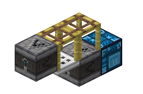

## 什么是树电与脚电

树电和脚电是两种基于方块状态传播的信号传递机制。它们都依赖一个共同的概念：`distance`——方块到“支撑源”的距离。

树电利用树叶方块的 `distance` 属性，通过改变树叶到原木的距离触发状态变化；脚电利用脚手架方块的 `distance` 属性，通过改变脚手架到固体支撑方块的水平距离触发状态变化。

两者都可以用于制造**奇数 gt 延迟**，是无粉布线中重要的信号传递方式。

## 树电的基本机制

### distance 的概念

每个树叶方块都有一个 `distance` 属性，取值范围是 1 到 7。这个值表示树叶到最近原木的距离：

- 与原木直接相邻的树叶，`distance` 为 1
- 与 `distance=1` 树叶相邻的树叶，`distance` 为 2
- 依此类推，最大为 7

需要注意的是，原木本身在计算中被视为 `distance=0`，但**实际存储的树叶 distance 最小值是 1**。换句话说，树叶不会将自己的 distance 设为 0，即使它紧贴原木。仓库中较早的无粉布线概述曾将这两者混写为“树叶设为 0”；本文以源码中的属性范围与计算逻辑为准。

### 距离的计算方式

树叶在计算自己的 `distance` 时，会检查六个方向（上下东西南北）的相邻方块：

1. 如果相邻方块是原木（或其他被标记为树干的方块），则将自己的 `distance` 设为 1
2. 如果周围没有原木，则找出相邻树叶中最小的 `distance` 值，然后**加 1** 作为自己的 `distance`
3. 计算值被限制在 7；非持久树叶在 `distance=7` 时等待随机刻凋落

这个过程可以概括为：**六方向最小值 + 1**。[^1]

[^1]: 源码路径 `LeavesBlock.java` 第 84-97 行的 `updateDistanceFromLogs` 方法。实际实现中，原木通过 `getDistanceFromLog` 返回 0，所以毗邻原木的树叶计算为 0+1=1。

### 状态更新的触发条件

在相邻方块状态变化后，树叶会通过 `getStateForNeighborUpdate` 方法响应 PP 更新，并调度一个延迟为 1 的**计划刻**（Scheduled Tick）。[^2]

[^2]: 源码路径 `LeavesBlock.java` 第 69-82 行的 `getStateForNeighborUpdate` 与第 58-61 行的 `scheduledTick`。前者在相邻方块的 `distance` 计算值不为 1，或者树叶自身 `distance` 与该值不同时，调用 `world.scheduleBlockTick(pos, this, 1)`；后者在计划刻到期时重新计算并写回状态。

检查过程如下：

1. 计划刻执行时，调用 `scheduledTick` 方法
2. 重新计算 `distance`（调用 `updateDistanceFromLogs`）
3. 调用 `setBlockState` 更新方块状态，使用 `Block.NOTIFY_ALL` 标志
4. 如果 `distance` 没变化，方块状态不变，不发出更新

这个“接收 PP 更新 → 调度计划刻 → 计算 distance → 更新状态 → 发出更新”的过程会在相邻树叶上重复触发，形成**连锁传播**。

### 树电的传播特性

树电的传播不是瞬时的，也不是完全线性的。它的速度取决于：

- PP 更新的触发顺序
- 计划刻的调度时机
- 方块的相对位置

接收到 PP 更新后，树叶会调度一个延迟为 1 的计划刻。同一位置的同一方块类型如果收到多次调度请求，调度器会通过哈希去重，只保留一个计划刻。因此**实际的传播延迟取决于计划刻的调度阶段、优先级和子刻顺序**，无法简单概括为“每层 1 gt”。[^3]

[^3]: 调度器使用 `OrderedTick.HASH_STRATEGY` 进行去重，排序依据 `triggerTick → priority → subTickOrder`。详见进阶篇。

### 树电的典型用途

通常通过**活塞或粘液块推拉原木**来改变树叶到原木的距离，从而触发树电传播：

- **上升沿信号**：将原木推向树叶，缩短距离，触发 `distance` 减小的传播
- **下降沿信号**：将原木拉离树叶，拉长距离，触发 `distance` 增大的传播

当 `distance` 增大到 7 时，非持久树叶不会立即凋落，而是等待下一次**随机刻**（Random Tick）才会变为空气。[^4]

[^4]: 源码路径 `LeavesBlock.java` 第 42-55 行。`distance=7` 且 `PERSISTENT=false` 的树叶会启用随机刻检查（`hasRandomTicks` 返回 true），在 `randomTick` 中调用 `shouldDecay` 判断后移除。随机刻的触发时机由游戏规则 `randomTickSpeed` 控制，无法预测。

## 脚电的基本机制

### distance 的概念

脚手架的 `distance` 取值范围是 0 到 7，表示脚手架到**固体支撑方块**的水平距离：

- 下方直接放置在固体方块上的脚手架，`distance` 为 0
- 下方是 `distance=0` 脚手架的脚手架，**继承下方脚手架的 distance**，也是 0
- 水平方向相邻的脚手架，取最小 `distance + 1`
- 计算到 `distance=7` 时，如果旧状态已是 7 则变为下落方块，如果新到达 7 则破坏并掉落物品

脚手架的 `distance` 计算与树叶有两个关键区别：

1. 脚手架会检查**下方方块是否提供全上表面固体支撑**（`isSideSolidFullSquare(world, mutable, Direction.UP)`），如果是则 `distance=0`；如果下方是另一个脚手架则直接**继承**其 `distance`；都不满足时才检查水平四方向
2. 脚手架只关心**水平方向**的相邻脚手架，上方的脚手架不会为下方提供支撑

这个判断顺序是固定的：先检查自己下方，再检查四个水平方向。[^5]

[^5]: 源码路径 `ScaffoldingBlock.java` 第 133-154 行的 `calculateDistance` 方法。逻辑：如果下方方块是脚手架，继承其 `DISTANCE`；否则如果下方方块提供全上表面固体支撑，返回 0；否则从水平四方向的脚手架中取最小 `distance+1`。

### 状态更新的触发条件

与树叶类似，脚手架在接收到 PP 更新后，会通过 `getStateForNeighborUpdate` 调度一个延迟为 1 的**计划刻**。[^6]

[^6]: 源码路径 `ScaffoldingBlock.java` 第 81-93 行。在非客户端环境下，调用 `world.scheduleBlockTick(pos, this, 1)`。

检查过程如下：

1. 计划刻执行时，调用 `scheduledTick` 方法
2. 重新计算 `distance`（调用 `calculateDistance`）
3. 构造新状态 `blockState`
4. 如果新 `distance=7`：
   - 若旧状态已经是 7，调用 `FallingBlockEntity.spawnFromBlock` 生成下落方块实体
   - 若旧状态不是 7，调用 `world.breakBlock` 破坏方块并掉落物品
5. 否则如果状态变化，调用 `setBlockState` 更新状态，使用 `Block.NOTIFY_ALL` 标志

脚手架的 `distance=7` 处理有双分支逻辑：如果脚手架在上一次检查时就是 7，它会变成下落方块实体；如果是新到达 7，则直接破坏并掉落物品。[^7]

[^7]: 源码路径 `ScaffoldingBlock.java` 第 96-108 行。这个区别影响脚手架的下落动画和物品掉落位置。

### 脚电的传播特性

脚电的传播方式与树电类似，都是通过 PP 更新驱动的计划刻完成的。实际传播延迟同样取决于调度阶段、优先级和子刻顺序。

由于脚手架会直接继承下方脚手架的 `distance`，同一竖直柱中的脚手架可以具有相同的距离值；但各格状态何时写回，仍取决于各自计划刻的调度与执行顺序。

### 脚电的典型用途

脚电通常由**活板门的状态变化**触发：

- 在脚手架下方放置活板门
- 活板门打开/关闭会改变其固体支撑属性
- 脚手架检测到下方支撑变化，重新计算 `distance`
- 状态变化沿水平方向传播

脚电同样可以用于制造**奇数 gt 延迟**，使用场景与树电类似。

## 树电与脚电的对比

| 特性          | 树电                   | 脚电                                       |
| ------------- | ---------------------- | ------------------------------------------ |
| distance 范围 | 1-7（原木内部视为 0）  | 0-7                                        |
| 计算方向      | 六方向                 | 下方优先，然后水平四方向                   |
| 到达上限后    | 随机刻凋落             | 双分支：已是 7 变下落方块，新到 7 破坏掉落 |
| 典型触发方式  | 推拉原木               | 活板门开关                                 |
| 传播特性      | PP 驱动，计划刻延迟    | PP 驱动，计划刻延迟                        |
| 常见用途      | 奇数 gt 延迟，树场检测 | 奇数 gt 延迟，紧凑布线                     |

两者的核心思想是一致的：通过改变方块到“支撑源”的距离，触发连锁的状态变化，实现信号传播。在实际应用中，选择哪一种取决于具体的空间布局和信号需求。

想了解树电传播的更深层机制，可以阅读进阶篇：[树电的复杂下降沿](./[进阶]树电的复杂下降沿.zh.md)。
