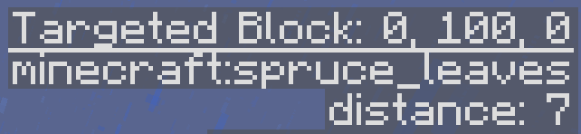
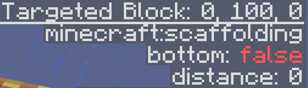
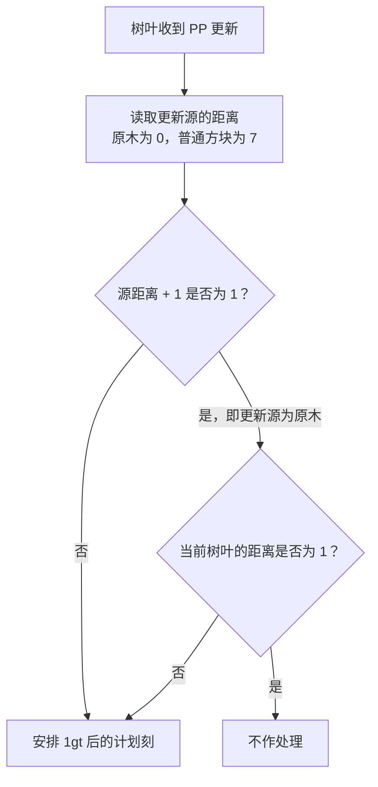
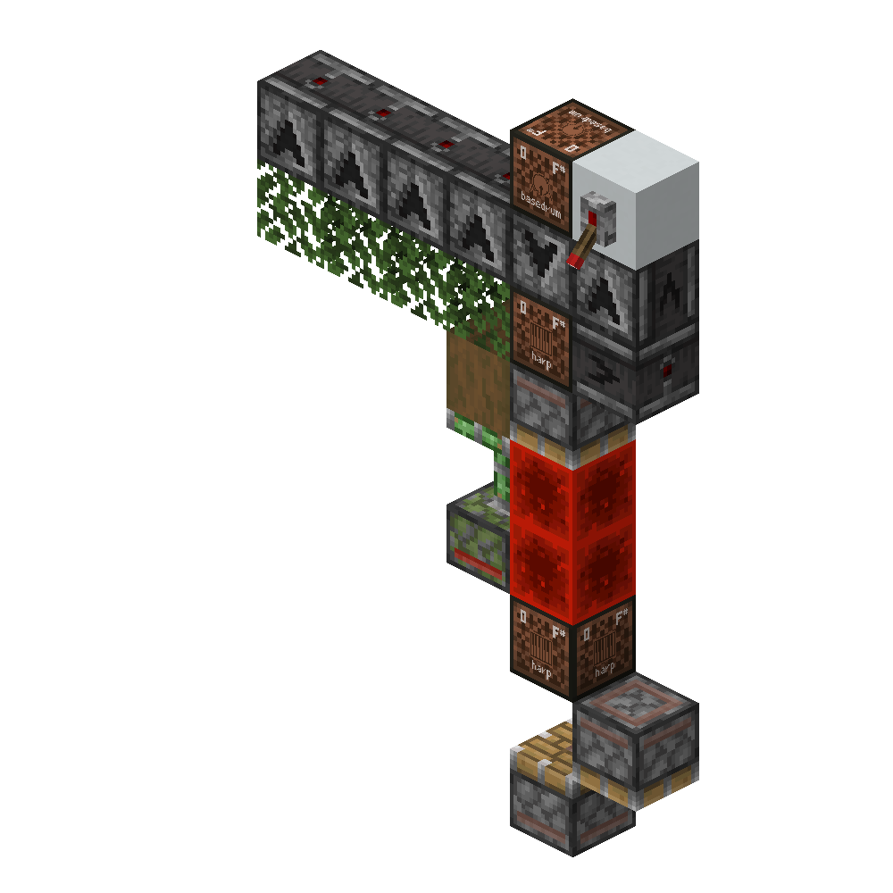
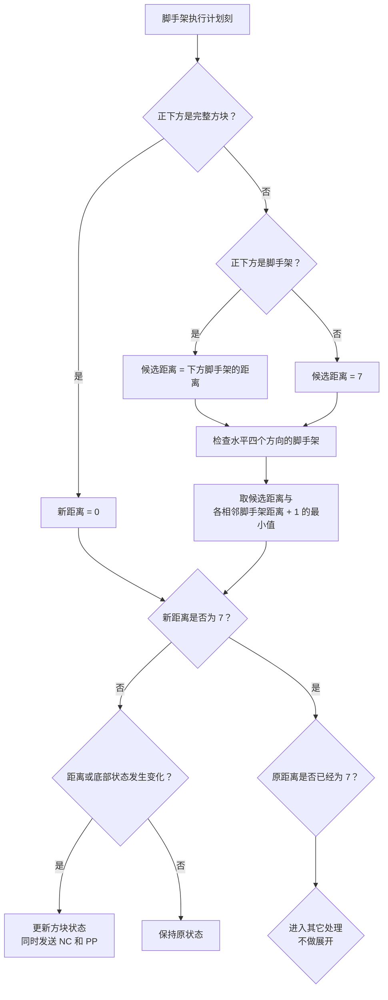

## "距离"

在红石社区里，"树电"和"脚电"是两个约定俗成的叫法，分别指利用树叶和脚手架的 `distance` 属性变化来传递信号。这两种方块在 `distance` 改变时都会发出 PP 更新（shape update），而相邻的同种方块收到 PP 更新后又会重新计算自己的 `distance`，从而形成连锁传播——这就是"树电"和"脚电"的底层原理。

后面讨论时，我们统一用"距离"来称呼 `distance` 属性。

按 `F3` 看向树叶或脚手架，就能直接看到当前的 distance 值：

本文的核心就是分析这个值是怎么变化的，以及它如何被用来传递信号。

## 树叶收到 PP 更新时

树叶不会响应 NC 更新。这里只讨论 PP 更新。另外本文不涉及流体计划刻，以下只给出和流体无关的逻辑。

当树叶收到邻居发来的 PP 更新时，会先读取更新源的距离。原木视为距离 0，其他树叶沿用自身的距离。

树叶随后用“源方块的距离 + 1”进行判断。只有一种情况不会安排计划刻：更新源是原木，并且当前树叶的距离已经是 1。除此之外，无论更新来自另一片树叶还是其他方块，树叶都会给自己安排一个 1gt 后的计划刻。

图中的判断只决定要不要安排计划刻，并不会立刻修改树叶的距离。真正的距离重算要等到计划刻执行时才发生。

## 树叶执行计划刻时

树叶的计划刻优先级为 0。执行时，它扫描周围六个方向，取其中最小的"距离 + 1"作为自己的新距离，上限为 7。注意原木本身被视为距离 0。

距离更新时，其发出一阶毗邻NC和PP更新。

## 一个完整的时序例子

下面这张图展示了树电的一个典型应用场景：

拉杆松开后 2gt，到第 12gt 之间，完整时序如下。为了简洁，省略了方向性无关的细节——总的来说，树电的传播没有方向性。

> 标注"（失败）"表示该树叶已经在计划刻队列中，重复添加不会生效。

- 0gt TT：
  - 音符盒发出 PP 更新
  - 树叶 A 添加计划刻
- 0gt BE：
  - 原木移除，发出 PP 更新
  - 树叶 A 添加计划刻（失败）
- 1gt TT：
  - 树叶 A distance=3，发出 PP 更新
  - 侦测器 A 添加亮起计划刻
  - 树叶 B 添加计划刻
- 2gt TT：
  - 树叶 B distance=4，发出 PP 更新
  - 侦测器 B 添加亮起计划刻
  - 树叶 A、C 添加计划刻
- 3gt TT：
  - 侦测器 A 添加熄灭计划刻，发出 PP 更新
  - 树叶 A 添加计划刻
  - 树叶 A distance=5，发出 PP 更新
  - 树叶 B 添加计划刻
  - 树叶 C distance=5，发出 PP 更新
  - 侦测器 C 添加亮起计划刻
  - 树叶 B 添加计划刻（失败）
  - 树叶 D 添加计划刻
- 3gt BE：
  - 原木到位，发出 PP 更新
  - 树叶 A 添加计划刻（失败）
- 4gt TT：
  - 侦测器 B 添加熄灭计划刻，发出 PP 更新
  - 树叶 B 添加计划刻
  - 树叶 A distance=1，发出 PP 更新
  - 树叶 B 添加计划刻（失败）
  - 树叶 B distance=2，发出 PP 更新
  - 树叶 A 添加计划刻
  - 树叶 C 添加计划刻
  - 树叶 D distance=6，发出 PP 更新
  - 树叶 C 添加计划刻（失败）
  - 侦测器 D 添加亮起计划刻
- 5gt TT：
  - 侦测器 A 执行熄灭计划刻，发出 PP 更新
  - 树叶 A 添加计划刻
  - 侦测器 C 执行亮起计划刻，添加熄灭计划刻，发出 PP 更新
  - 树叶 C 添加计划刻
  - 树叶 C distance=3，发出 PP 更新
  - 树叶 B 添加计划刻
  - 树叶 D 添加计划刻
- 6gt TT:
  - 音符盒发出 PP 更新
  - 树叶 A 添加计划刻
  - 侦测器 B 执行熄灭计划刻，发出 PP 更新
  - 树叶 B 添加计划刻
  - 侦测器 D 执行亮起计划刻，添加熄灭计划刻，发出 PP 更新
  - 树叶 D 添加计划刻
  - 树叶 D distance=6，发出 PP 更新
  - 树叶 C 添加计划刻
- 6gt BE：
  - 原木移除，发出 PP 更新
  - 树叶 A 添加计划刻（失败）
- 7gt TT：
  - 侦测器 C 执行熄灭计划刻，发出 PP 更新
  - 树叶 C 添加计划刻
  - 树叶 A distance=3，发出 PP 更新
  - 侦测器 A 添加亮起计划刻
  - 树叶 B 添加计划刻
  - 树叶 B distance=4，发出 PP 更新
  - 侦测器 B 添加亮起计划刻
  - 树叶 A 添加计划刻
  - 树叶 C 添加计划刻（失败）
  - 树叶 D distance=4，发出 PP 更新
  - 树叶 C 添加计划刻（失败）
  - 树叶 C distance=5，发出 PP 更新
  - 侦测器 C 添加亮起计划刻
  - 树叶 D 添加计划刻
  - 树叶 B 添加计划刻（失败）
- 8gt TT：
  - 侦测器 D 执行熄灭计划刻，发出 PP 更新
  - 树叶 D 添加计划刻
  - 树叶 A distance=5，发出 PP 更新
  - 树叶 B 添加计划刻
  - 树叶 D distance=6，发出 PP 更新
  - 侦测器 D 添加亮起计划刻
  - 树叶 C 添加计划刻
- 9gt TT：
  - 侦测器 A 执行亮起计划刻，添加熄灭计划刻，发出 PP 更新
  - 树叶 A 添加计划刻
  - 侦测器 B 执行亮起计划刻，添加熄灭计划刻，发出 PP 更新
  - 树叶 B 添加计划刻
  - 侦测器 C 执行亮起计划刻，添加熄灭计划刻，发出 PP 更新
  - 树叶 C 添加计划刻
  - 树叶 B distance=6，发出 PP 更新
  - 树叶 A 添加计划刻（失败）
  - 树叶 C 添加计划刻（失败）
  - 树叶 C distance=7，发出 PP 更新
  - 树叶 B 添加计划刻（失败）
  - 树叶 D 添加计划刻
- 9gt BE：
  - 原木到位，发出 PP 更新
  - 树叶 A 添加计划刻（失败）
- 10gt TT：
  - 侦测器 D 执行亮起计划刻，添加熄灭计划刻，发出 PP 更新
  - 树叶 D 添加计划刻
  - 树叶 A distance=1，发出 PP 更新
  - 树叶 B 添加计划刻
  - 树叶 B distance=2，发出 PP 更新
  - 树叶 A 添加计划刻
  - 树叶 C 添加计划刻
  - 树叶 C distance=3，发出 PP 更新
  - 树叶 B 添加计划刻（失败）
  - 树叶 D 添加计划刻（失败）
  - 树叶 D distance=4，发出 PP 更新
  - 树叶 C 添加计划刻（失败）
- 11gt TT：
  - 侦测器 A 执行熄灭计划刻，发出 PP 更新
  - 树叶 A 添加计划刻
  - 侦测器 B 执行熄灭计划刻，发出 PP 更新
  - 树叶 B 添加计划刻
  - 侦测器 C 执行熄灭计划刻，发出 PP 更新
  - 树叶 C 添加计划刻
- 12gt TT：
  - 音符盒发出 PP 更新
  - 树叶 A 添加计划刻
- 12gt BE：
  - 原木移除，发出 PP 更新
  - 树叶 A 添加计划刻（失败）
- ...

## 脚手架收到 PP 更新时

和树叶一样，脚手架也不响应 NC 更新，同样不在此讨论流体计划刻。

脚手架收到 PP 更新的处理非常简单：无论更新源是什么，只要收到了，就给自己安排一个 1gt 后的计划刻。

## 脚手架执行计划刻时

脚手架执行计划刻时，会重新检查自己与支撑点之间的距离：

1. 如果正下方方块的上表面能够提供完整支撑，距离直接记为 0。
2. 否则，先以 7 为初始值；如果正下方是脚手架，则改用下方脚手架的距离。
3. 接着检查水平四个方向。每找到一个相邻脚手架，就拿“该脚手架的距离 + 1”和当前结果比较，保留较小值。

这样算出的结果就是脚手架的新距离，最大为 7。换句话说，下方脚手架只是候选支撑路径之一；如果水平方向存在更近的支撑链，最终会采用水平方向算出的距离。

距离或底部支撑状态发生变化时，脚手架会同时发送 NC 和 PP 更新。
