## 机制

**基础部分**

- 活塞的组成
- 无头活塞的创建
- 活塞的自检触发方式与红石信号判定(QC半连接性)
- 活塞尝试移动方块的结构分析与通俗逻辑
- 活塞的更新顺序与方块事件响应

**进阶部分**

- 活塞自检与信号判定的源码调用
- b36转化顺序与推拉结构分析
- 方块移动底层实现与哈希表运用
- b36到位与实体运算

### 活塞的组成

完整意义上的活塞由两部分组成，分别是**活塞底座**与**活塞头**。

活塞底座完全控制活塞头，并且活塞由两种状态：`收回`与`伸出`。通常情况下，当活塞处于被激活状态时，其会同时更改活塞底座为伸出状态，并出现活塞头。当活塞处于收回状态时，其活塞头也随即消失。也有部分手段可以创造出只有活塞底座，没有活塞头的**无头活塞**；也可以通过某些手段创造出只有活塞头没有活塞底座的活塞。

### 无头活塞

#### 无头活塞的创建

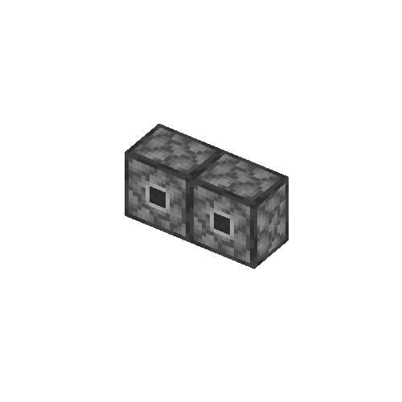

所有无头活塞的创建本质上只有两种办法，分别是：

1. 在活塞伸出时，活塞头处于b36状态时使用TNT等手段移除b36
2. 通过特定手段让未伸出的活塞触发收回事件。本内容会在后续更详细的阐述

#### 无头活塞的基本机制

活塞头其实在活塞底座看来依然存在，它就位于活塞底座的正前方。注意，活塞底座认为自己正前方是活塞头与自己正前方是否真的是活塞头无关。如果更新未被充能的无头活塞，无头活塞就会自检并收回。

### 活塞的自检机制

#### 触发方式

活塞当且仅当以下两种情况发生时触发自检：

1. 被放置(包括被玩家放置，或被其他活塞推拉到位放置)
2. 受到NC更新

必须强调的是，活塞的自检是可以发生在任意阶段的。换言之，其自检是瞬时的。当上述情况发生时，活塞会立即自检并通过一定的逻辑尝试推出或收回。这里的“尝试”并不代表一定会成功执行。

#### 红石信号的检查与QC充能

自检的本质是为了确认活塞是否需要动作，因此它会先判断自己是否被充能。

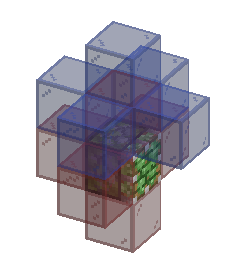

活塞检查信号的范围包括：

- 自身一阶毗邻(除推动方向外)的所有方块是否正在输出红石信号
- 自身**正上方一格方块为核心**的一阶毗邻方块是否正在输出红石信号

由于活塞会检查其上方方块的毗邻充能情况，这就导致了活塞可以通过上方的空间被“隔空”充能。这种充能无法直接对活塞发出NC更新，因此需要额外的NC更新来更新它，这就是活塞的半连接性(Quasi-Connectivity, 简称QC)的来源。这也是为什么BUD只能检查NC更新。

#### 自检逻辑通俗解释

活塞自检时，总是会遵循以下行为树：

1. 应伸出且未伸出：创建一个分析实例尝试分析前方的推动结构。如果分析失败(超过推动上限，有不可推动方块阻挡等)，则不动作；如果分析成功，则给自己当前位置添加一个**伸出**的方块事件
2. 不应伸出且已伸出：活塞需要收回
   - 如果前方是一个正在伸出的同向移动的"移动的活塞"(Moving_Piston, 或称B36,36号方块, 后续均简称b36)，且当前刻不会到位(进度<50%)，则触发**瞬推收回**，添加对应方块事件
   - 否则，执行**普通收回**，添加对应方块事件。

### 活塞的推拉与可推动方块

#### 可推动方块判定

一个方块要是能被活塞推动，必须同时满足以下要求:

1. 在世界有效高度范围内
2. 不能是黑曜石，哭泣的黑曜石，重生锚，或强化深板岩等硬编码不可推动方块
3. 方块硬度不能为-1
4. 如果是带釉陶瓦，被推动方向必须与活塞推动方向一致
5. 该方块不能带有方块实体(如箱子、熔炉、漏斗)

#### 尝试移动方块与结构分析

活塞在尝试推动时，会动态维护两个列表：**推动方块列表**与**破坏方块列表**。

它会以一定的顺序去顶前方将要推动的方块和将要破坏的方块结构。活塞只会注意在推动轴方向的可破坏方块，若方块附着在推动结构的侧面，则会在稍后被更新并掉落，而不会进入破坏列表。

> 提示：由于结构分析极其复杂(直线分析与分支分析交替入栈)，人工分析极为困难。强烈建议使用[Fallen_Breath的](https://fallenbreath.me/)[PistOrder模组](https://github.com/Fallen-Breath/pistorder)来直接在游戏内查看活塞尝试推动的方块到位顺序。

### 活塞的更新顺序

活塞的更新顺序总的来说分为五种情况：

- 活塞/粘性活塞只伸出
  1. 同活塞/粘性活塞推动方块，只是移动方块为空
- 活塞/粘性活塞只收回
  1. 创建活塞底座b36，发出PP更新和NC更新
  2. 移除活塞头，发出PP更新和NC更新
- 活塞/粘性活塞推动方块
  1. 移除破坏方块位置的方块
  2. 在移动的目标位置创建b36，发出PP更新
  3. 创建活塞头b36，发出红石粉prepare更新与PP更新
  4. 在破坏方块位置发出红石粉prepare更新和NC更新
  5. 在移动原位置发出NC更新
  6. 在活塞头位置发出NC更新
  7. 在活塞底座发出PP更新和NC更新。
- 粘性活塞收回方块
  1. 创建活塞底座b36，发出PP更新和NC更新
  2. 移除破坏方块位置的方块
  3. 在移动目标位置创建b36，发出PP更新
  4. 移除未被覆盖的方块，发出红石粉prepare更新，PP更新
  5. 移动原位置，发出NC更新
- 粘性活塞收回失败
  1. 创建活塞底座b36方块，发出PP更新和NC更新

我们发现，这个行为中不具备任何在活塞头的更新，也就是我们常说的粘性收回方块失败无更新。这里给几个实例：

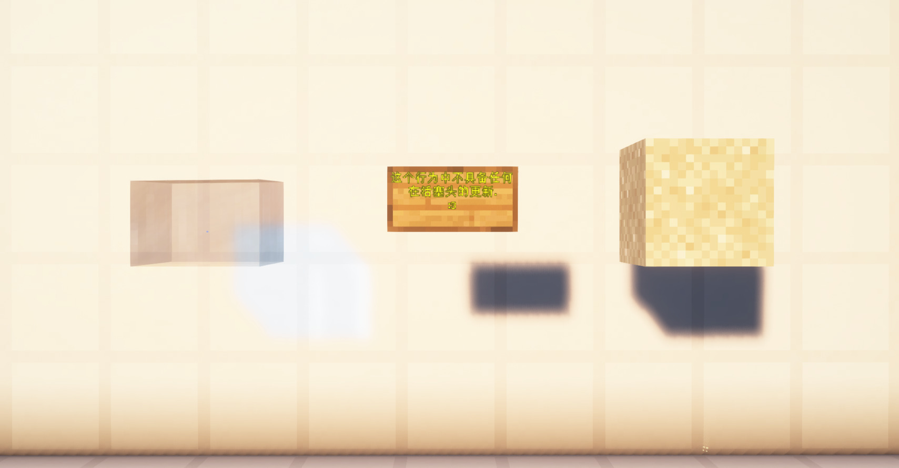
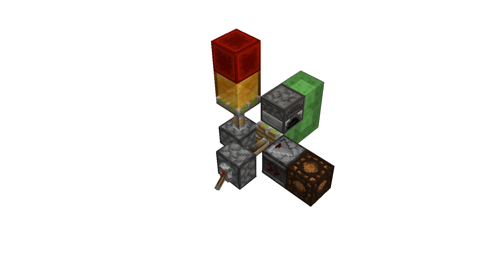

### b36与方块到位

#### 常规到位

在每个游戏刻的方块时阶段，b36会给自己的推动进度+0.5

- 0gt BE：开始推动，创建b36，此时进度为0
- 0gt TE：进度+0.5，进行实体位移运算
- 1gt TE：进度+0.5，进行实体位移运算，此事总进度达到1.0
- 2gt TE：发现进度已经大于等于1.0，b36变回原来方块，发出最终的PP和NC更新。

若我们从0gt AT开始观测的话，在3gt AT才算完全完成方块到位，因此就有了所谓活塞3gt延迟的说法

#### 瞬时到位

当活塞触发瞬推收回时，方块不会经理常规的TE阶段累加，而是直接强制到位。触发条件为：

- 收回事件，且活塞头位置当前方块时b36.
- 收回事件，粘性活塞伸出方向一格外为b36且该b36正在朝活塞推动轴同方向移动。

这里举两个例子做演示：

**活塞头位置为b36**

我们看如下的一个实例：

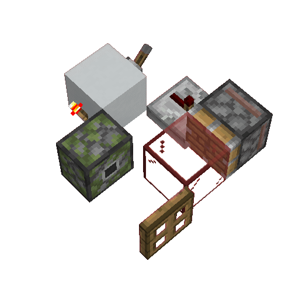

在这个实例中，红色玻璃被瞬间到位，这是从观测角度而言的，而从理论上，我们给出如下解释：

中继器的优先级高于红石火把，所以普通活塞先添加方块事件，无头粘性活塞再添加方块事件，尝试拉回更前方1格的方块（实际上此时actionType=1）

但是，在BE阶段，由于b36的插入，粘性活塞拉回受阻，并不会破坏这个b36，此时活塞头位置为b36，触发瞬时收回，红色玻璃瞬时到位。

**粘性活塞伸出方向一格外为b36且b36移动方向与活塞移动方向一致**

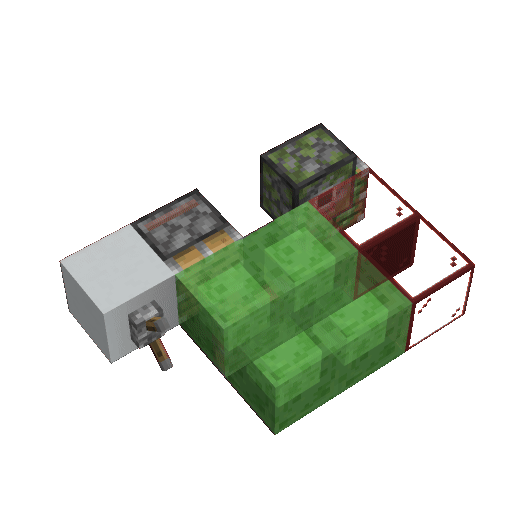

在以上实例中，红色玻璃被瞬时到位，是因为：

活塞推动粘液棒子，红色玻璃被移动，发出NC更新，触发无头粘性活塞的自检。此时，粘性活塞可以成功拉回，并且在伸出方向一格外存在b36，该b36推动方向与粘性活塞推动方向是一致的，因此被瞬时到位。

---

当然，值得注意的是，这种瞬时到位只会影响一格方块，也就是粘性活塞面前的方块，其余方块仍然会被转化为b36，所以，我们可以利用这一点稍微解读一下一种在许多人看来是魔法的装置：

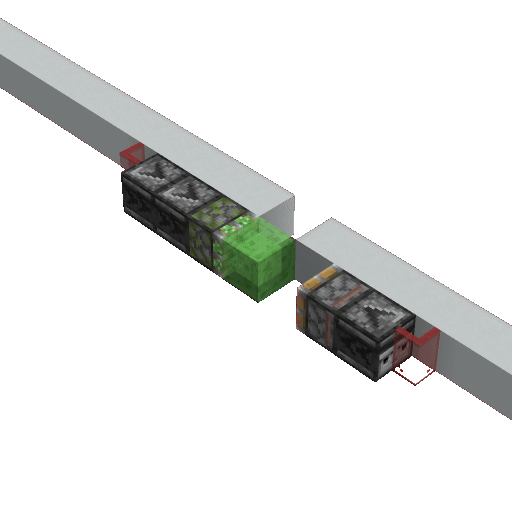

在这个装置中，当拉杆被拉下，粘性活塞会在方块到位1gt后移动它侧翼的方块，此时这个方块被粘液块带着向前推动，但由于粘性活塞是被侦测器激活的，该粘液块被提前到位，被活塞回推，而此时这个方块尚处于b36的状态，因此被留在了被带过去的位置，这样就实现了对方块流的延长。

瞬时到位会将进度直接设为1.0，移除b36方块实体，直接替换为原本的方块并发出更新。值得注意的是，瞬推不会附带对周围实体的位移推拉运算。

值得注意的是，由于笨蛋麻将并没有在这部分写任何实体运算或对含水方块的特殊判断，所以瞬推不会影响实体，也不会消除含水状态。但是值得注意的是，如果在此前经历了TE阶段的实体运算，在此前的实体运算会被保留，仅有当前gt的TE阶段的实体运算会被忽略。

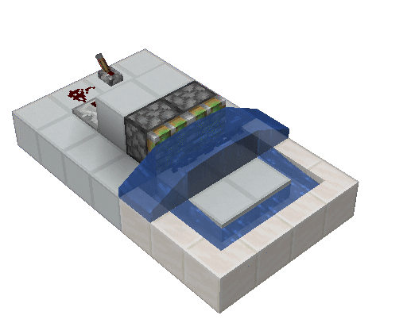

---

### :advanced 活塞自检逻辑与源码分析

#### 自检的三个入口

活塞有三个自检入口：被玩家放置、受到NC更新，以及被其他方式放入世界。三个入口虽然对应不同的源码方法，但职责相同：只在服务端发起一次**活塞动作检查**（源码方法`PistonBlock.tryMove`）。首次阅读时不需要记住三个方法名，只需记住它们最终会进入同一套判断。

```java
//被玩家放置
public void onPlaced(World world, BlockPos pos, BlockState state, LivingEntity placer, ItemStack itemStack) {
    if (!world.isClient) {
        this.tryMove(world, pos, state);
    }
}
//被NC更新
public void neighborUpdate(BlockState state, World world, BlockPos pos, Block sourceBlock, BlockPos sourcePos, boolean notify) {
    if (!world.isClient) {
        this.tryMove(world, pos, state);
    }
}
//被其他东西放置
public void onBlockAdded(BlockState state, World world, BlockPos pos, BlockState oldState, boolean notify) {
    if (!oldState.isOf(state.getBlock())) {
        if (!world.isClient && world.getBlockEntity(pos) == null) {
            this.tryMove(world, pos, state);
        }
    }
}
```

#### 充能状态检查（`shouldExtend`）

充能状态检查负责回答一个问题：**活塞此刻是否应该伸出？**它先检查活塞自身周围，再检查活塞上方一格周围；任意受检位置能够向活塞供电，检查结果便为“应当伸出”。后一部分检查就是QC充能的来源。源码将这项职责写在`shouldExtend`方法中。

```java
private boolean shouldExtend(RedstoneView world, BlockPos pos, Direction pistonFace) {
    // 遍历所有方向（上、下、北、南、东、西）
    for (Direction direction : Direction.values()) {
        if (direction != pistonFace && world.isEmittingRedstonePower(pos.offset(direction), direction)) {
            return true;// 如果活塞所在的一格接受到红石信号，活塞应当伸展
        }
    }
    if (world.isEmittingRedstonePower(pos, Direction.DOWN)) {
        return true;  // 如果下方有红石信号，活塞应当伸展
    } else {
        // 如果下方没有红石信号，检查活塞上方的方块
        BlockPos blockPos = pos.up(); // 获取活塞上方的方块位置(这是为了QC充能准备的)
        for (Direction direction2 : Direction.values()) {
            // 如果当前方向不是向下（活塞本体所在的位置），并且该方向的方块发出红石信号
            if (direction2 != Direction.DOWN && world.isEmittingRedstonePower(blockPos.offset(direction2), direction2)) {
                // 如果活塞上方的一格接受到红石信号，活塞应当伸展
                return true;
            }
        }
        // 如果没有任何方向的方块发出红石信号，活塞不应伸展
        return false;
    }
}
```

#### 活塞动作检查（`PistonBlock.tryMove`）

活塞动作检查比较“现在是否应当伸出”和“当前是否已经伸出”，再决定要不要登记方块事件。这里还没有真正搬动方块：

- 应当伸出但尚未伸出：先检查前方结构能否推动；成功后登记**伸出事件**。
- 不应伸出但已经伸出：登记**收回事件**；若活塞前方满足瞬推条件，则改为登记**瞬推收回事件**。
- 供电状态与当前状态一致：不登记事件。

源码使用事件类型`actionType`区分三种结果：0表示伸出，1表示普通收回，2表示瞬推收回。

```java
private void tryMove(World world, BlockPos pos, BlockState state) {
    // 获取活塞的朝向（通过状态中的FACING属性）
    Direction facing = (Direction)state.get(FACING);

    // 判断是否有红石信号
    boolean shouldExtend = this.shouldExtend(world, pos, facing);

    // 如果应该伸出且活塞当前没有伸出（EXTENDED属性为false）
    if (shouldExtend && !(Boolean)state.get(EXTENDED)) {
        // 创建一个PistonHandler对象来尝试推动方块
        // 如果成功推动，则添加一个方块事件
        if ((new PistonHandler(world, pos, facing, true)).calculatePush()) {
            world.addSyncedBlockEvent(pos, this, 0, facing.getId());
        }
    }
    // 如果不应该伸出且活塞当前处于伸出状态（EXTENDED属性为true）
    else if (!shouldExtend && (Boolean)state.get(EXTENDED)) {
        // 计算活塞头前方的位置（当前活塞位置向活塞推出朝向进行2个单位的偏移）
        BlockPos pistonHeadFront = pos.offset(facing, 2);

        // 获取目标位置的方块状态
        BlockState headFrontState = world.getBlockState(pistonHeadFront);

        // 初始化状态码（默认为1）
        // 状态码的代表状态：
        // 0：伸出
        // 1：收回
        // 2：瞬推收回
        int actionType = 1;


        if (headFrontState.isOf(Blocks.MOVING_PISTON) // 如果目标方块是一个正在移动的活塞
                && headFrontState.get(FACING) == facing //并且其朝向与当前活塞相同
                && world.getBlockEntity(pistonHeadFront)
                        instanceof PistonBlockEntity pistonBlockEntity // 如果方块实体是移动的活塞（b36）
                && pistonBlockEntity.isExtending()// 如果目标b36正在伸出
                && (pistonBlockEntity.getProgress(0.0F) < 0.5F //如果伸出进度小于50%
                        || world.getTime() == pistonBlockEntity.getSavedWorldTime()
                        || ((ServerWorld)world).isInBlockTick())
        ) {
            actionType = 2;// 应该瞬推收回
        }

        // 添加方块事件
        world.addSyncedBlockEvent(pos, this, actionType, facing.getId());
    }
}
```

### :advanced b36转化与结构分析源码

> 温馨提示，这部分是本章节最为复杂的一部分之一，如果比较懒可以直接使用pistOrder模组而并不需要真正学习本部分在说的内容

这一部分只解决一个问题：**活塞怎样把相互连接的方块整理成一条可以执行的推动结构？**游戏先汇总正前方的直线结构，再从粘液块和蜂蜜块向侧面展开黏附分支，最终得到**待移动列表**与**待破坏列表**。源码中的`movedBlocks`和`brokenBlocks`分别对应这两个列表。

#### 推动结构汇总（`PistonHandler.calculatePush`）

```java
public boolean calculatePush() {
    // 清空已移动的方块和已破坏的方块列表，以便重新计算
    this.movedBlocks.clear();
    this.brokenBlocks.clear();

    // 获取活塞将要推动的起始点
    BlockState pistonHeadFrontState = this.world.getBlockState(this.posTo);

    // 如果起始点不能推动
    if (!PistonBlock.isMovable(pistonHeadFrontState, this.world, this.posTo, this.motionDirection, false, this.pistonDirection)) {
        // 如果方块不可推动且当前处于缩回状态，并且方块行为为DESTROY，则将其标记为破坏
        if (this.retracted && pistonHeadFrontState.getPistonBehavior() == PistonBehavior.DESTROY) {
            this.brokenBlocks.add(this.posTo); // 添加到破坏列表
            return true; // 活塞仍然可以进行操作（通过破坏方块）
        } else {
            return false; // 活塞无法推动且无法破坏目标方块
        }
    }
    // 如果目标方块可推动，但无法添加直线结构，无法推动
    else if (!this.tryMove(this.posTo, this.motionDirection)) {
        return false;
    }
    else {
        // 遍历所有被标记为需要移动的方块
        for (int i = 0; i < this.movedBlocks.size(); ++i) {
            BlockPos posToValidate = (BlockPos) this.movedBlocks.get(i);

            // 如果当前方块是粘性方块，尝试移动它周围的粘连方块
            if (isBlockSticky(this.world.getBlockState(posToValidate)) && !this.tryMoveAdjacentBlock(posToValidate)) {
                return false; // 如果移动周围粘连方块失败，则整体推动失败
            }
        }

        return true; // 所有方块都成功移动或处理
    }
}

```

`calculatePush`是整个推动结构分析的编排者。它的职责是清空旧结果，先分析正前方的直线推动链，然后在遍历已添加方块时持续展开粘液块和蜂蜜块侧面黏附的分支，最终得到一份完整的待移动方块列表。列表中方块的排列顺序，决定了后续创建b36时的逆序遍历顺序。

`movedBlocks`和`brokenBlocks`在正文中分别称为**待移动列表**和**待破坏列表**。它们是源码中的列表对象，不需要Java知识也能理解行为。

**编排流程**：

1. 清空待移动列表和待破坏列表
2. 检查起始位置(活塞头前方)是否可推动
   - 不可推动且可破坏:加入待破坏列表,返回成功
   - 不可推动且不可破坏:返回失败
   - 可推动:调用`tryMove`建立直线推动链
     - 直线链建立失败:返回失败
     - 直线链建立成功:遍历`movedBlocks`列表(注意,遍历过程中列表还在增长)
       - 遇到粘性方块:调用`tryMoveAdjacentBlock`检查侧面黏附分支
         - 侧面分支添加失败:返回失败
       - 所有粘性方块的侧面分支均成功:返回成功

游戏分别使用**推动链直线检查**(`PistonHandler.tryMove`)和**黏附分支检查**(`tryMoveAdjacentBlock`)完成后续分析。[^1]

[^1]: 这里的`tryMove`需要消歧义,在Java中,不同类的方法可以重名。这里的`tryMove`是`PistonHandler.java`中的方法,不是`PistonBlock.tryMove`。

#### 推动链直线检查（`PistonHandler.tryMove`）

`tryMove`负责分析某个方块能否移动,并将整条相连的直线推动链追加到`movedBlocks`列表。它会在两种情况下被调用:

1. **直线推动**:从活塞头前方或粘性方块侧面,沿推动方向继续向前检查直线结构
2. **黏附拉动**:粘性方块侧面黏附的方块需要被分析时

**返回值含义**:

- 返回`false`:这个方块(或这条分支)的引入会导致整个推动失败
- 返回`true`:这个方块和它的直线推动链可以安全添加,或这条分支不需要扩展但也不阻塞推动

##### 早期退出判断

```java
BlockState stateToValidate = this.world.getBlockState(posToValidate);

// 如果方块是空气方块，直接返回true，因为不需要处理空气
if (stateToValidate.isAir()) {
    return true;
}
// 如果方块不可移动，根据当前条件直接返回true
else if (!PistonBlock.isMovable(stateToValidate, this.world, posToValidate, this.motionDirection, false, dir)) {
    return true;
}
// 如果方块位置是活塞的初始位置，直接返回true
else if (posToValidate.equals(this.posFrom)) {
    return true;
}
// 如果方块已经在已移动列表中，直接返回true，避免重复计算
else if (this.movedBlocks.contains(posToValidate)) {
    return true;
}
```

这些提前退出的`true`不表示"方块一定会被移动",而是表示"当前分支不需要继续扩展,也不会导致推动失败"。具体情况:

1. **空气**:直线推动链遇到空气时自然终止,不需要继续向前
2. **不可移动方块**:从黏附侧面遇到时,该分支停止扩展,但不阻塞主推动链
3. **活塞底座**:检查回到活塞自身时停止,避免把活塞加入推动链
4. **已在列表**:已经被其他分支添加过,避免重复处理

##### 向后粘性扫描(拉动部分)

```java
while (isBlockSticky(stateToValidate)) {
// 获取黏性方块在相反方向上的下一个方块
    BlockPos blockBehind = posToValidate.rearBlockCount(this.motionDirection.getOpposite(), rearBlockCount);
    BlockState currentStateSaved = stateToValidate; // 当前方块状态
    stateToValidate = this.world.getBlockState(blockBehind); // 下一个方块状态

    // 如果下一个方块是空气、不粘连、不可移动或是活塞初始位置，结束循环
    if (stateToValidate.isAir()
    || !isAdjacentBlockStuck(currentStateSaved, stateToValidate)
    || !PistonBlock.isMovable(stateToValidate, this.world, blockBehind, this.motionDirection, false, this.motionDirection.getOpposite())
            || blockBehind.equals(this.posFrom))
    {
            break;
    }

    ++rearBlockCount; // 增加偏移距离
    if (rearBlockCount + this.movedBlocks.size() > 12) {
        // 如果移动的方块总数超过12个，返回false
        return false;
    }
}

```

当目标方块是粘性方块时,游戏会向推动方向的反方向扫描后方黏附的方块。这是为了处理黏性方块拉动后方方块的情况。扫描会在遇到空气、不互粘的方块、不可移动的方块或活塞底座时停止。

此段代码的完整实现会将扫描到的后方黏附链追加到`movedBlocks`列表,但完整追加逻辑的源码未在本文展示。如果加上后方黏附链后总方块数超过12,则推动失败。

##### 向前直线扫描与碰撞处理

```java
while (true) {
    BlockPos blockFront = posToValidate.offset(this.motionDirection, frontBlockCount); // 下一个方块的位置
    int l = this.movedBlocks.indexOf(blockFront); // 检查方块是否已在移动列表中
    if (l > -1) {
        // 如果方块已经在移动列表中，调整移动列表的顺序
        this.setMovedBlocks(succeededCount, l);

        // 遍历调整后的列表，检查所有黏性方块并处理其连接方块
        for (int m = 0; m <= l + succeededCount; ++m) {
            BlockPos stuckBlock = (BlockPos) this.movedBlocks.get(m);
            if (isBlockSticky(this.world.getBlockState(stuckBlock))
                && !this.tryMoveAdjacentBlock(stuckBlock)) {
                return false;
            }
        }
        return true; // 所有相关方块处理成功
    }

    // 获取当前偏移位置的方块状态
    stateToValidate = this.world.getBlockState(blockFront);

    // 如果当前方块是空气，推动成功
    if (stateToValidate.isAir()) {
        return true;
    }

    // 如果当前方块不可移动或是活塞的初始位置，返回false
    if (!PistonBlock.isMovable(stateToValidate, this.world, blockFront, this.motionDirection, true, this.motionDirection)
            || blockFront.equals(this.posFrom)) {
        return false;
    }

    // 如果当前方块是可破坏的，将其添加到破坏列表
    if (stateToValidate.getPistonBehavior() == PistonBehavior.DESTROY) {
        this.brokenBlocks.add(blockFront);
        return true;
    }

    // 如果移动列表已达到12个方块，返回false
    if (this.movedBlocks.size() >= 12) {
        return false;
    }

    // 将当前方块添加到移动列表
    this.movedBlocks.add(blockFront);
    ++succeededCount; // 增加移动计数
    ++frontBlockCount; // 增加偏移量
}
```

完成后方黏附扫描后,游戏继续向推动方向向前扫描。关键行为:

1. **碰撞检测**:如果正前方方块已经在`movedBlocks`列表中(索引`l > -1`),说明当前分支的推动链与之前已添加的结构发生碰撞
2. **列表重排**：游戏调用`setMovedBlocks(succeededCount, l)`重排当前列表。根据`D:\guardian`中的完整实现，它把列表拆成“汇合点之前的前缀”“本次刚加入的尾段”“汇合点至新尾段之间的中段”，再按“前缀 → 新尾段 → 中段”拼回
3. **后续检查**:重排后遍历受影响范围,对所有粘性方块调用侧面黏附检查,任何侧面分支失败则整体推动失败
4. **正常扩展**:如果正前方不是碰撞,则检查是否是空气(成功终止)、不可移动/活塞底座(失败)、可破坏方块(加入破坏列表并成功终止),或者继续将方块加入列表并向前推进

**列表顺序与b36创建顺序的关系**:这里追加到`movedBlocks`的方块顺序,会在后续`PistonBlock.move`中被逆序遍历,因此列表中靠后的方块会先创建b36。

#### 黏附分支检查（`tryMoveAdjacentBlock`）

```java
private boolean tryMoveAdjacentBlock(BlockPos pos) {
    // 获取指定位置的方块状态
    BlockState targetBlockState = this.world.getBlockState(pos);
    // 遍历所有方向
    for (Direction direction : Direction.values()) {
        // 只处理与推动方向轴线不同的方向
        if (direction.getAxis() != this.motionDirection.getAxis()) {
            // 获取相邻位置的方块
            BlockPos adjacentBlockPos = pos.offset(direction);
            BlockState adjacentBlockState = this.world.getBlockState(adjacentBlockPos);

            // 如果当前方块和相邻方块是粘性方块，尝试移动相邻方块
            if (isAdjacentBlockStuck(adjacentBlockState, targetBlockState) && !this.tryMove(adjacentBlockPos, direction)) {
                return false; // 如果相邻方块无法移动，返回false
            }
        }
    }

    // 如果所有相邻方块都成功移动，返回true
    return true;
}
```

`tryMoveAdjacentBlock`只在`calculatePush`遍历到粘液块或蜂蜜块时才会被调用。它负责检查粘性方块侧面黏附的四个方向(垂直于推动轴的方向),对每个黏附的方块调用`tryMove`进行直线结构分析。

**关键设计**:

1. **只检查垂直方向**:排除与推动轴平行的前后两个方向,只检查垂直于推动轴的四个侧面
2. **逐个调用直线检查**:对每个互粘的侧面方块调用`tryMove`,触发完整的直线推动链分析
3. **任一失败即整体失败**:如果任何一个侧面黏附的方块无法移动,整个推动结构分析失败

遍历顺序与NC更新顺序一致(下、上、北、南、西、东),但由于只保留垂直于推动轴的四个方向,实际顺序依赖推动轴方向。

#### 分析结果列表与b36创建顺序

待移动列表(`movedBlocks`)和待破坏列表(`brokenBlocks`)的**逆序**,就是`PistonBlock.move`中实际创建b36和破坏方块时采用的顺序。为什么是逆序?因为`move`方法会从列表末尾向前遍历(`for (int k = blocksToMove.size() - 1; k >= 0; --k)`),远端方块先变成b36,近端方块后变成b36。这样设计是为了避免方块覆盖冲突。

在正常连续运行中，**b36创建顺序也就是b36到位顺序**。`PistonBlock.move`按待移动列表的逆序创建b36，并按同样的顺序注册方块实体调用器；方块实体刻随后按调用器列表顺序执行。区块卸载、重载会重新建立调用器，因此重载后的顺序仍可能变化。

#### 简单示例:理解movedBlocks顺序与b36创建顺序

##### 示例1:直线推动链

假设活塞向+x方向推动，活塞头前方依次是A、B、C，之后是空气：

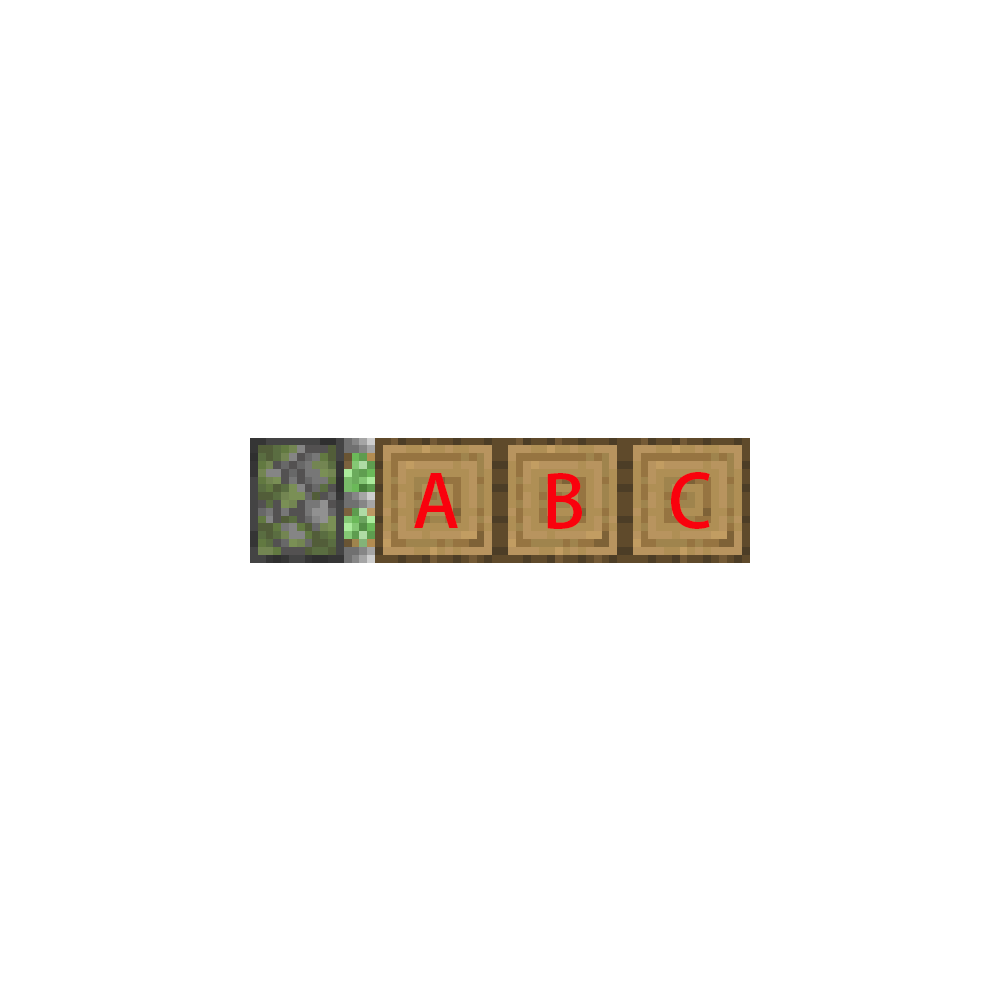

**分析过程**:

1. `calculatePush`从A开始调用推动链直线检查。
2. 检查依次把A、B、C加入待移动列表；遇到空气后，这条直线结束。
3. `movedBlocks`列表为`[A, B, C]`，按从近到远排列。

**b36到位顺序**:

- `PistonBlock.move`从列表末尾向前遍历。
- 创建顺序为C、B、A，即远端方块先创建b36，近端方块后创建。

```
movedBlocks顺序: [A, B, C]  (索引0,1,2)
b36到位顺序:     C, B, A     (逆序遍历)
```

##### 示例2:黏附侧面分支

假设活塞向+x方向推动，活塞头前方是粘液块S，S的+y方向黏附普通方块A：

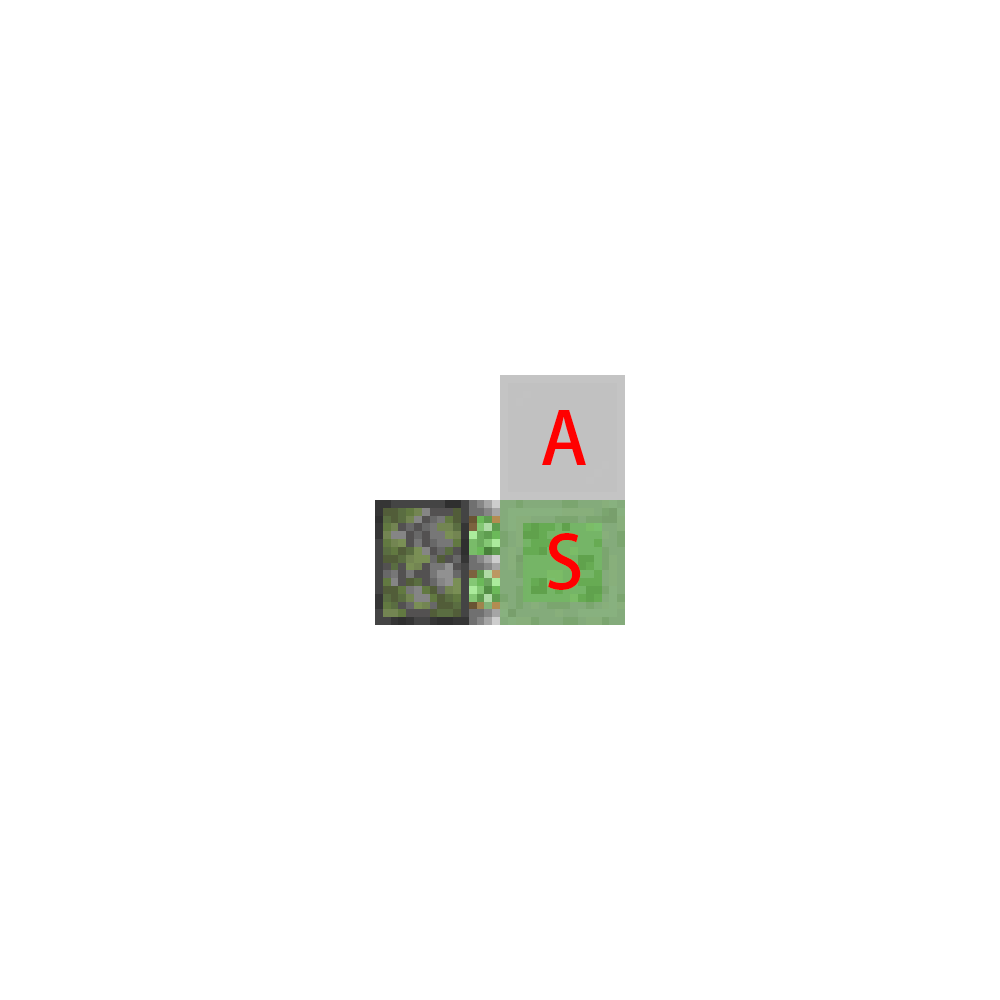

**分析过程**:

1. `calculatePush`调用`tryMove(S)`,S加入列表:`[S]`
2. `calculatePush`遍历列表,遇到粘性方块S,调用`tryMoveAdjacentBlock(S)`
3. `tryMoveAdjacentBlock`检查S的四个垂直方向,发现+y方向的A与S互粘,调用`tryMove(A, +y)`
4. `tryMove(A, +y)`分析A的直线推动链,A加入列表,A前方是空气,终止
5. 最终`movedBlocks`列表:`[S, A]`

**b36到位顺序**:

- 逆序遍历:A先创建b36,S后创建b36

```
movedBlocks顺序: [S, A]
b36到位顺序:     A, S
```

##### 示例3：三层黏附结构的完整分析

下面分析一个三层粘液块结构。三张图使用相同的水平坐标：**Layer 1中的粘液块1、Layer 2中的粘液块2、Layer 3中的粘液块3位于同一列，只是高度不同。**活塞的实际推动方向为+Z，也就是图中的向下方向。

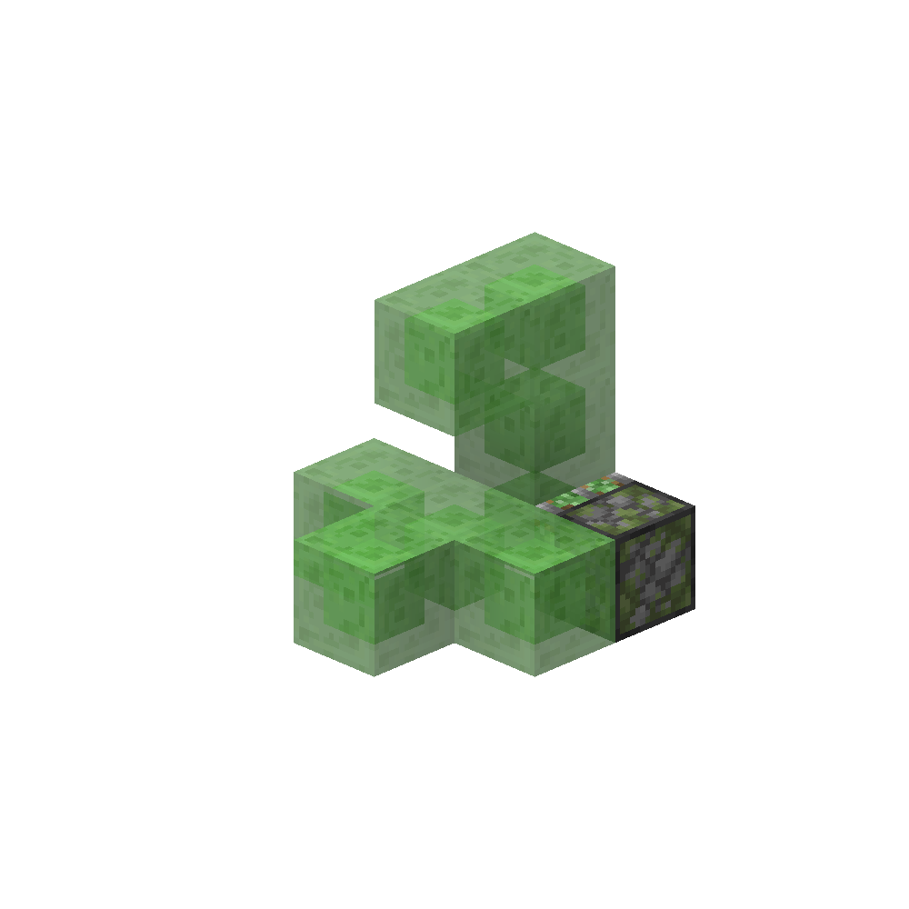

这八个方块的实际b36到位顺序如下：

```text
Layer 1              Layer 2    Layer 3

    6
    |
8 - 5 - 2               7          3 - 1
    |
    4
```

由于`PistonBlock.move`逆序读取待移动列表，先把到位顺序反过来，就能得到最终的`movedBlocks`：

```text
movedBlocks：    [8, 7, 6, 5, 4, 3, 2, 1]
b36到位顺序：     1, 2, 3, 4, 5, 6, 7, 8
```

下面按照源码逐步还原这份列表。+Z推动时，`tryMoveAdjacentBlock`会排除Z轴上的北、南，只按**下 → 上 → 西 → 东**检查侧面。

1. **建立起点**：活塞正前方是Layer 1的粘液块1，也就是顺序图中的8。推动链直线检查先把8加入列表：`[8]`。
2. **检查8的下方**：侧面检查的第一个方向是下。8的正下方是Layer 2的粘液块2，也就是7，因此加入7：`[8, 7]`。
3. **检查8的水平方向**：下方分支结束后，检查继续走到水平方向，并找到与8相连的中心粘液块5。对5调用推动链直线检查时，游戏会先沿推动反方向-Z扫描：先找到5上方的6，再回到5；随后沿+Z继续找到5下方的4。因此这一整条直线按`6 → 5 → 4`加入：`[8, 7, 6, 5, 4]`。
4. **继续遍历新增方块**：`calculatePush`使用的循环条件会实时读取列表长度，所以刚加入的7、6、5、4随后也会被逐个检查。轮到7时，它的下方是Layer 3的粘液块3，于是加入3：`[8, 7, 6, 5, 4, 3]`。
5. **展开第一层右枝**：轮到5时，侧面检查找到右侧的2，将其加入：`[8, 7, 6, 5, 4, 3, 2]`。
6. **展开第三层右枝**：轮到3时，侧面检查找到右侧的1，将其加入，得到最终列表：`[8, 7, 6, 5, 4, 3, 2, 1]`。

这个结构中并没有发生“向前扫描再次撞上已在列表中的方块”，因此**不会调用`setMovedBlocks`**。它的顺序完全来自三条规则：侧面方向按下、上、西、东检查；黏性直线先沿-Z回溯，再沿+Z前进；`calculatePush`会继续遍历分析过程中追加到列表末尾的新方块。

最后，`PistonBlock.move`从列表末尾向前创建b36，调用器也按这个顺序注册，所以正常连续运行时的到位顺序就是`1 → 2 → 3 → 4 → 5 → 6 → 7 → 8`。

### :advanced 活塞响应事件与移动方块源码

#### 方块事件响应入口（`onSyncedBlockEvent`）

动作检查只负责登记事件；真正执行伸出、普通收回或瞬推收回的是方块事件响应入口。它先复核当前供电状态，避免执行已经过时的动作，然后按照事件类型进入伸出或收回流程。以下源码用于定位这些分支，正文结论见代码后的分类说明。

```java
public boolean onSyncedBlockEvent(BlockState state, World world, BlockPos pos, int actionType, int directionData) {
    // 获取方块的方向（例如，活塞朝向的方向）
    Direction facing = (Direction)state.get(FACING);

    // 获取激活的方块状态（表示方块正在扩展）
    BlockState extendedState = (BlockState)state.with(EXTENDED, true);

    // 如果当前不是客户端，进行一些服务器端操作
    if (!world.isClient) {
        // 检查是否需要扩展活塞（是否有红石信号）
        boolean shouldExtend = this.shouldExtend(world, pos, facing);

        // 如果需要扩展并且事件类型是收缩，更新方块状态并返回
        if (shouldExtend && (actionType == 1 || actionType == 2)) {
            world.setBlockState(pos, extendedState, 2);
            return false;
        }

        // 如果不需要扩展并且事件类型是0，直接返回false
        if (!shouldExtend && actionType == 0) {
            return false;
        }
    }

    // 事件类型为0：活塞伸展事件
    if (actionType == 0) {
        // 如果移动方块失败，返回false
        if (!this.move(world, pos, facing, true)) {
            return false;
        }

        // 设置方块为扩展状态，并播放伸展声音
        world.setBlockState(pos, extendedState, 67);
        world.playSound((PlayerEntity)null, pos, SoundEvents.BLOCK_PISTON_EXTEND, SoundCategory.BLOCKS, 0.5F, world.random.nextFloat() * 0.25F + 0.6F);
        world.emitGameEvent(GameEvent.BLOCK_ACTIVATE, pos, Emitter.of(extendedState));
    }
    // 事件类型为1或2：活塞收缩事件
    else if (actionType == 1 || actionType == 2) {
        // 获取活塞前方的方块实体
        BlockEntity blockEntityInFront = world.getBlockEntity(pos.offset(facing));

        // 如果该位置有活塞方块实体，完成收缩操作
        if (blockEntityInFront instanceof PistonBlockEntity) {
            ((PistonBlockEntity)blockEntityInFront).finish();
        }

        // 创建移动的活塞方块状态
        BlockState pistonHeadState = Blocks.MOVING_PISTON.getDefaultState().with(PistonExtensionBlock.FACING, facing)
                .with(PistonExtensionBlock.TYPE, this.sticky ? PistonType.STICKY : PistonType.DEFAULT);

        // 设置新的活塞方块状态，并创建新的方块实体
        world.setBlockState(pos, pistonHeadState, 20);
        world.addBlockEntity(PistonExtensionBlock.createBlockEntityPiston(pos, pistonHeadState, (BlockState)this.getDefaultState().with(FACING, Direction.byId(directionData & 7)), direction, false, true));
        world.updateNeighbors(pos, pistonHeadState.getBlock());
        pistonHeadState.updateNeighbors(world, pos, 2);

        // 如果是粘性活塞，执行特殊逻辑
        if (this.sticky) {
            // 计算目标位置
            BlockPos targetpos = pos.add(facing.getOffsetX() * 2, facing.getOffsetY() * 2, facing.getOffsetZ() * 2);
            BlockState targetState = world.getBlockState(targetpos);
            boolean hasMovingPistonInFront = false;

            // 如果目标位置已有移动活塞方块，尝试完成它的扩展
            if (targetState.isOf(Blocks.MOVING_PISTON)) {
                BlockEntity blockEntity2 = world.getBlockEntity(targetpos);
                if (blockEntity2 instanceof PistonBlockEntity) {
                    PistonBlockEntity pistonBlockEntity = (PistonBlockEntity)blockEntity2;
                    if (pistonBlockEntity.getFacing() == facing && pistonBlockEntity.isExtending()) {
                        pistonBlockEntity.finish();
                        hasMovingPistonInFront = true;
                    }
                }
            }

            // 如果没有特殊情况，移除目标方块或继续移动
            if (!hasMovingPistonInFront) {
                if (actionType != 1 || targetState.isAir() || !isMovable(targetState, world, targetpos, facing.getOpposite(), false, facing)
                        || targetState.getPistonBehavior() != PistonBehavior.NORMAL && !targetState.isOf(Blocks.PISTON) && !targetState.isOf(Blocks.STICKY_PISTON)) {
                    world.removeBlock(pos.offset(facing), false);
                } else {
                    this.move(world, pos, facing, false);
                }
            }
        }
        // 如果不是粘性活塞，直接移除目标方块
        else {
            world.removeBlock(pos.offset(facing), false);
        }

        // 播放收缩声音
        world.playSound(null, pos, SoundEvents.BLOCK_PISTON_CONTRACT, SoundCategory.BLOCKS, 0.5F, world.random.nextFloat() * 0.15F + 0.6F);
        world.emitGameEvent(GameEvent.BLOCK_DEACTIVATE, pos, Emitter.of(pistonHeadState));
    }

    // 返回true表示事件成功处理
    return true;
}
```

**服务端**

如果不是客户端，那么会执行几个服务端特有的事件：

- 检查激活情况，如果激活，并且方块事件为收回或者瞬推收回，将活塞设置为伸出状态，并进行寻路更新，方块事件执行失败。
- 如果没有激活并且方块事件为伸出，方块事件执行失败。

**伸出事件**

> 注意，本部分无论客户端，服务端都必须执行

活塞会尝试移动前方方块，这是通过`move`方法实现的，我稍后会补充这个方法的细节。如果移动失败，则活塞执行事件失败。

接下来，将活塞设置为伸出状态，此处`bitflag`为`0b01000011`放置移除更新，寻路更新，NC更新

最后，播放活塞伸出的声音，方块事件执行成功

**瞬间收回与收回事件**

首先获取活塞头的方块实体，如果是b36，那么使其瞬间到位。

接下来，将活塞设置为b36，此处`bitflag`为`0b00010100`，无PP更新，寻路更新

再将活塞设置成b36方块实体，先发出NC更新，再发出PP更新

如果这个活塞是一个粘性活塞，那么将活塞头伸出1格外的地方，如果它试图放置活塞头的位置的一格外是一个b36，并且该b36的推动方向与活塞同向，那么让方块瞬间到位。

如果活塞行为不为瞬推收回，并且该方块不是空气，活塞可以移动前方一格的方块，而且这个方块可以被正常拉回或者这个方块是活塞或者粘性活塞，那么尝试拉回前方方块。如果前方一格的方块无法被拉动，那么删除活塞头位置的方块。

如果是普通活塞，直接删除活塞头位置的方块。

无论何种情况，播放活塞收回的声音。方块事件执行成功。

#### 实际搬移流程（`PistonBlock.move`）

方块事件入口决定“做哪种动作”，实际搬移流程则负责“怎样搬”。它重新检查推动结构，依次处理待破坏方块、把待移动方块转换为b36、清空没有被新方块覆盖的原位置，最后集中发出更新。

```java
// retract=0：收回
// retract=1：伸出
private boolean move(World world, BlockPos pos, Direction dir, boolean retract) {
    // 活塞头的位置
    BlockPos headPos = pos.offset(dir);

    // 如果是收缩动作并且目标位置是活塞头
    if (!retract && world.getBlockState(headPos).isOf(Blocks.PISTON_HEAD)) {
        // 将活塞头设为空气
        // flag=0b00010100, 无PP更新，寻路更新 客户端
        world.setBlockState(headPos, Blocks.AIR.getDefaultState(), 20);
    }

    // 创建 PistonHandler 实例，用于计算推动或拉回操作的合法性
    PistonHandler pistonHandler = new PistonHandler(world, pos, dir, retract);

    // 如果无法执行推动/拉回操作，则无法移动
    if (!pistonHandler.calculatePush()) {
        return false;
    } else {
        // 使用哈希表存储需要移动的方块及其状态，便于后续处理
        Map<BlockPos, BlockState> map = Maps.newHashMap();

        // 创建移动方块列表并获取移动方块列表
        List<BlockPos> blocksToMove = pistonHandler.getMovedBlocks();

        // 用于记录需要移动的方块的原始状态
        List<BlockState> blocksOriginal = Lists.newArrayList();

        // 遍历需要移动的方块，将其原始状态保存到列表中，并存储到 map 中
        for (int i = 0; i < blocksToMove.size(); ++i) {
            BlockPos blockPos2 = (BlockPos) blocksToMove.get(i);
            BlockState blockState = world.getBlockState(blockPos2);
            blocksOriginal.add(blockState);
            map.put(blockPos2, blockState);
        }

        // 获取所有需要破坏的方块位置列表
        List<BlockPos> list3 = pistonHandler.getBrokenBlocks();

        // 用于记录被破坏方块的状态
        BlockState[] blockStates = new BlockState[blocksToMove.size() + list3.size()];

        // 确定移动方向
        Direction direction = retract ? dir : dir.getOpposite();

        // 处理被破坏的方块，从后到前
        int j = 0;
        for (int k = list3.size() - 1; k >= 0; --k) {
            BlockPos blockPos3 = (BlockPos) list3.get(k);
            BlockState blockState2 = world.getBlockState(blockPos3);

            // 如果方块有方块实体，则先处理掉落逻辑
            BlockEntity blockEntity = blockState2.hasBlockEntity() ? world.getBlockEntity(blockPos3) : null;
            dropStacks(blockState2, world, blockPos3, blockEntity);

            // 将方块设置为空气并触发销毁事件
            world.setBlockState(blockPos3, Blocks.AIR.getDefaultState(), 18);
            world.emitGameEvent(GameEvent.BLOCK_DESTROY, blockPos3, Emitter.of(blockState2));

            // 如果方块不是火类方块，则添加破坏粒子效果
            if (!blockState2.isIn(BlockTags.FIRE)) {
                world.addBlockBreakParticles(blockPos3, blockState2);
            }

            // 保存被破坏方块的状态
            blockStates[j++] = blockState2;
        }

        // 处理需要移动的方块
        for (int k = blocksToMove.size() - 1; k >= 0; --k) {
            BlockPos targetPos = (BlockPos) blocksToMove.get(k);
            BlockState targetState = world.getBlockState(targetPos);

            // 移动到目标位置
            targetPos = targetPos.offset(direction);
            map.remove(targetPos);

            // 设置目标位置为 MOVING_PISTON 状态，用于动画处理
            BlockState blockState3 = (BlockState) Blocks.MOVING_PISTON.getDefaultState().with(FACING, dir);
            world.setBlockState(targetPos, blockState3, 68);

            // 创建b36方块实体，用于控制移动动画
            world.addBlockEntity(PistonExtensionBlock.createBlockEntityPiston(targetPos, blockState3, (BlockState) blocksOriginal.get(k), dir, retract, false));
            blockStates[j++] = targetState;
        }

        // 如果是伸出操作，添加活塞头
        if (retract) {
            PistonType pistonType = this.sticky ? PistonType.STICKY : PistonType.DEFAULT;
            BlockState blockState4 = (BlockState) ((BlockState) Blocks.PISTON_HEAD.getDefaultState().with(PistonHeadBlock.FACING, dir)).with(PistonHeadBlock.TYPE, pistonType);
            BlockState targetState = (BlockState) ((BlockState) Blocks.MOVING_PISTON.getDefaultState().with(PistonExtensionBlock.FACING, dir)).with(PistonExtensionBlock.TYPE, this.sticky ? PistonType.STICKY : PistonType.DEFAULT);
            map.remove(headPos);

            // 设置当前活塞位置为 MOVING_PISTON 状态
            world.setBlockState(headPos, targetState, 68);

            // 添加b36方块实体，用于控制动画
            world.addBlockEntity(PistonExtensionBlock.createBlockEntityPiston(headPos, targetState, blockState4, dir, true, true));
        }

        // 将 map 中剩余的方块设置为空气
        BlockState blockState5 = Blocks.AIR.getDefaultState();
        for (BlockPos blockPos4 : map.keySet()) {
            world.setBlockState(blockPos4, blockState5, 82);
        }

        // 更新邻居方块状态
        for (Map.Entry<BlockPos, BlockState> entry : map.entrySet()) {
            BlockPos blockPos5 = entry.getKey();
            BlockState blockState6 = entry.getValue();
            blockState2.prepare(world, blockPos5, 2);
            blockState5.updateNeighbors(world, blockPos5, 2);
            blockState5.prepare(world, blockPos5, 2);
        }

        // 更新被破坏方块的邻居状态
        for (int l = list3.size() - 1; l >= 0; --l) {
            BlockState targetState = blockStates[j++];
            BlockPos blockPos5 = (BlockPos) list3.get(l);
            targetState.prepare(world, blockPos5, 2);
            world.updateNeighborsAlways(blockPos5, targetState.getBlock());
        }

        // 更新移动方块的邻居状态
        for (int l = blocksToMove.size() - 1; l >= 0; --l) {
            world.updateNeighborsAlways((BlockPos) blocksToMove.get(l), blockStates[j++].getBlock());
        }

        // 如果是收缩动作，更新活塞位置邻居
        if (retract) {
            world.updateNeighborsAlways(headPos, Blocks.PISTON_HEAD);
        }

        return true; // 如果执行成功，返回 true
    }
}

```

实际搬移流程同时服务于伸出和收回。源码参数`retract`的命名容易误导：在这段实现中，值为`true`表示伸出，值为`false`表示收回。正文后续直接使用“伸出流程”和“收回流程”，不再依赖这个布尔变量理解行为。

当活塞**尝试**收回时，游戏会首先检查**预期是**活塞头的位置是不是活塞头，如果是活塞头才执行收回。每次执行收回时，游戏都会先将活塞头的位置设置为空气（删除活塞头）。此时的`setBlockState`的传入`bitflag`为`0b00010100`，即无PP更新，和客户端的寻路更新。

在正式开始移动前，无论收回或伸出，游戏都会调用[5.4.2](#进阶542-移动结构分析)部分分析的`calculatePush`方法，再次分析是否可以移动，如果不能成功移动，则活塞执行推动/拉动失败。

接下来，游戏会正式开始移动方块，它首先会逆序地处理破坏方块列表(`brokenBlocks`)，如果被破坏的方块具备掉落物品的方块实体，那么掉落物品，再将被锚定破坏的方块（也就是当前正在处理的方块）设置为空气，此时无PP更新，发出寻路更新。

破坏了应该破坏的方块后，游戏会开始移动方块。从后往前遍历移动方块列表(`movedBlocks`)，将该方块设置为b36，`bitflag`为`0b01101000`，也就是放置移除更新，再向该方块添加b36的方块实体，并添加到`blockStates`列表中备用。

如果是伸出，就在活塞头位置创建b36，放置移除更新，再向活塞头位置添加b36方块实体。

完成以上操作后，将未被覆盖到的方块全部设置为空气，并放置移除更新，寻路更新。此时无PP更新。再统一发出更新，对于哈希表中所有的方块，都先统一发出红石粉prepare更新，再给出方块更新（在方块原位置），如果是伸出，活塞头完成方块更新。

以上代码解释了为什么游戏会按待移动列表的逆序创建b36。结合`D:\guardian`中方块实体调用器的注册与执行逻辑，正常连续运行时，这个逆序同时也是b36到位顺序。区块卸载、重载会重新建立调用器，原有顺序可能丢失。

### :advanced 到位的源码解析

#### 普通到位`tick`

> 这东西太简单了没什么好讲的，所以通俗解释都扔到前面去了(笑)，因此这里只放个代码供参考

```java
public static void tick(World world, BlockPos pos, BlockState state, PistonBlockEntity blockEntity) {
        //记录当前gt
    blockEntity.savedWorldTime = world.getTime();
    blockEntity.lastProgress = blockEntity.progress;
    //如果推动已完成
    if (blockEntity.lastProgress >= 1.0F) {
        //如果是客户端且当前deathTick没有超过5
        if (world.isClient && deathTicks < 5) {
            //增加deathTicks计数
            ++deathTicks;
        } else {
            //移除方块实体
            world.removeBlockEntity(pos);
            blockEntity.markRemoved();
            //如果该方块为b36
            if (world.getBlockState(pos).isOf(Blocks.MOVING_PISTON)) {
                //给出PP更新
                BlockState blockState = Block.postProcessState(blockEntity.pushedBlock, world, pos);
                //如果为空气
                if (blockState.isAir()) {
                    //设置为对应方块，无更新，bitflag=0b01010100;
                    world.setBlockState(pos, blockEntity.pushedBlock, 84);
                    //更新或破坏该方块
                    Block.replace(blockEntity.pushedBlock, blockState, world, pos, 3);
                } else {
                    //如果是含水方块
                    if (blockState.contains(Properties.WATERLOGGED) && (Boolean)blockState.get(Properties.WATERLOGGED)) {
                        //移除含水方块中的水
                        blockState = (BlockState)blockState.with(Properties.WATERLOGGED, false);
                    }
                    //设置为对应方块，给出NC更新，PP更新，客户端更新，bitflag=0b01000011
                    world.setBlockState(pos, blockState, 67);
                    //自身受到NC更新
                    world.updateNeighbor(pos, blockState.getBlock(), pos);
                }
            }
        }
    }
    //如果推动未完成
    //推动进度+0.5
    else {
        float f = blockEntity.progress + 0.5F;
        //进行实体运算
        pushEntities(world, pos, f, blockEntity);
        moveEntitiesInHoneyBlock(world, pos, f, blockEntity);
        blockEntity.progress = f;
        //如果推动进度>=1，取为1
        if (blockEntity.progress >= 1.0F) {
            blockEntity.progress = 1.0F;
        }
    }
}
```

#### 瞬时到位`finish`

```java
public void finish() {
    // 存在世界且进度未满或客户端运算
    if (this.world != null && (this.lastProgress < 1.0F || this.world.isClient)) {
        // 将进度设置为完成
        this.progress = 1.0F;
        this.lastProgress = this.progress;
        // 移除方块实体
        this.world.removeBlockEntity(this.pos);
        this.markRemoved();
        //如果此处为b36方块
        if (this.world.getBlockState(this.pos).isOf(Blocks.MOVING_PISTON)) {
            // 如果是活塞臂
            BlockState blockState;
            if (this.source) {
                // 设置为空气
                blockState = Blocks.AIR.getDefaultState();
            } else {
                // 否则在PP更新后到位
                blockState = Block.postProcessState(this.pushedBlock, this.world, this.pos);
            }
            // 设置方块，PP更新，寻路更新，NC更新
            this.world.setBlockState(this.pos, blockState, 3);
            // 自身受到方块更新
            this.world.updateNeighbor(this.pos, blockState.getBlock(), this.pos);
        }
    }
}
```

大部分内容前面也解释过了，所以这里直接略过。我们只看后半部分的b36特判看起。

在1.20中，只有活塞臂的`source`属性是`true`，其它都是`false`。因此当该方法被调用时，若该位置是目标方块为活塞臂的b36，会直接变成空气。其余部分就不细说了，前面都讲过了。

### :advanced 活塞头

> 本章其实没什么难度，但是由于除了前阵子[Menggui233](https://space.bilibili.com/1725417238?spm_id_from=333.337.0.0)在[PetrisAFE](https://space.bilibili.com/397472062)的[视频](https://www.bilibili.com/video/BV19xchzfEBr/?share_source=copy_web&vd_source=a7c3c614e18f7d33800bde0d541328ca)中演示的装置外，未见得其它用途，故在这里放在了进阶的位置。

我们首先观察如下装置：

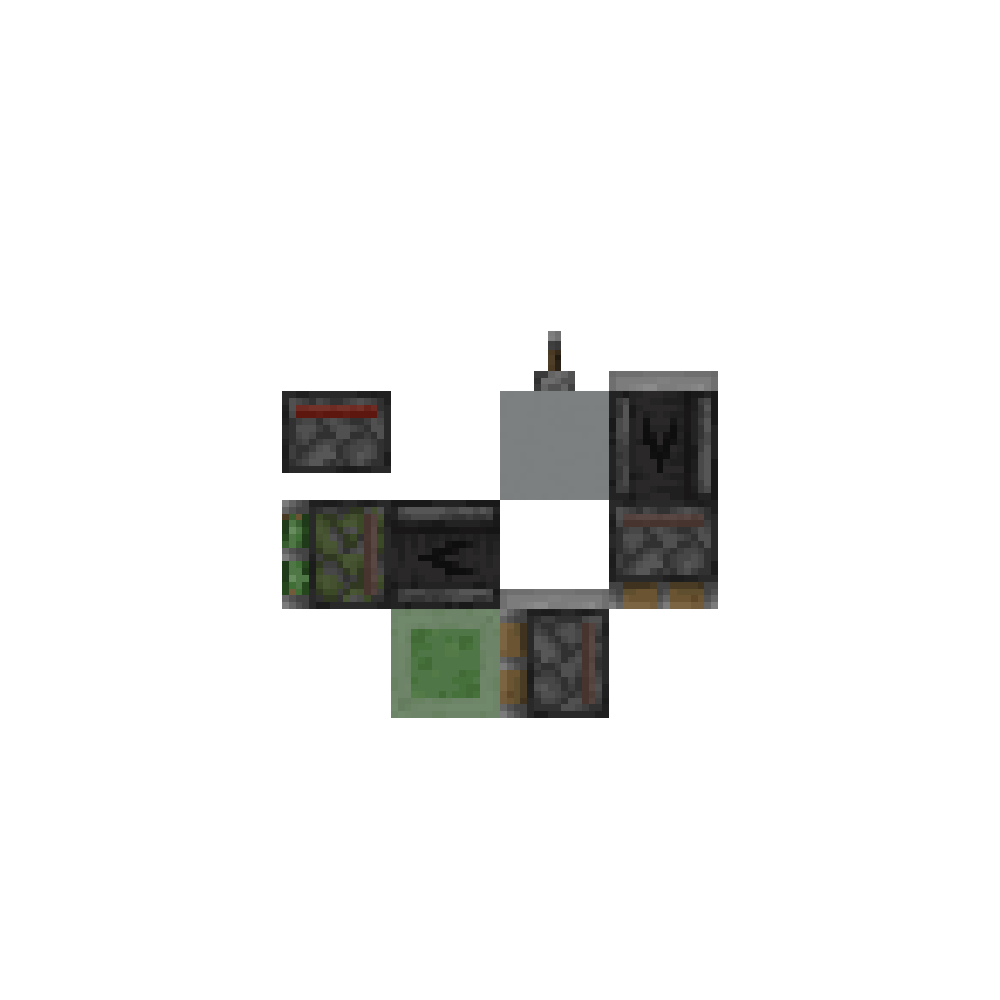

现在，拉下拉杆

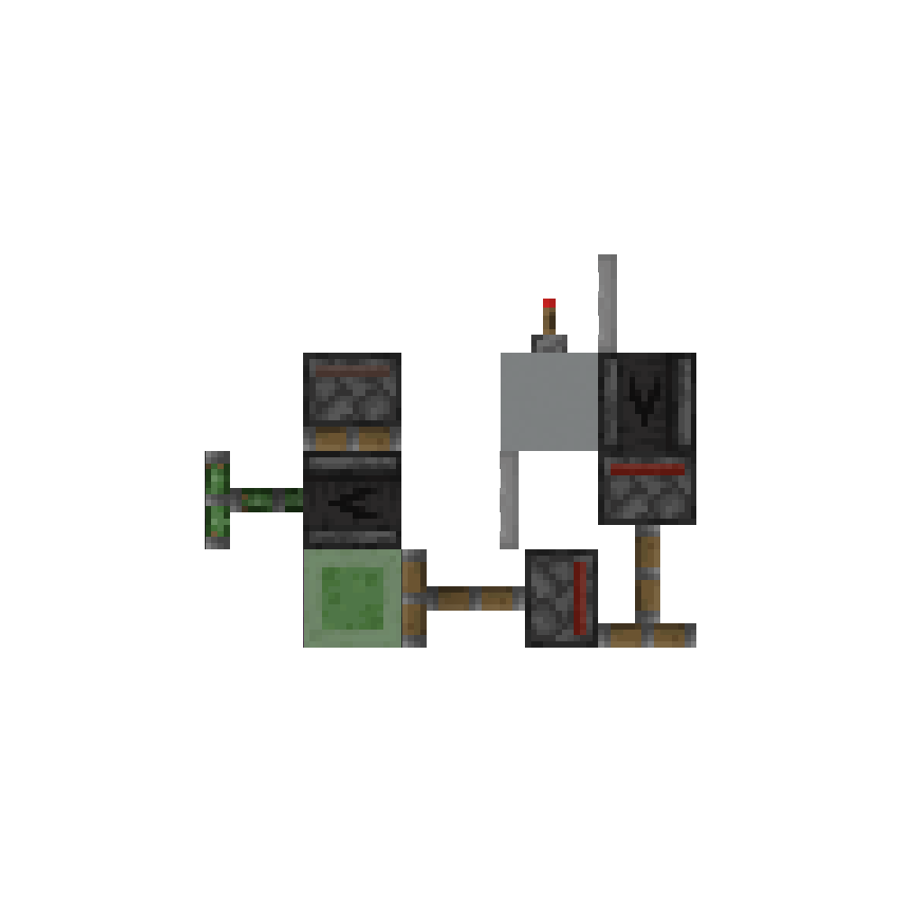

观察到活塞底座被换成了侦测器，而活塞头被保留。为什么？

我们首先回顾一下b36到位时发生了什么：

- 给出自身位置的PP更新
- 给出自身位置的一阶毗邻的NC，PP更新
- 给出自身位置的NC更新

因此，我们分别查看活塞头受到PP更新和NC更新会发生什么

#### 活塞头存在的条件判定`canSurvive`

```java
private boolean isFittingBase(BlockState baseState, BlockState extendedState) {
    Block block = baseState.getValue(TYPE) == PistonType.DEFAULT ? Blocks.PISTON : Blocks.STICKY_PISTON;
    return extendedState.is(block) && extendedState.getValue(PistonBaseBlock.EXTENDED) && extendedState.getValue(FACING) == baseState.getValue(FACING);
}

@Override
public boolean canSurvive(BlockState state, LevelReader level, BlockPos pos) {
    BlockState blockState = level.getBlockState(pos.relative(state.getValue(FACING).getOpposite()));
    return this.isFittingBase(state, blockState) || blockState.is(Blocks.MOVING_PISTON) && blockState.getValue(FACING) == state.getValue(FACING);
}
```

`isFittingBase`方法本质上说明，当且仅当一个活塞头的后方(更确切地说，是推动方向的反方向1格，后续均以后方简称)是正在伸展的活塞，且该活塞的伸出方向与活塞头一致活塞头可以被称之为`适配`。而`canSurvive`则要求一个活塞头的存在是合法的，当且仅当该活塞头是`适配`的，或其后方是一个与活塞头推动方向相同的b36。

#### 活塞头的移除`onRemove`

```java
@Override
public void onRemove(BlockState state, Level level, BlockPos pos, BlockState newState, boolean isMoving) {
    if (!state.is(newState.getBlock())) {
        super.onRemove(state, level, pos, newState, isMoving);
        BlockPos blockPos = pos.relative(state.getValue(FACING).getOpposite());
        if (this.isFittingBase(state, level.getBlockState(blockPos))) {
            level.destroyBlock(blockPos, true);
        }
    }
}
```

一句话总结：移除时如果状态为`适配`，则连带着底座一起移除，并掉落活塞。

#### 活塞头受到PP更新，NC更新

```java
@Override
public BlockState updateShape(BlockState state, Direction facing, BlockState facingState, LevelAccessor level, BlockPos currentPos, BlockPos facingPos) {
    return facing.getOpposite() == state.getValue(FACING) && !state.canSurvive(level, currentPos)
        ? Blocks.AIR.defaultBlockState()
        : super.updateShape(state, facing, facingState, level, currentPos, facingPos);
}
@Override
public void neighborChanged(BlockState state, Level level, BlockPos pos, Block block, BlockPos fromPos, boolean isMoving) {
    if (state.canSurvive(level, pos)) {
        level.neighborChanged(pos.relative(state.getValue(FACING).getOpposite()), block, fromPos);
    }
}
```

**PP更新**

活塞头实际上只关心来自后方的PP更新。当后方发生PP更新时，活塞头会调用`canSurvive`来检查自己是否合法，若不合法则立刻消失。

**NC更新**

在任何情况下，活塞头均不会因受到NC更新而消失。当受到NC更新时，若自身合法，则将更新视为后方方块收到的NC更新。

#### 案例分析

因此，对于在章首提到的案例：

- 0gt AT: 玩家拉下拉杆，活版门触发
- 2gt BE 深度0: 粘性活塞被激活，更新无头活塞
- 2gt BE 深度1: 无头活塞吃掉粘性活塞底座，粘液块&亮起侦测器被推动
- 4gt TE: 粘性活塞头先到位，此时检查后方是和自己同方向的b36，自检通过。随后亮起侦测器b36到位，无更新。

因此侦测器成功取代了原本的活塞底座。

### :advanced b36相关的实体运算

```java
//该方法用于处理活塞对实体的推动。它会获取b36在当前游戏刻的移动方向和距离，并找出路径上所有可能接触的实体。然后，它会精确计算每个实体与b36在移动方向上的最大重叠部分，并据此推动实体（同时增加微小位移0.01防卡入）。此过程还会特殊处理黏液块的弹射效果以及b36收回时对实体的影响。
private static void pushEntities(World world, BlockPos pos, float f, PistonBlockEntity blockEntity) {
    //获取b36移动的方向
    Direction direction = blockEntity.getMovementDirection();

    //计算在当前tick，b36需要移动的距离
    double d = f - blockEntity.progress;

    //获取b36的碰撞箱体素模型
    VoxelShape voxelShape = blockEntity.getHeadBlockState().getCollisionShape(world, pos);

    //检查b36是否有实际的碰撞体积。如果没有，就什么也不做
    if (!voxelShape.isEmpty()) {

    //获取b36该tick移动后的包围盒
    Box box = offsetHeadBox(pos, voxelShape.getBoundingBox(), blockEntity);

        //根据b36移动前后扫描过的区域，粗略筛选可能被推动的实体
        List<Entity> list = world.getOtherEntities(null, Boxes.stretch(box, direction, d).union(box));

        //如果扫描区域内有实体，则开始处理
        if (!list.isEmpty()) {

            //获取组成b36体素模型的所有子包围盒列表
            List<Box> list2 = voxelShape.getBoundingBoxes();

            //检查b36是否是黏液块
            boolean bl = blockEntity.pushedBlockState.isOf(Blocks.SLIME_BLOCK);
            Iterator var12 = list.iterator();

            //遍历所有可能被影响的实体
            while (true) {
                Entity entity;
                while (true) {
                    if (!var12.hasNext()) {
                        return;
                    }

                    entity = (Entity)var12.next();
                    //检查实体是否忽略b36推动
                    if (entity.getPistonBehavior() != PistonBehavior.IGNORE) {
                        if (!bl) {
                            break;
                        }

                        //如果是黏液块在推动，对于除服务端玩家外的实体，将其沿移动轴向的速度分量强制设为1.0
                        if (!(entity instanceof ServerPlayerEntity)) {
                            Vec3d vec3d = entity.getVelocity();
                            double e = vec3d.x;
                            double g = vec3d.y;
                            double h = vec3d.z;
                            switch (direction.getAxis()) {
                                case X:
                                    e = direction.getOffsetX();
                                    break;
                                case Y:
                                    g = direction.getOffsetY();
                                    break;
                                case Z:
                                    h = direction.getOffsetZ();
                            }

                            entity.setVelocity(e, g, h);
                            break;
                        }
                    }
                }

                //记录实体与b36在移动方向上的最大重叠距离
                double i = 0.0;

                //遍历b36模型的每一个子包围盒
                for (Box box2 : list2) {

                    //检查b36的子包围盒的移动路径是否与实体的碰撞箱相交
                    Box box3 = Boxes.stretch(offsetHeadBox(pos, box2, blockEntity), direction, d);
                    Box box4 = entity.getBoundingBox();

                    //如果相交，计算重叠的距离
                    if (box3.intersects(box4)) {
                        i = Math.max(i, getIntersectionSize(box3, direction, box4));

                        //重叠的距离大于实际推动距离，这是最坏的情况，不需要进行多余检查了
                        if (i >= d) {
                            break;
                        }
                    }
                }

                //如果最终计算出的最大重叠距离大于0，进行推动
                if (!(i <= 0.0)) {

                    //确定最终的推动距离。这个距离不能超过b36本身在这一刻的移动距离
                    //并额外增加0.01防止下一tick实体被卡在b36里
                    i = Math.min(i, d) + 0.01;

                    //沿移动方向，将实体推动计算出的距离
                    moveEntity(direction, entity, i, direction);

                    //如果是b36在收回，则特殊处理被其影响的实体
                    if (!blockEntity.extending && blockEntity.source) {
                        push(pos, entity, direction, d);
                    }
                }
            }
        }
    }
}


//此方法用于解决实体卡在b36内的问题。它会检查实体是否与b36所在位置的方块存在重叠，如果存在，则计算出沿反方向将实体推出的最小距离。通过一次精细的重叠深度比较后，它会校准并执行这个位移，确保实体被平滑地推离b36。
private static void push(BlockPos pos, Entity entity, Direction direction, double amount) {

    //获取实体的包围盒
    Box box = entity.getBoundingBox();

    //创建一个位于b36位置的、标准大小(1x1x1)的方块包围盒
    Box box2 = VoxelShapes.fullCube().getBoundingBox().offset(pos);

    // 如果实体与方块的包围盒没有重叠，则说明实体未被卡住，直接返回
    if (box.intersects(box2)) {

        //获取原始推动的相反方向
        Direction direction2 = direction.getOpposite();

        //计算要使实体脱离方块所需的最小推出距离
        double d = getIntersectionSize(box2, direction2, box) + 0.01;

        //计算实体与方块实际重叠区域的深度
        double e = getIntersectionSize(box2, direction2, box.intersection(box2)) + 0.01;

        // 如果两次计算的推出距离几乎相等（表明实体只是轻微接触），则进行位置校准(float align)
        if (Math.abs(d - e) < 0.01) {
            d = Math.min(d, amount) + 0.01;

                //沿相反方向，将实体推动计算出的距离
            moveEntity(direction, entity, d, direction2);
        }
    }
}


//该方法用于实现移动的蜂蜜块对上方实体的粘滞效果，且仅在b36水平推动时生效。其核心逻辑是：在蜂蜜块表面上方定义一个“粘滞区域”，然后将该区域内所有符合条件的实体，与蜂蜜块b36进行同步移动。
private static void moveEntitiesInHoneyBlock(World world, BlockPos pos, float f, PistonBlockEntity blockEntity) {

    //整个逻辑只在b36是蜂蜜块时才会触发
    if (blockEntity.isPushingHoneyBlock()) {

        //获取b36移动的方向
        Direction direction = blockEntity.getMovementDirection();

        //蜂蜜块的粘滞效果仅在水平方向推动时生效
        if (direction.getAxis().isHorizontal()) {

            //获取蜂蜜块b36碰撞箱的实际顶部高度
            double d = blockEntity.pushedBlockState.getCollisionShape(world, pos).getMax(Direction.Axis.Y);

            //定义一个位于蜂蜜块表面上方的粘滞区域(从其顶部到Y=1.5)，并使其随b36同步移动
            Box box = offsetHeadBox(pos, new Box(0.0, d, 0.0, 1.0, 1.5000010000000001, 1.0), blockEntity);

            //计算在当前tick，蜂蜜块b36需要移动的距离
            double e = f - blockEntity.progress;

            //遍历粘滞区域内所有符合移动条件的实体
            for (Entity entity : world.getOtherEntities((Entity)null, box, entityx -> canMoveEntity(box, entityx, pos))) {

                //沿移动方向，将所有符合条件的实体推动计算出的距离
                moveEntity(direction, entity, e, direction);
            }
        }
    }
}
```

**`pushEntities`：处理活塞推动**

该方法是活塞与实体交互的核心。它会获取b36在当前游戏刻的移动方向和距离，并找出路径上所有可能接触的实体。然后，它会精确计算每个实体与b36在移动方向上的最大重叠部分，并据此推动实体（同时增加微小位移0.01防卡入）。此过程还会特殊处理黏液块的弹射效果以及b36收回时对实体的影响。
其工作流程如下：

1. 确定移动参数：首先，获取活塞头在当前游戏刻（tick）的移动方向和精确距离。
2. 粗略筛选实体：通过计算活塞头在这一帧内扫过的空间，快速找出所有可能被推动的实体。
3. 精确计算重叠：遍历每一个可能被影响的实体，并将其碰撞箱与活塞头模型的每一个子碰撞箱进行比较。它会精确计算出在活塞移动方向上，实体与活塞头之间发生的最大重叠距离。
4. 执行推动：根据计算出的最大重叠距离，对实体施加一个位移。为了防止实体在下一帧被卡住，推动的距离会额外增加一个极小值（0.01）。
5. 特殊情况处理：
   - 黏液块：如果推动的方块是黏液块，它会对非玩家实体产生一个弹射效果，将其沿移动方向的速度设置为一个固定值。
   - 活塞收回：如果活塞正在收回，它会调用 push 方法来特殊处理可能被拉动的实体，确保它们不会卡在活塞臂消失后的空间里。

**`push`：解决实体卡入问题**

这个方法是一个辅助函数，专门用于解决实体意外卡入活塞臂所在方块的问题。
其工作流程如下：

1. 检查重叠：首先，检查实体的碰撞箱是否与活塞臂目标位置的方块碰撞箱有重叠。如果没有重叠，则说明实体没有卡住，方法直接结束。
2. 计算推出距离：如果检测到重叠，它会计算需要将实体沿反方向推出多远才能恰好分离。它会进行两次计算和比较，以确保推出的距离精确且最小，避免过度位移。
3. 执行位移：最后，它会沿活塞移动的相反方向，将实体推出计算好的距离，从而平滑地解决卡入问题。

**`moveEntitiesInHoneyBlock`：实现蜂蜜块粘滞效果**

这个方法专门用于实现移动中的蜂蜜块对上方实体的“粘滞”效果。
其工作流程如下：

1. 条件检查：该功能只在活塞推动的是蜂蜜块，并且是水平移动时才会触发。
2. 定义粘滞区域：它会在移动的蜂蜜块表面上方定义一个特定的“粘滞区域”（从蜂蜜块顶部到Y=1.5的高度）。
3. 同步移动：系统会找出所有位于这个粘滞区域内的实体。
4. 施加位移：最后，将这些实体与蜂蜜块一起，沿着相同的方向移动相同的距离，从而实现了实体被“粘”在蜂蜜块上一起移动的效果。

### :advanced 基于`Extended=False`的活塞收回事件的无头活塞制造办法

我们先召回前面提到的`onSyncedBlockEvent`。值得注意的是，当服务端执行该方法并`return false`时，并不会向客户端发包，因此客户端也不会执行任何动画，或将任何东西变成b36。（也就是客户端并不会执行该方法）

实际上在前文提到的`setBlockState`的传入形参`flag`仅仅在通常意义下是寻路更新，这里需要更为详细的解释。

我们观察如下现象：

1. 放置一个任意方向的任意种类的活塞。并在其除活塞面向方向的一阶毗邻位置放置红石块。这一步会激活这个活塞
2. `/tick freeze`
3. 移除红石块
4. 将原本的活塞替换为任意方向的同一类型的活塞
5. 放回红石块，红石块的位置要求等同与第一步提到的位置要求
6. 在活塞面向方向放置一个不可推动方块
7. `/tick freeze`解除时停

如果操作完全没有错误，则该活塞变为无头活塞

这是因为在`onSyncedBlockEvent`中

```java
if (!world.isClient) {
    // 检查是否需要扩展活塞（是否有红石信号）
    boolean shouldExtend = this.shouldExtend(world, pos, facing);

    // 如果需要扩展并且事件类型是收缩，更新方块状态并返回
    if (shouldExtend && (actionType == 1 || actionType == 2)) {
        world.setBlockState(pos, extendedState, 2);
        return false;
    }

    // 如果不需要扩展并且事件类型是0，直接返回false
    if (!shouldExtend && actionType == 0) {
        return false;
    }
}
```

方块事件在执行时只会校验方块类型和位置，不会校验这个方块的朝向，因此在这个活塞的位置，我们得到了一个可以校验通过并执行的，活塞状态处于Extended=False的活塞，并且该活塞将执行收回事件。在服务端，活塞会被校验是否应该伸出。此时活塞因为被红石块激活，确实应该伸出，所以进入第一个if分支条件。这个分支条件首先调用了`setBlockState`，而我们查看一下`setBlockState`在`flag=2`时做了什么:

```java
public boolean setBlockState(BlockPos pos, BlockState state, int flags, int maxUpdateDepth) {
    if (this.isOutOfHeightLimit(pos)) {
        return false;
    } else if (!this.isClient && this.isDebugWorld()) {
        return false;
    } else {
        WorldChunk worldChunk = this.getWorldChunk(pos);
        Block block = state.getBlock();
        BlockState blockState = worldChunk.setBlockState(pos, state, (flags & 64) != 0);
        if (blockState == null) {
            return false;
        } else {
            BlockState blockState2 = this.getBlockState(pos);
            if (blockState2 == state) {
                if (blockState != blockState2) {
                    this.scheduleBlockRerenderIfNeeded(pos, blockState, blockState2);
                }

                if ((flags & 2) != 0 && (!this.isClient || (flags & 4) == 0) && (this.isClient || worldChunk.getLevelType() != null && worldChunk.getLevelType().isAfter(ChunkLevelType.BLOCK_TICKING))) {
                    this.updateListeners(pos, blockState, state, flags);
                }

                ...

                this.onBlockChanged(pos, blockState, blockState2);
            }

            return true;
        }
    }
}
```

我们发现在`if ((flags & 2) != 0 && (!this.isClient || (flags & 4) == 0) && (this.isClient || worldChunk.getLevelType() != null && worldChunk.getLevelType().isAfter(ChunkLevelType.BLOCK_TICKING)))`这个分支调用中，调用了一个方法`updateListeners`，我们会发现这个`updateListeners`有两个实现方法：

1. `ServerWorld`
2. `ClientWorld`

在`ServerWorld`中，这里就是普通的寻路更新。这里寻路更新会假定活塞臂存在，当然这是题外话了。

而在`ClientWorld`中，这个`updateListeners`负责了渲染。因此这里客户端抢跑了，直接渲染了伸出的活塞臂而没有渲染活塞头。

接下来是第二个，由于活塞自检引起的伸出事件。这个伸出事件在执行时会直接失败。无论客户端还是服务端，在这里不做进一步解释。

因此，这样就制造出了一个无头活塞。

### :advanced 案例分析

#### 案例1

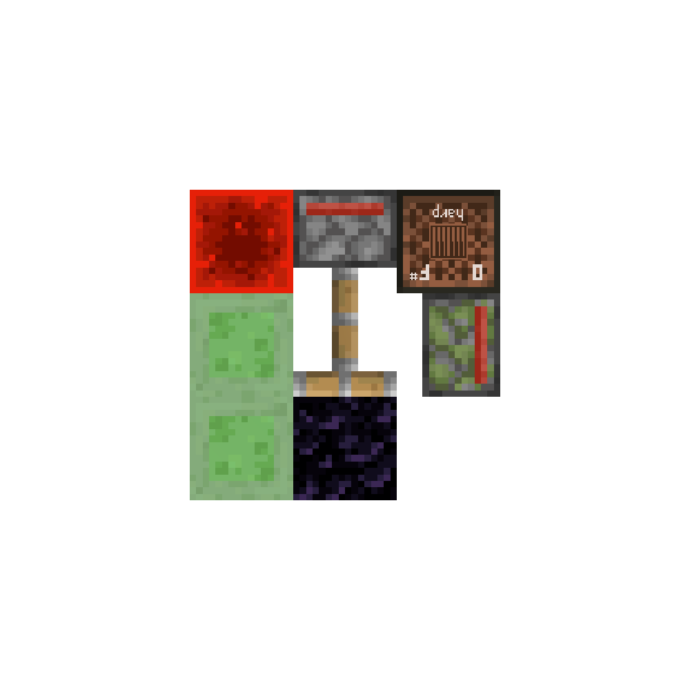

敲击音符盒，会发生什么？

:hidden[活塞掉落]

粘性活塞受到NC更新后开始自检。活塞动作检查登记收回方块事件，随后由方块事件响应入口（`onSyncedBlockEvent`）执行，并进入下述判断：

```java
if (!hasMovingPistonInFront) {
    if (actionType != 1 || targetState.isAir() || !isMovable(targetState, world, targetpos, facing.getOpposite(), false, direction)
            || targetState.getPistonBehavior() != PistonBehavior.NORMAL && !targetState.isOf(Blocks.PISTON) && !targetState.isOf(Blocks.STICKY_PISTON)) {
        world.removeBlock(pos.offset(facing), false);
    } else {
        this.move(world, pos, facing, false);
    }
}
```

稍做判断，进入`move`方法。

```java
if (!retract && world.getBlockState(headPos).isOf(Blocks.PISTON_HEAD)) {
    // 将活塞头设为空气
    // flag=0b00010100, 无PP更新，寻路更新 客户端
    world.setBlockState(headPos, Blocks.AIR.getDefaultState(), 20);
}
```

由于目标位置是活塞头，且是收缩动作，将活塞头位置设为空气，触发活塞头的`onRemove`，活塞头连带着活塞底座掉落。

#### 案例2

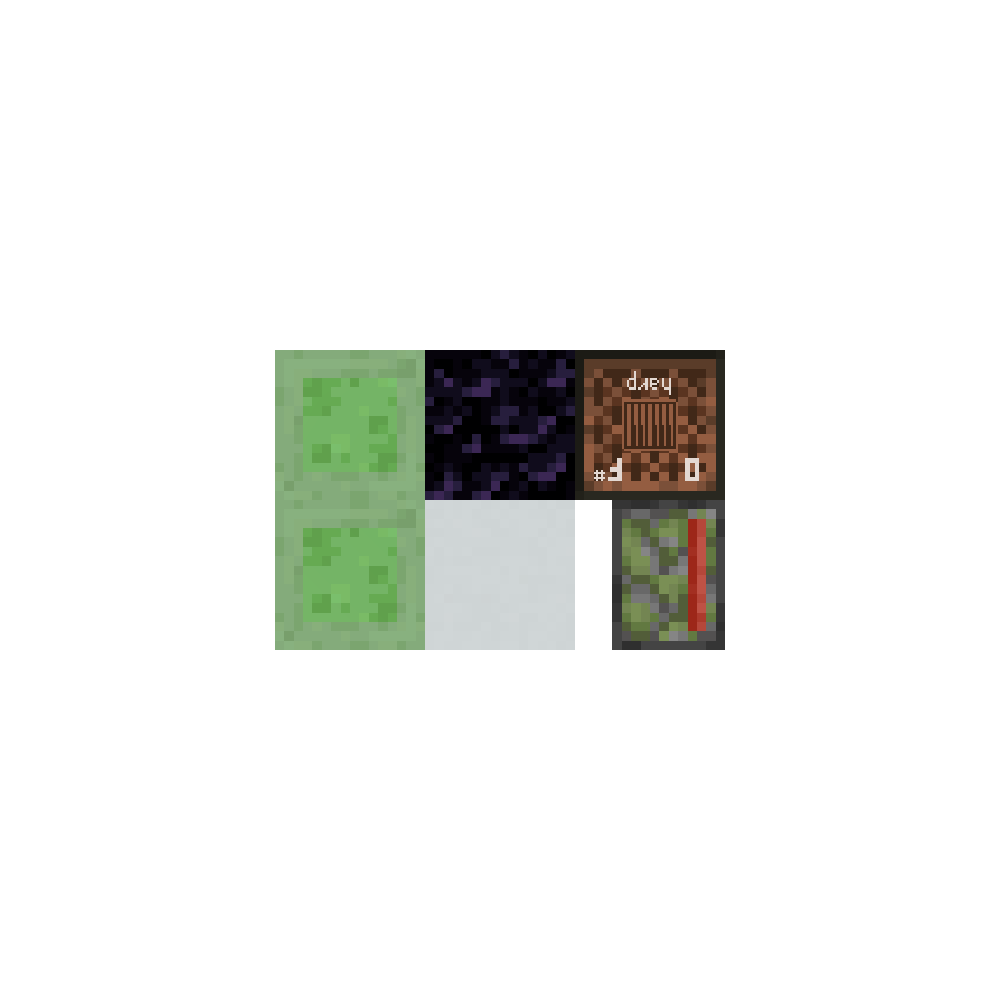

敲击音符盒，会发生什么？

:hidden[粘性活塞变回完整状态，除此之外无事发生]

步骤如前一例所述，但这里进入`move`后不符合上文的移除活塞头的方法。于是进入下一步

```java
if (!pistonHandler.calculatePush()) {
    return false;
}
```

由于面前结构无法拉回，则直接`return false`，无事发生。

#### 案例3

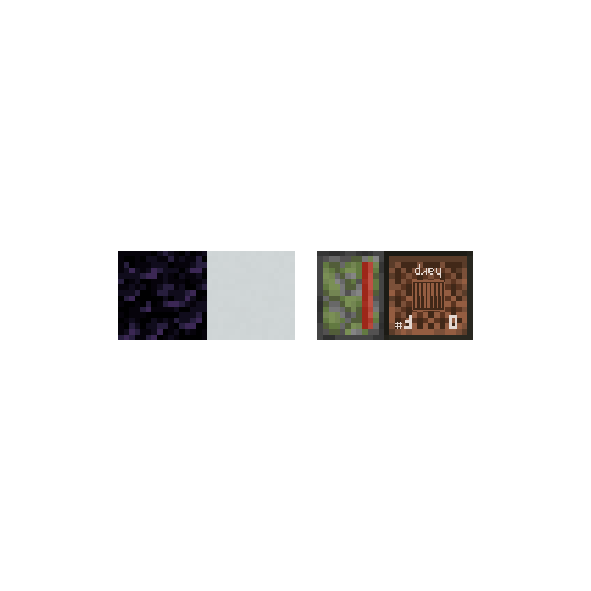

敲击音符盒，会发生什么？

:hidden[普通方块被移除]

回到`onSyncedBlockEvent`，依旧是这个判断:

```java
if (!hasMovingPistonInFront) {
    if (actionType != 1 || targetState.isAir() || !isMovable(targetState, world, targetpos, facing.getOpposite(), false, direction)
            || targetState.getPistonBehavior() != PistonBehavior.NORMAL && !targetState.isOf(Blocks.PISTON) && !targetState.isOf(Blocks.STICKY_PISTON)) {
        world.removeBlock(pos.offset(facing), false);
    } else {
        this.move(world, pos, facing, false);
    }
}
```

但在此处，if分支成立(黑曜石不可移动,`!isMovable`是`true`)，因直接移除活塞面前的方块，普通方块被移除。

#### 案例4

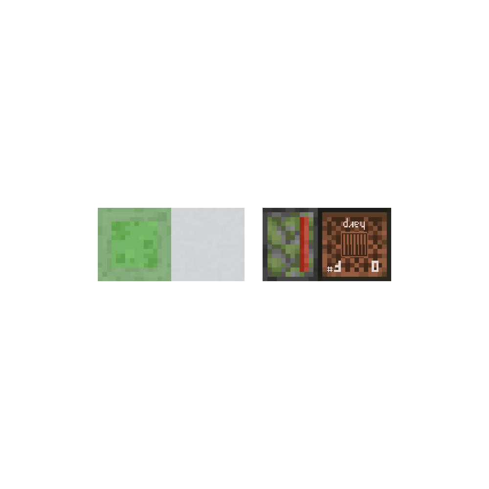

敲击音符盒，会发生什么？

:hidden[无事发生]

同案例2，进入`move`方法。当活塞尝试计算是否可拉回时，它把自己检查到了，而激活的活塞底座本身又是不可推动的，于是`return false`，无事发生。

#### 案例5

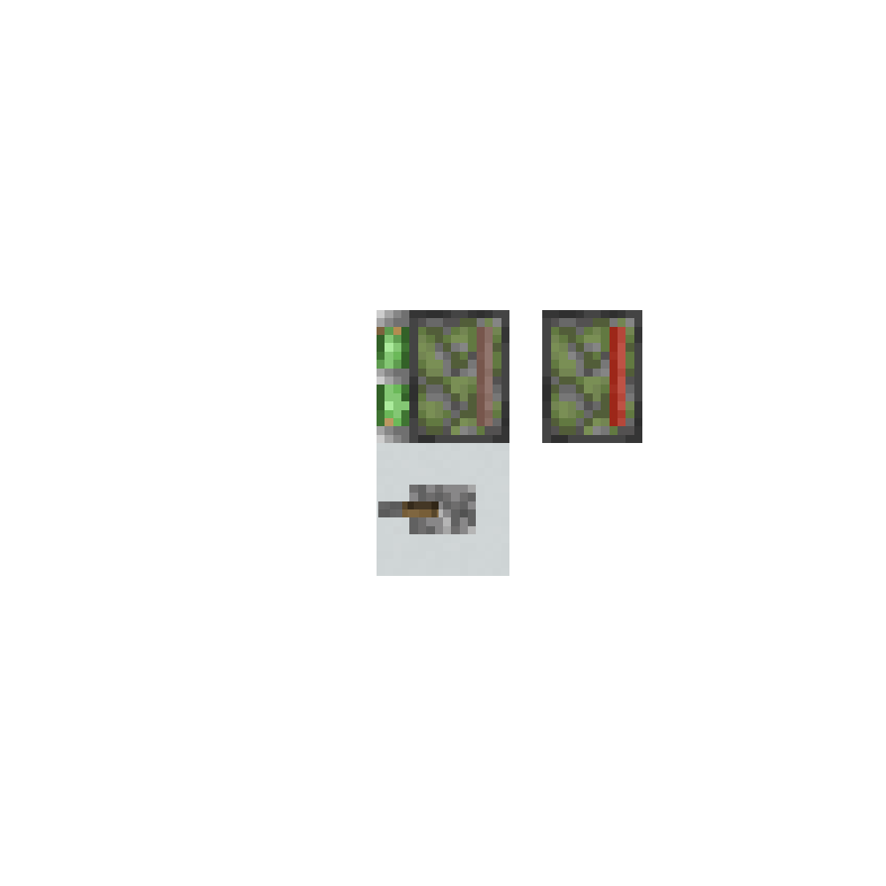

拉下拉杆，会发生什么？

:hidden[前面的活塞变为无头活塞，后面的活塞变回普通活塞]

依旧考察`onSyncedBlockEvent`，在此处注意到这段代码：

```java
BlockPos targetpos = pos.add(facing.getOffsetX() * 2, facing.getOffsetY() * 2, facing.getOffsetZ() * 2);
BlockState targetState = world.getBlockState(targetpos);
boolean hasMovingPistonInFront = false;

// 如果目标位置已有移动活塞方块，尝试完成它的扩展
if (targetState.isOf(Blocks.MOVING_PISTON)) {
    BlockEntity blockEntity2 = world.getBlockEntity(targetpos);
    if (blockEntity2 instanceof PistonBlockEntity) {
        PistonBlockEntity pistonBlockEntity = (PistonBlockEntity)blockEntity2;
        if (pistonBlockEntity.getFacing() == facing && pistonBlockEntity.isExtending()) {
            pistonBlockEntity.finish();
            hasMovingPistonInFront = true;
        }
    }
}
```

拉下拉杆时，前方的活塞先在面前位置创建一个b36(注意活塞底座并未变为b36)，然后执行上述操作，调用了前一个活塞的活塞臂的`finish`方法。我在前面提到，该方法对于活塞臂的b36会有特判，直接将其变为空气。因此前一个活塞的活塞臂就被移除，变为无头活塞。后一个位置的粘性活塞收回，变为`Extended=False`的活塞。

#### 案例6

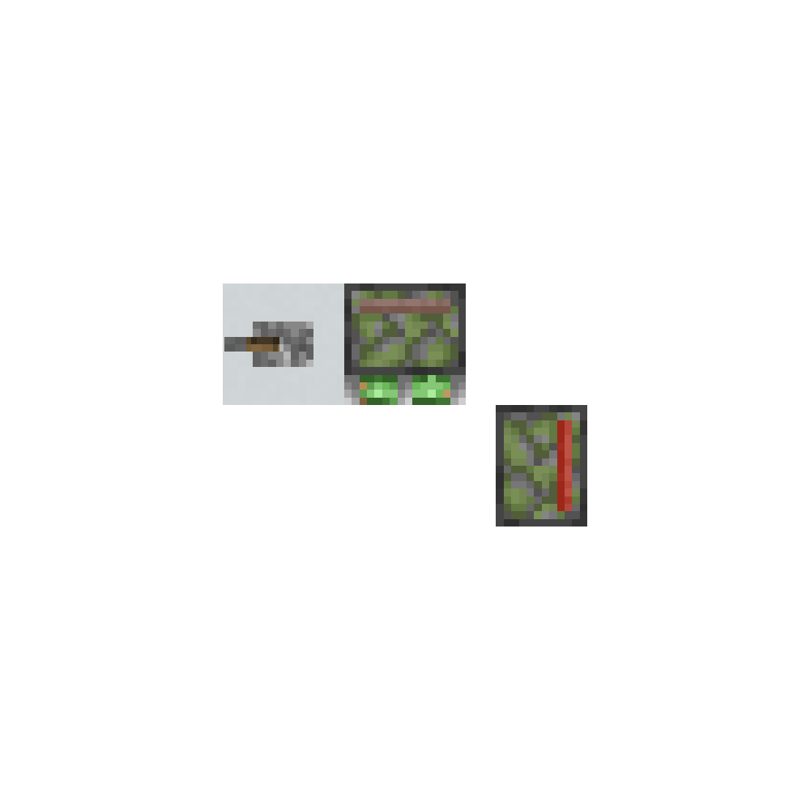

拉下拉杆会发生什么？

:hidden[两个活塞换头]

原理和案例5类似，但是调用的是这里的代码：

```java
BlockEntity blockEntityInFront = world.getBlockEntity(pos.offset(facing));

// 如果该位置有活塞方块实体，完成收缩操作
if (blockEntityInFront instanceof PistonBlockEntity) {
    ((PistonBlockEntity)blockEntityInFront).finish();
}

// 创建移动的活塞方块状态
BlockState pistonHeadState = Blocks.MOVING_PISTON.getDefaultState().with(PistonExtensionBlock.FACING, direction)
        .with(PistonExtensionBlock.TYPE, this.sticky ? PistonType.STICKY : PistonType.DEFAULT);

// 设置新的活塞方块状态，并创建新的方块实体
world.setBlockState(pos, pistonHeadState, 20);
world.addBlockEntity(PistonExtensionBlock.createBlockEntityPiston(pos, pistonHeadState, (BlockState)this.getDefaultState().with(FACING, Direction.byId(directionData & 7)), direction, false, true));
world.updateNeighbors(pos, pistonHeadState.getBlock());
pistonHeadState.updateNeighbors(world, pos, 2);

```

面前是b36就直接调用`finish`方法，将其变为空气。

#### 案例7

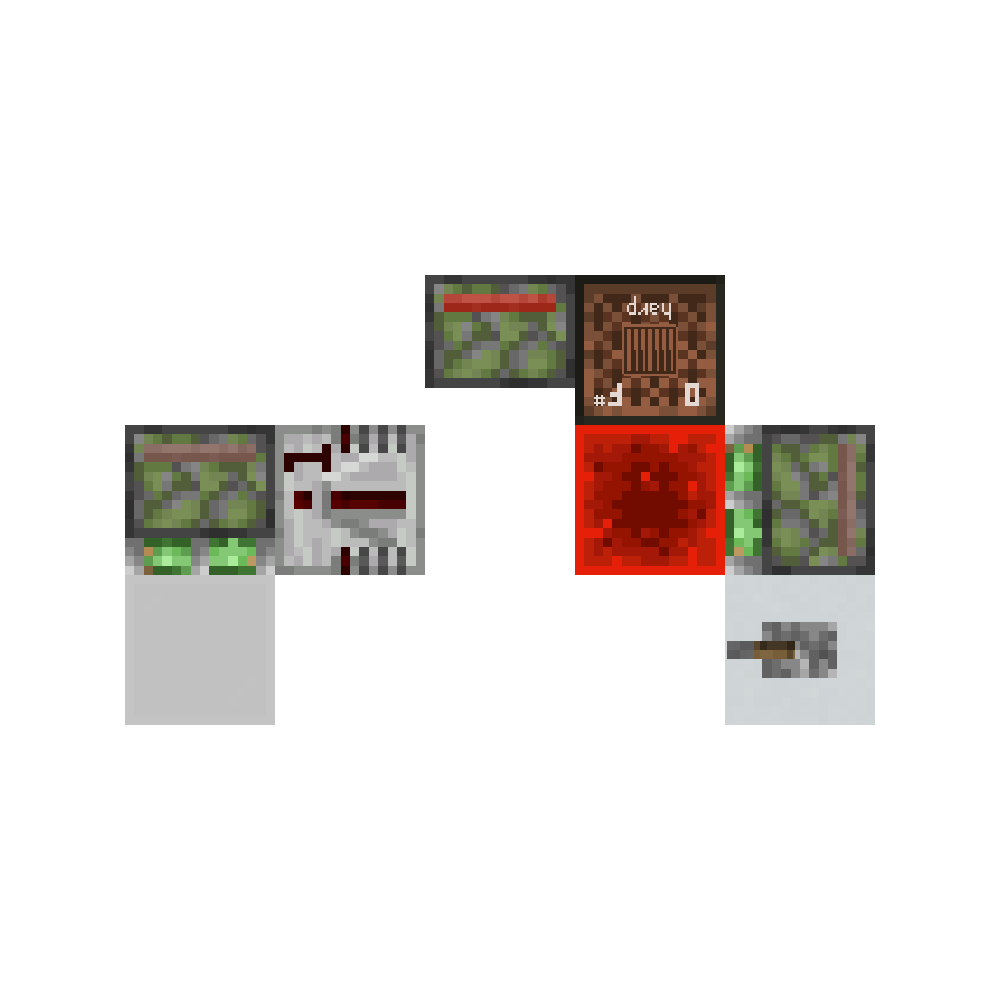

拉下拉杆会发生什么？

:hidden[红石块消失，最左侧粘性活塞丢方块]

拉下拉杆，无头活塞面前方块为b36，并被更新。红石块瞬间到位，造成NC更新，更新到中继器，添加TT事件

```java
BlockEntity blockEntityInFront = world.getBlockEntity(pos.offset(facing));

// 如果该位置有活塞方块实体，完成收缩操作
if (blockEntityInFront instanceof PistonBlockEntity) {
    ((PistonBlockEntity)blockEntityInFront).finish();
}
```

但注意，这里`onSyncedBlockEvent`还没被return，继续执行如下操作:

```java
if (!hasMovingPistonInFront) {
    if (actionType != 1 || targetState.isAir() || !isMovable(targetState, world, targetpos, facing.getOpposite(), false, direction)
            || targetState.getPistonBehavior() != PistonBehavior.NORMAL && !targetState.isOf(Blocks.PISTON) && !targetState.isOf(Blocks.STICKY_PISTON)) {
        world.removeBlock(pos.offset(facing), false);
    } else {
        this.move(world, pos, facing, false);
    }
}
```

于是红石块就被移除掉了。发出NC更新。添加TT事件。

中继器亮起2gt，于是最左侧粘性活塞丢方块。

## 应用

### 复制

#### 亮起侦测器的移除运算

亮起侦测器被移除时会向后方发出NC更新并熄灭自己。

#### 基于侦测器的复制

复制的本质实际上是这个方块添加进了移动列表，但是这个时候方块还没转化为b36。我以某种迅雷不及掩耳盗铃的姿势插入一个更新，这个时候这个更新导致了某些东西被激活/掉落，但是因为这个方块本身已经滚进移动方块列表，到位的时候又被以b36的形式放下来了。

我们将复制分为两种，基于侦测器和基于附着性方块的。其中，基于侦测器的复制正利用了上述只要侦测器被移除（换成了b36）的时候就会瞬时产生NC更新。

这里给出基于侦测器的铁轨复制：

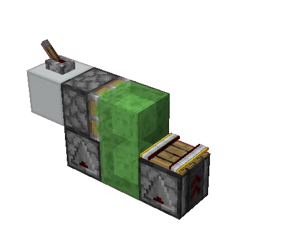

在移动方块列表中，当粘性活塞推出时，会先移动左侧侦测器，在目标位置创建b36，再移动粘液块，覆盖了亮起侦测器，更新，铁轨发现下面居然是b36，掉落。移动铁轨，在目标位置创建b36。

这样我们就完成了一次复制

#### 基于附着方块破碎的复制

##### 基于BUD的TNT复制

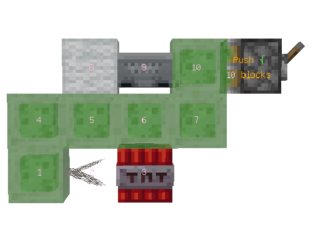
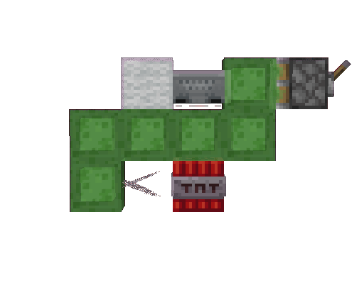

附着方块的掉落同样会产生更新，但是由于附着方块通常会直接掉落而难以二次利用。例如：

##### 基于粉导向的极简TNT复制

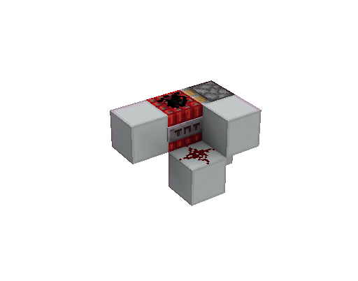

##### 地毯复制

下图中是一种极为流行的地毯复制:

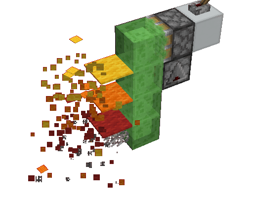

当活塞收回时其完成一次复制，我们在这里对其稍做分析：

移动方块列表：

1. 移动最下方的粘液块，在目标位置创建b36
2. 移动失活的珊瑚扇，在目标位置创建b36，发出PP更新，自检发现自己应该掉落，发出PP更新和NC更新，引导上方地毯连锁掉落
3. 移动其余粘液块和地毯

这就完成了复制。

### 信息不一致的方块事件

根据5.1章节、2.1.5章节等，我们可以发现：活塞在执行方块事件时只对其`方块位置`和`方块类型`进行校对。尽管记录了`活塞朝向`，但它只管辖b36的方向。

而活塞执行方块事件时的`真实方向`是即时采样的。

这意味着，在一个活塞的方块事件实例被在方块事件阶段中执行前，存在一个时段：此时，我们可以随意改变其对应位置的活塞的属性，甚至对此活塞本生进行破坏，更换。

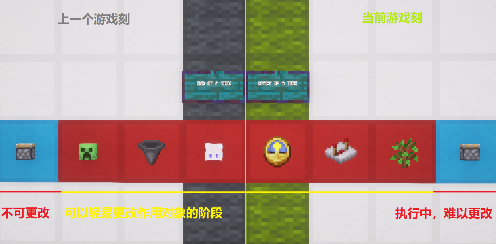

如图所示，从上一游戏刻的EU到当前游戏刻的BE，这段时间内我们可以修改某一方块事件的作用对象。
同理，从当前游戏刻的EU到下一游戏刻的BE，也存在这样一段时间。
但只要执行到这个活塞的方块事件实例时，如果执行位置有活塞，且活塞类型没有改变，那么活塞尝试推出/拉回的朝向就会由执行时的朝向决定，尽管这个朝向可能并不是方块事件添加时的朝向。

> 有趣的是，b36的收回时的动画仍然以方块事件传入的data参数为准，
> 所以，尽管方块事件执行时活塞朝向与添加时不同，活塞头的动画仍会面向方向方块事件添加时的活塞朝向（但碰撞箱是准确的）。
> 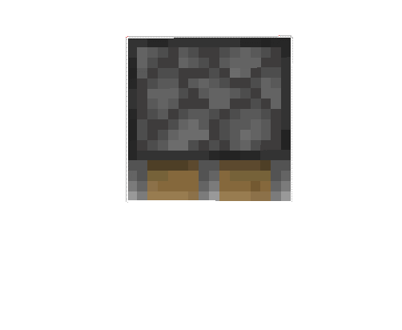

#### 破基岩

##### 跨越游戏刻的破基岩

> 活塞的逆袭之旅

正如前面所提到的，我们可以在活塞的方块事件阶段前，偷偷摸摸地修改活塞的属性，包括朝向。
这意味着我们可以在活塞推出时，将其朝向改为朝向基岩，然后在活塞收回时，就会将基岩当作活塞头摧毁。
下面的展示动画是一个典型,在方块事件阶段前更改活塞朝向的破基岩例子。

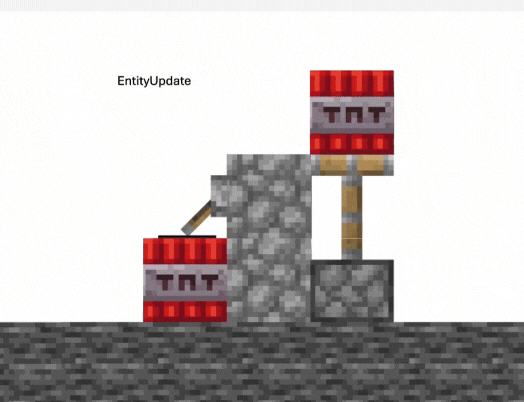

在整个过程中，发生了如下重要事件

CECECE{gt0}-EU阶段

- 左侧TNT爆炸。
  - 爆炸破坏拉杆。
  - 爆炸破坏圆石。

  - 右侧TNT爆炸。
    - 爆炸破坏活塞头,发出nc更新。
    - 活塞基座被更新，由于拉杆已经被炸掉，活塞给自己添加**收回**的方块事件。
      > 可惜的是，它已经错过了这个游戏刻的BE阶段，所以只能在gt1的BE阶段默默等待了。。
    - 活塞头破坏活塞基座。

CECECE{gt0}-AT阶段

- 玩家放置朝下的活塞新活塞。

CECECE{gt0}-BE阶段

- 活塞按照现有朝向收回，破坏基岩。

以上便是破基岩的全部过程。

但是，在破基岩机等结构内，由玩家放置活塞是不可能的，我们必须通过其他方式来实现这个效果。

##### 在方块事件阶段完成的破基岩

"在活塞的方块事件阶段前"的"前"不仅仅适用于其他的游戏阶段。就算在方块事件阶段内，你仍然可以在某个方块事件之前更改它对应的方块。
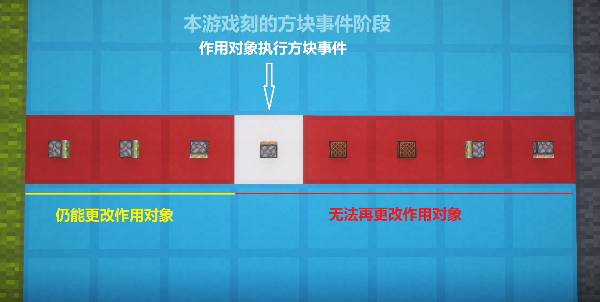

如你所见，下图是部分破基岩机中的破基岩结构的简化版本..

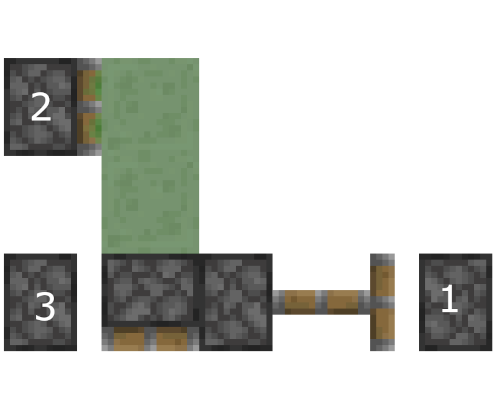
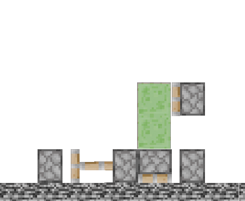

如动图所示，在整个过程中，发生了如下重要事件

> 前提--上图面标记的数字是各个活塞的深度，他们按照这个顺序在BE阶段尝试伸出或收回。

CECECE{gt0}-BE阶段

- 1号活塞收回，破坏活塞头,发出nc更新
  - 1号活塞前方的活塞基座被更新，由于处于BUD状态，活塞给自己添加**收回**的方块事件。
    > 由于深度1，2，3已被占用，它将会被安排到4号，也就是目前情况下的"最后执行"。
  - 活塞头破坏活塞基座。
- 2号活塞伸出，创建了3个b36。
- 3号粘性活塞收回，将正前方的朝下的活塞的b36强制瞬间到位。
- 朝下的活塞现在的位置拥有先前1号活塞导致的方块事件，按照现有朝向收回，破坏基岩。

### 欺骗活塞添加/取消添加方块事件

#### 欺骗活塞取消添加方块事件:推动上限检测

方块事件也会出现活塞觉得自己要执行的事件与实际状况不一致的情况，最典型的便是推动上限检测。

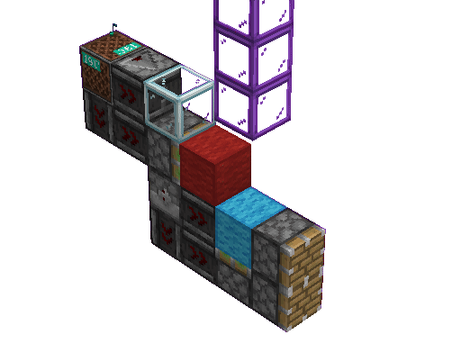

推动上限检测机制最初由玩家\_Kayleigh和Landmining发现，其核心在于"欺骗"活塞。这里展示的是Bright_Observer制作的简化版本，便于分析理解。

该装置虽具有方向性设计，但这并不影响其检测功能，因此可自由选择建造方向。

运行现象：

- 放下紫色羊毛(羊毛连接了一根很长很长的柱子...)后敲击音符盒，普通活塞会启动
- 破坏紫色羊毛后敲击，普通活塞则保持不变

原理分析：

1. 上推活塞在被更新时自检
2. 系统检查推动上限条件
3. 若羊毛放下，因上方玻璃柱子已超出推动上限，活塞不会添加方块事件
4. 此时激活两个普通活塞
5. 粘性活塞被普通活塞更新，自检后伸出
6. 羊毛不存在时：  
   粘性活塞正常运作  
   上方普通活塞的推出状态取决于朝向  
   下方普通活塞因深度关系保持原位

关键发现：  
粘性活塞的计划动作与实际执行时推动结构可能存在差异，这种特性被巧妙地用于检测机制。

#### 欺骗活塞添加方块事件

遗憾的是，如果你试图复刻***5.10.1 破基岩***的布局和激活顺序
