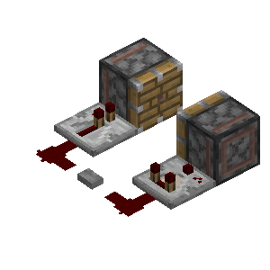
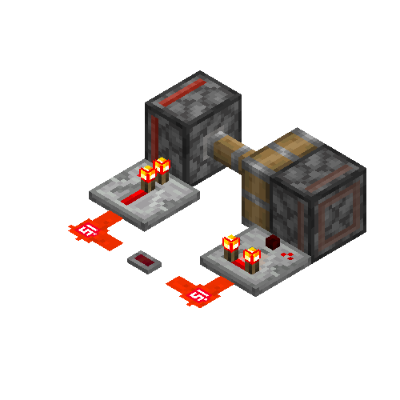
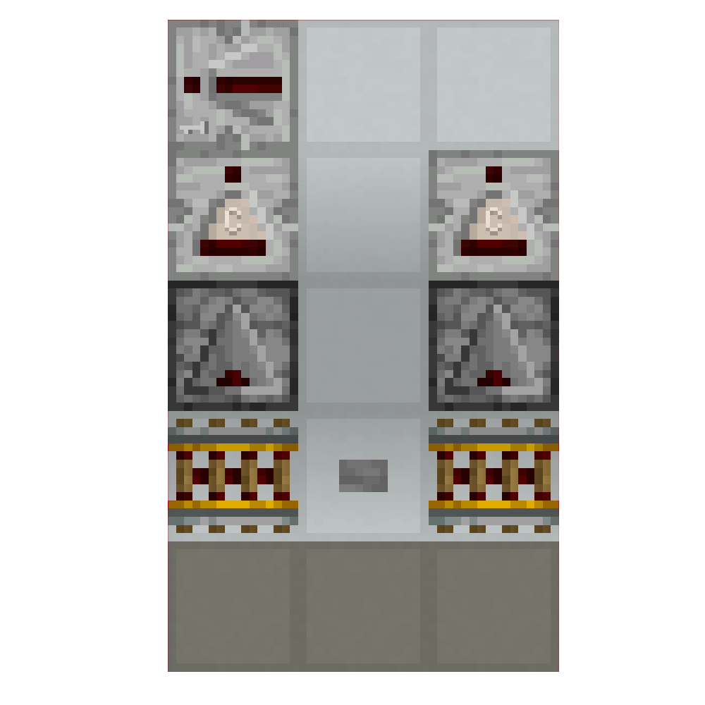
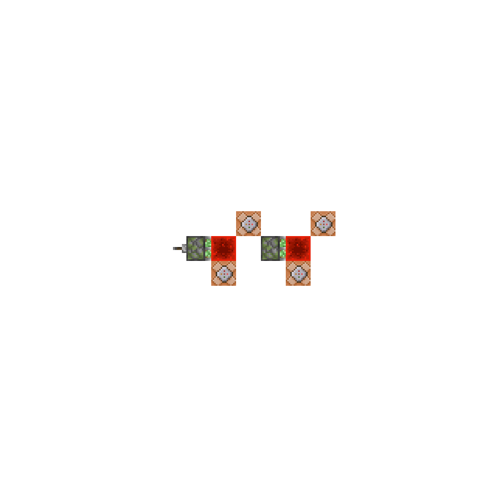

本部分我们将初步回答这一问题：Minecraft中有"同时发生"这一概念吗？

## 发现刻内时序

### 引入：一个奇怪的现象

在[刻与刻间时序](./刻与刻间时序.zh.md)中，我们学会了基于游戏刻的延迟分析方法，例如：

- 中继器：2~8gt延迟
- 比较器：2gt延迟
- 侦测器：2gt延迟

这套分析方法十分有效——直到我们遇到了这样的一个装置：

如果我们**按照gt分析**，假设按下按钮时为第0gt，会得到这样的结果：

- 中继器：按下按钮 -> 中继器延迟2gt -> 左侧活塞在第2gt激活
- 比较器：按下按钮 -> 比较器延迟2gt -> 右侧活塞在第2gt激活

这样看来，两个活塞应该同时伸出！

然而，事实却是……

……只有左侧的活塞推出了。

### 刻间时序的不足

基于游戏刻的分析能够告诉我们：某一行为“在哪一刻发生”。然而，在上文的情况中：

- 两个活塞都应该在第2gt被激活
- 两个活塞的表现不同

直觉告诉我们，这两个活塞虽然都在同一游戏刻内被激活，但或许也存在着一定的先后顺序。

### “我们需要更深入些”：刻内时序

在大部分情况下，Minecraft的游戏逻辑是单线程的——也就是说，在任意一个时刻，只能有一件事在执行。

即使两个活塞都“在同一游戏刻内被激活”，但在**这一游戏刻内**，这两个活塞**被激活的先后顺序**也是不同的，进而导致了**只有左侧的活塞推出**，而**右侧的活塞推出失败了**。

对于这种**在一个游戏刻内的精细时间**，我们称之为**刻内时序**。

与之相对的，以**游戏刻**为单位的“不那么精细”的时间，我们称之为**刻间时序**（或**宏观时序**）。

刻内时序的运行具有更加复杂的机制，各元件的行为也可能会在不同情况下发生变化，例如下图中的装置：

明明在同一游戏刻内，加个中继器就大有不同，这又是什么原理呢？且看下文分解，

## 微时序理论

微时序理论是我们用于研究刻内时序的一套方法。在接下来的内容中，我们将逐步深入地学习并尝试应用这套理论。

### 微时序的阶段划分

**一个游戏刻**就像现实生活中的**一天**。我们可以将**一天**内划分为凌晨、上午、中午、下午、晚上……并且每个阶段对应着不同的任务：凌晨睡觉、上午工作、中午午休、下午锻炼、晚上休息……

我们通过各种方法，发现**一个游戏刻**内也可以被划分为有固定顺序的多个阶段，每个阶段中，游戏又会执行不同的任务。这些阶段分别是[^1]：

[^1]: 此处我们仅介绍微时序理论分析时最常用的游戏阶段。对于更加完整、复杂的游戏阶段划分，读者可以自行前往 [Minecraft Wiki #刻-游戏刻流程-java版](https://zh.minecraft.wiki/w/%E5%88%BB?variant=zh-cn#Java%E7%89%88) 下的 **“每个维度执行游戏刻的流程如下：……”** 中查阅。其中 **WTU** 即对应 **“更新游戏时间”**。

1. <WTUColor>**世界时间更新**</WTUColor>（<WTUColor>**World Tick Update**</WTUColor>，简称 <WTUColor>WTU</WTUColor>）
    
   - 这是**划分两个不同游戏刻**的阶段。如果将**游戏刻**比作时钟上的**分针**，**刻内时序的运行**比作**秒针旋转**，那么<WTUColor>WTU</WTUColor>就是**秒针转过数字12的那一刻**，分针进入了下一分钟，游戏也进入了下一游戏刻。
    
   - 一个<WTUColor>WTU</WTUColor>的开始到下文中所有阶段结束，构成了**一个完整的游戏刻**。
    
   - 游戏在这一阶段进行的具体工作内容是：游戏中存在一个世界时间计数器，从0开始每刻加1。本阶段的作用就是让**世界时间+1**，从而推进游戏时间。例如，当计数器从1增加到2时，我们就说“进入了第2刻”；计数器为2时，我们就说“当前是游戏的第2gt”

   - 注：为了方便分析和简化表述，在实际分析时序时，我们通常假定**最开始的操作**为第0gt（而不是用真实的世界时间计算），以第0gt为起始进行后续分析。

2. <TTColor>**计划刻**</TTColor>（<TTColor>**Schedule Tick / Tile Tick / Next Tick Entry**</TTColor>，简称 <TTColor>TT</TTColor> 或 <TTColor>NTE</TTColor>[^2]）
   
   - 大部分具有**延迟几gt执行**的行为的元件都是由<TTColor>**计划刻**</TTColor>控制、并在<TTColor>**计划刻阶段**</TTColor>执行对应行为的。
  
   [^2]: Next Tick Entry（NTE）并不是一个标准的称呼。我们更建议读者称呼 **计划刻（阶段）** 为 **TT（阶段）** ，在此处提及 NTE 只是为了读者在阅读其他部分资料时能够识别该称呼。

3. <CTColor>**区块刻**</CTColor>（<CTColor>**Chunk Tick**</CTColor>，简称<CTColor>CT</CTColor>）
   
   - 这一阶段包含较多工作内容，详细内容读者可以自行查阅[Minecraft Wiki #刻-区块刻](https://zh.minecraft.wiki/w/%E5%88%BB?variant=zh-cn#%E5%8C%BA%E5%9D%97%E5%88%BB)，下文按执行先后顺序列出在此阶段执行的一些常见内容：
   
   1. 执行**雷暴**相关逻辑。
   2. 执行**结冰**、**积雪**、**炼药锅收集水**相关逻辑。
   3. 执行**随机刻**。**随机刻**控制着**农作物、树苗等的生长**、**冰雪融化**、**草方块蔓延**、**红石矿石发光与熄灭**等游戏中**随机发生的事件**。关于随机刻的详细内容，读者可以自行查阅[Minecraft Wiki #刻-随机刻](https://zh.minecraft.wiki/w/%E5%88%BB?variant=zh-cn#%E9%9A%8F%E6%9C%BA%E5%88%BB)，此处不作过多罗列。

4. <BEColor>**方块事件**</BEColor>（<BEColor>**Block Event**</BEColor>，简称<BEColor>BE</BEColor>）
   
   - 这一阶段最常见的“工作内容”是活塞相关的行为。在最常见的情况中，活塞在<BEColor>**此阶段**</BEColor>推动方块，被推动的方块经过一定变化，在**2gt后**的**TE**阶段中**到位**。读者在此处仅需初步认识活塞即可，更多有关方块事件和活塞的内容详见后续章节。
  
   - 除此之外，**音符盒、钟发出声音**等一些行为也在<BEColor>**此阶段**</BEColor>执行。

5. <EUColor>**实体运算**</EUColor>（<EUColor>**Entity Update**</EUColor>，简称<EUColor>EU</EUColor>）
  
   - 实体会在这一阶段执行自己的行为逻辑，如生物移动、怪物攻击、TNT爆炸等**实体自身的行为**，以及非玩家实体激活压力板、绊线钩并使它们发出红石信号等**实体触发红石元件的行为**。这些红石元件通常在此阶段（或AT阶段，见下文）被激活并发出红石信号，而在计划刻阶段停止发出红石信号。

6. <TEColor>**方块实体**</TEColor>（<TEColor>**Block Entity / Tile Entity**</TEColor>，简称<TEColor>TE</TEColor>）
   
   - 一些具有特殊行为的方块会在这一阶段执行自己相关的运算，如**漏斗吸取与传输物品**、**被活塞推动的方块到位**等。

7. <ATColor>**异步事件**</ATColor>（<ATColor>**Async Task / Network Update**</ATColor>，简称<ATColor>AT</ATColor>/<ATColor>NU</ATColor>）
   
   - 与玩家相关的各种操作都在这一阶段运算，例如玩家**放置与破坏方块**、**触发压力板、绊线钩**等行为。

在接下来的内容中，我们将围绕这几个主要阶段展开。

<!-- 此注释以下的内容还未进行二次修订 -->

### 瞬时行为

在上文中，我们认识到1gt内又划分成了不同的阶段。就像早饭只能在早上吃、午饭只能在中午吃一样，Minecraft中的许多事件只能遵循一定的顺序，发生在特定的阶段。但还有一些“立刻响应”的事件，就像我们渴了就可以立刻去喝水，而不关心早上、中午、还是晚上。

如果一个方块的行为可以在任意阶段发生的、只由**方块更新**触发，那么这个方块就称为**瞬时元件**。

举例来说，红石粉亮灭是瞬时的。如果玩家关闭了一个拉杆，那么可以导致红石粉在玩家操作阶段熄灭；如果活塞推走了一个红石块，就可以导致红石粉在方块事件阶段熄灭。

### 延时行为

既然有瞬时事件，就必然有“延时”事件。举例来说，如果玩家放置了一个红石块，红石块激活了一个中继器，这个中继器就会在2gt后亮起。中继器亮起的这一行为具有**延时**，且**由游戏控制**（由计划刻控制），在**特定阶段发生**（计划刻阶段），中继器就不是瞬时事件。

在接下来的几部分中，我们将详细地展开这些**不同的游戏阶段**。

### 常见元件的运行阶段

|                元件种类                |           运行阶段            |
| :------------------------------------: | :---------------------------: |
|            命令方块运行指令            |  <TTColor>计划刻TT</TTColor>  |
| 中继器、比较器、红石火把、侦测器的亮灭 |  <TTColor>计划刻TT</TTColor>  |
|          红石粉、铁轨改变状态          |             瞬时              |
|         栅栏门、活板门改变状态         |             瞬时              |
|         漏斗因红石信号改变状态         |             瞬时              |
|           漏斗吸收、传递物品           | <TEColor>方块实体TE</TEColor> |
|      音符盒、钟因红石信号改变状态      |             瞬时              |
|           音符盒、钟发出声音           | <BEColor>方块事件BE</BEColor> |
|    发射器、投掷器因红石信号改变状态    |             瞬时              |
|       发射器发射/投掷器投出物品        |  <TTColor>计划刻TT</TTColor>  |
|              红石灯的亮起              |             瞬时              |
|              红石灯的熄灭              |  <TTColor>计划刻TT</TTColor>  |
|        按钮、压力板、绊线的亮起        |           瞬时            |
|        按钮、压力板、绊线的熄灭        |  <TTColor>计划刻TT</TTColor>  |
|       重力方块判定下落、创建实体       |  <TTColor>计划刻TT</TTColor>  |
|           重力方块下落、到位           | <EUColor>实体运算EU</EUColor> |
|             活塞推出或收回             | <BEColor>方块事件BE</BEColor> |
|            b36 推动实体            | <TEColor>方块实体TE</TEColor> |
|              b36 自然到位              | <TEColor>方块实体TE</TEColor> |
|       b36 被粘性活塞收回到位       | <BEColor>方块事件BE</BEColor> |

### 刻内时序基础分析

在这里，我们给出一个基本的例子。

下图中，所有的命令方块内指令都为time query gametime

上升沿 _（拉下拉杆，粘性活塞推出）_：

| 刻数 | 阶段                  | 事件                             |
| ---- | --------------------- | -------------------------------- |
| 0    | <ATColor>AT</ATColor> | 玩家拉下拉杆                     |
| 0    | <ATColor>AT</ATColor> | 第一个活塞添加方块事件           |
| 1    | <BEColor>BE</BEColor> | 第一个活塞推出                   |
| 3    | <TEColor>TE</TEColor> | 第一个红石块到位                 |
| 3    | <TEColor>TE</TEColor> | 命令方块计划在4刻（延迟1刻）运行 |
| 3    | <TEColor>TE</TEColor> | 第二个活塞添加方块事件           |
| 4    | <TTColor>TT</TTColor> | 第一个命令方块读数4              |
| 4    | <BEColor>BE</BEColor> | 第二个活塞推出                   |
| 6    | <TEColor>TE</TEColor> | 第二个红石块到位                 |
| 7    | <TTColor>TT</TTColor> | 第二个命令方块读数7              |

下降沿 _（拉回拉杆，粘性活塞收回）_：

| 刻数 | 阶段                  | 事件                   |
| ---- | --------------------- | ---------------------- |
| 0    | <ATColor>AT</ATColor> | 玩家关闭拉杆           |
| 0    | <ATColor>AT</ATColor> | 第一个活塞添加方块事件 |
| 1    | <BEColor>BE</BEColor> | 第一个活塞收回         |
| 1    | <BEColor>BE</BEColor> | 第一个红石被撤去       |
| 1    | <BEColor>BE</BEColor> | 第二个活塞添加方块事件 |
| 1    | <BEColor>BE</BEColor> | 第二个活塞收回         |
| 3    | <TEColor>TE</TEColor> | 两个红石块到位         |
| 4    | <TTColor>TT</TTColor> | 两个命令方块都读数4    |

（改自void的例子）
